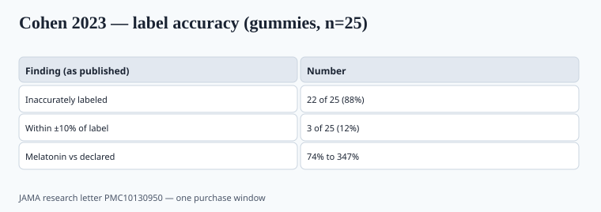

**Disclaimer.** Educational only. Not medical advice. Dietary supplements are not intended to diagnose, treat, cure, or prevent any disease (DSHEA; 21 U.S.C. § 321(ff); 21 CFR 101.93). This is not a pediatric dosing guide and not advice to give melatonin to children.

April 2023. Pieter Cohen's group published a *JAMA* research letter that should have ended "natural sleep candy" as a casual category. It did not. The paper is still the one to keep on the formulator's desk.

## What they measured

<!-- graphics-pack:v1 -->

*Figure 1. Published counts from one 25-SKU purchase window (PMC10130950) — not a category census.*

Cohen, Avula, Wang, Katragunta, Khan: 25 melatonin gummy brands identified from NIH's Dietary Supplement Label Database (2021 entries), bought online after a September 2022 pull. HPLC for melatonin, CBD, serotonin.

- 22 of 25 (88%) were inaccurately labeled.
- Only 3 (12%) were within ±10% of declared melatonin.
- In products that had melatonin, actual content ran **74% to 347%** of the label.
- One product had **no detectable melatonin** and **31.3 mg CBD**.
- Five declared CBD; CBD assay was 104–118% of label (tighter than the melatonin).
- Serotonin: not detected.

That is not a "some lots vary" story. That is a category failing the only promise a gummy can keep: the milligram line.

Cohen's letter is small — 25 SKUs, one purchase window. It is still the cleanest public assay of the aisle that exploded during the pandemic. A brand that answers "our gummies are different" without lot data is asking a buyer to take a vibe over HPLC.

Gummy matrices are hostile. Heat during cook, acid for pectin or gelatin set, moisture in the jar, a flavor system that wants a low pH. Melatonin is not vitamin C. If your CMO skip-lots melatonin because "we always hit it," Cohen is why you stop skipping.

## Kids were already in the poison-center graph

Lelak, Vohra, Neuman, Toce, Canning, *MMWR* 3 June 2022, PMID 35737571: US poison-control pediatric melatonin ingestions, 2012–2021. **260,435** ingestions in people ≤19 years. Reports rose 530% over the decade. Hospitalizations and serious outcomes were a minority; the paper reported two deaths in the window. Most cases were in children ≤5. Unintentional ingestions dominated in the youngest group.

CDC/MMWR is surveillance, not a randomized trial of melatonin harm. It counts calls, not a denominator of bottles sold. It is still the reason a 10 mg "kids sleep" gummy is an operator problem even if a parent asked for it. Pediatric insomnia is a clinician's job. A brand that puts a cartoon bear on 5 mg has chosen a market I would not underwrite.

Gummies are candy. Candy is what toddlers eat. Child-resistant closures exist because of this shape, not because of a vitamin C chew. If your pack-out cannot do CR, do not do melatonin gummies.

Piece 34 is the rest of the children's aisle. This piece is why melatonin specifically showed up in the ER graph.

## The sleep file, separate from the assay file

ODS melatonin fact sheet: hormone, used for circadian timing. Jet-lag and delayed-sleep-phase literature is the part that has a real clock story. Chronic primary insomnia is messier. Typical studied adult doses are often in the **0.5–5 mg** band, not 20 mg. More is not a better clock. Morning grogginess and vivid dreams show up. Interactions (sedatives; anticoagulant conversations in some reviews) belong on a warning set. `[VERIFY]` ODS's current wording when you freeze a label.

None of that literature assumed the gummy contained 347% of claim. A 3 mg label that assays at 10 mg is a different product than the one in the citation.

Immediate-release vs prolonged-release is a second variable. Some clinical products use a prolonged-release tablet for a sleep-maintenance question. A pectin gummy is not that product. Do not steal a prolonged-release paper for a 20-minute chew.

"Helps regulate sleep-wake timing" is the most I would even walk to counsel. Not "cures insomnia," not "safe for toddlers," not a before/after of a child's school grades.

## What a 2026 SKU has to do

1. **Assay every lot** for melatonin, not a skip-lot from 2021.
2. **No CBD** in a sleep gummy you want to call a supplement (piece 14). Cohen found it anyway. A 31 mg CBD gummy sold as melatonin is a hemp problem wearing a sleep label.
3. **Adult label, adult dose, child-resistant closure.** If you cannot do CR packaging, do not do gummies.
4. **USP Verified** if you can get the SKU in. Cohen's own public comment pointed clinicians at USP for label accuracy. The mark is not a sleep claim. Trademark rules still apply (piece 10).
5. **Print a real milligram.** 0.5 mg and 1 mg tablets exist. A 10 mg gummy is rarely the studied adult clock dose.
6. Copy: timing language, DSHEA line, keep-away-from-children. No cartoon on a hormone.

If the CMO says the cook cannot hold ±10%, the answer is a tablet, not a wider spec.

## Gummy matrices lie for a reason

Pectin and gelatin cooks are wet, warm, and acidic. Melatonin is not a rock. If the CMO's process validation never challenged hold time and pH, Cohen's 74–347% range is the predictable output. A tablet press with a 1 mg tool is a different process capability story.

Ask for in-process assay, not only a finished-jar HPLC from a friendly lot. Ask whether the flavor acidulant changed since the last validation. Ask whether the jar's moisture vapor transmission was part of the expiry file. A 24-month dating on a gummy without those points is a hope.

If the answer is "we use a premix and it always hits," you are buying the 2021 Dietary Supplement Label Database SKU that Cohen later pulled off the internet. Piece 16 is how you read the PDF. This piece is why the PDF has to exist every lot.

## What changed since 2020 (box)

Pandemic sleep anxiety grew the aisle. 2022 MMWR made the pediatric curve visible. 2023 Cohen made the label a joke you can cite. Brands that answered with a real assay program and a 1 mg tablet are the ones I would contract. Brands that answered with "our gummies are different" and no lot data are the ones a retailer will dump after the next round of testing.
