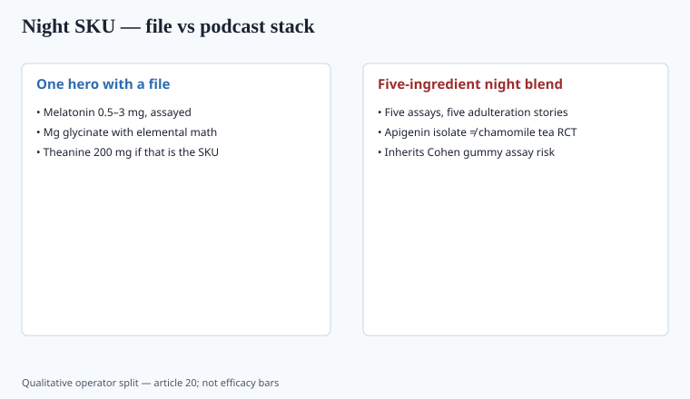

**Disclaimer.** Educational only. Not medical advice. Dietary supplements are not intended to diagnose, treat, cure, or prevent any disease (DSHEA; 21 U.S.C. § 321(ff); 21 CFR 101.93). This is not a treatment plan for insomnia, anxiety, or depression.

The Huberman-era night stack — magnesium, L-theanine, apigenin, sometimes glycine — sold because a podcast can outrun a Cochrane review. Melatonin has a file (piece 19). The rest of the bottle needs its own.

## Magnesium

ODS: nutrient, RDA, supplement UL 350 mg elemental/day for adults (food not counted the same way). `[VERIFY]` the live table. Oxide is a laxative for many people; glycinate is a tolerance play (piece 09). Sleep RCTs in people who are *not* deficient are small and mixed.

Abbasi et al., *Journal of Research in Medical Sciences* 2012, PMID 23853635: 46 elderly adults with primary insomnia, 500 mg magnesium daily vs placebo for eight weeks. Subjective ISI and sleep-log measures moved; total sleep time as they defined it did not show a between-group difference they treated as significant. It is one small trial in older adults, not a hypnotic license for a 28-year-old. Read the paper for the salt and the elemental math before you copy "500 mg" onto a glycinate SKU.

A person with low intake who sleeps poorly has two problems; fixing the intake is reasonable. "Magnesium is a hypnotic" is not.

Glycinate-as-glycine-drug is the stretch. Glycine has its own small sleep literature at **gram** doses (below). A 200 mg magnesium bisglycinate capsule does not deliver those grams of glycine. Do the molar math before you write the PDP. Most of the capsule is magnesium salt, not a 3 g glycine serving.

## L-theanine

Tea amino acid. Some small trials on relaxation and attention, often with caffeine as the pair — the "calm focus" story is a tea story first. Sleep-onset evidence is thinner than the capsule count on Amazon. `[CITE NEEDED]` for any specific PSQI delta you want to print.

200 mg is a common studied adult dose in the attention/relaxation papers. That is not a toddler dose. Theanine plus a 10 mg melatonin gummy is how you inherit Cohen's assay problem and a second active.

Quality: theanine is cheap to underfill and easy to confuse with theanine-adjacent botanicals. Assay the amino acid. A "green tea extract" line is a caffeine + EGCG problem (piece 24), not a theanine SKU.

## Apigenin

A flavone in chamomile. The 2020s dose that shows up in stacks is often **50 mg** isolated apigenin, not a tea cup. Human sleep RCTs at that isolate dose are not a VITAL-class file. Chamomile tea trials are small and heterogeneous. Isolated 50 mg is a different exposure. I will not invent a 2024 insomnia RCT. If you have one with a PMID, drop it in a revision. Until then the honest sentence is: **traditional tea, thin isolate data, unknown long-horizon at supplement doses.**

Chamomile is also an Asteraceae allergen. Isolated apigenin may or may not carry that protein risk; do not assume zero. Identity of the isolate (synthetic vs plant) belongs on the spec. Residual solvents if it was extracted.

The podcast chemistry — GABA-A talk, "binds the same receptor as benzodiazepines" — is a mechanism slide, not a trial. Do not put a benzo comparison on a supplement page. That sentence is a drug claim wearing a textbook.

## Glycine, taurine, "GABA"

Inagawa et al., *Sleep and Biological Rhythms* 2006: randomized crossover, 3 g glycine before bed, subjective morning ratings (fatigue, liveliness, clear-headedness) in people who already complained about sleep. Yamadera et al. 2007 added polysomnography at the same 3 g dose. `[VERIFY]` architecture numbers before you quote them. Bannai and colleagues later wrote daytime-sleepiness follow-ups. These are small Japanese studies from the 2000s–2010s. They are not a 2,000-person insomnia program.

Taurine is mostly energy-drink ballast. Oral GABA's brain availability is a long argument; "GABA calm" is usually a claim in search of a PK paper. `[CITE NEEDED]` before any of these become a number on a carton.

If you actually want the glycine file, you need **grams**, a scoop or a large tablet, and a warning that 3 g of a sweet amino acid is a different SKU from 200 mg of magnesium glycinate.

## The stack problem

<!-- graphics-pack:v1 -->

*Figure 1. Qualitative operator split — not efficacy bars.*

Five "sleep" ingredients at fairy-dust doses do not add. They create a COA with five assays, five adulteration stories (apigenin from which plant?), and a drug-interaction surface you did not model. Melatonin assay failure (Cohen 2023) already shows gummy matrices lie. Adding botanicals to the same gummy is how you fail identity *and* potency.

Sedative stacking with alcohol or prescription sleep drugs is a clinician warning, not a "more chill" joke.

Proprietary blends hide the melatonin milligrams. After Cohen, hiding the milligrams is the tell.

## How a night SKU stays adult

Pick **one** hero with a file (melatonin at 0.5–3 mg, assayed; or magnesium glycinate with elemental math; or theanine 200 mg). Print the dose. Leave the podcast molecule off until a paper exists. Child-resistant cap. No cartoon. No "safe for the whole family."

If you insist on a two-ingredient night tablet, write two substantiation files and two assays. Do not call it a "protocol."

## What a night-SKU COA has to show

One hero: one assay row, one method, one unit that matches the panel (piece 35). Melatonin in mcg or mg, not "sleep blend 400 mg." Magnesium as elemental mg, with the salt named. Theanine as the amino acid.

If you add apigenin, identity of the isolate and a solvent row (piece 36) join the file. If you add glycine at 3 g, you need a scoop or a large tablet and you need to stop calling 200 mg glycinate "the glycine study."

Lot match on every assay row. The Cohen letter is about melatonin, but a five-botanical night gummy fails the same matrix. Sedative-stacking warnings belong on the label, not in a joke caption.

## What changed since 2020 (box)

Sleep became a DTC default category. The evidence hierarchy did not. Melatonin got a quality scandal. Magnesium stayed a nutrient with one small elderly insomnia RCT people over-quote. Apigenin stayed a tweet. A brand that ships a one-ingredient night tablet with a real COA will look boring and will still be there after the next MMWR.
