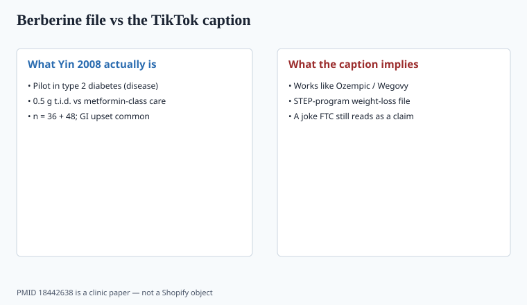

**Disclaimer.** Educational only. Not medical advice. Dietary supplements are not intended to diagnose, treat, cure, or prevent any disease (DSHEA; 21 U.S.C. § 321(ff); 21 CFR 101.93). This is not guidance to treat diabetes or to replace a GLP-1 drug. Numbers below from clinic papers are not product claims.

2023–2024. Semaglutide shortages and price. TikTok needed a capsule. **Berberine** got the caption "nature's Ozempic." That caption is a disease-treatment claim wearing a joke. FDA and FTC do not grade on joke.

## What the older papers actually are

<!-- graphics-pack:v1 -->

*Figure 1. PMID 18442638 is a disease-population pilot — not a GLP-1 file.*

Berberine is an isoquinoline alkaloid from *Berberis* and related plants. It is not a nutrient. ODS does not publish an RDA.

Yin, Xing, Ye, *Metabolism* 2008, PMID 18442638: a **pilot** in people with type 2 diabetes. Study A randomized 36 newly diagnosed adults to berberine or metformin, 0.5 g three times a day, three months. The authors reported HbA1c in the berberine arm moving from 9.5% ± 0.5% to 7.5% ± 0.4%. Study B added berberine to poorly controlled patients (n = 48). Transient GI adverse effects in 20 of 84 (34.5%). That is a **disease population**, a **glucose-drug comparison**, a small n, and a 2008 clinic — not STEP-1, not SURMOUNT, not 2.4 mg Wegovy.

Later metas in glycemic endpoints exist and are heterogeneous, often Chinese-clinic, often short. `[CITE NEEDED]` before you quote a pooled HbA1c drop as if it were a 2024 megatrial. None of them are GLP-1 receptor-agonist weight-loss programs. Weight change in berberine papers, when it shows up, is modest and secondary.

GLP-1 receptor agonists are drugs with boxed warnings, REMS-era attention, and GI adverse events that made the news. Pretending a 500 mg alkaloid is that pharmacology is how you get a 2022-style FTC letter with a new noun.

If you need a sentence for the science folder: AMPK talk and complex-I inhibition show up in mechanistic papers (including later work from overlapping groups). Mechanism slides do not become a semaglutide. They also do not become a supplement structure/function you should print without counsel.

Later Chinese-clinic metas and short RCTs piled onto Yin. Heterogeneity is the word: different salts, different grams, different background meds, different assay quality. A 2021-class systematic review you want to quote needs its own PMID and a risk-of-bias paragraph. `[CITE NEEDED]` before a pooled HbA1c or kilogram number. STEP and SURMOUNT programs enrolled thousands on a defined GLP-1 dose with a defined placebo. That is the file the caption stole. Berberine does not have it.

A buyer who is already on metformin, insulin, or a GLP-1 and then adds a 1.5 g/day alkaloid because a Reel said "stack it" is a clinician problem. The 2008 paper was a clinic comparison, not an add-on protocol for someone on Wegovy.

## Safety that the TikTok skipped

The 2008 paper already counted GI upset at 0.5 g three times a day. A Reel that shows a 500 mg once-daily capsule is not on that protocol. Do not copy a Reel dose onto a label and then cite Yin.

Berberine has **CYP and transporter interaction** logic (including some drugs with narrow windows). It is **not for pregnancy** in any cautious monograph; goldenseal/berberine and neonatal jaundice is an old midwifery warning. Glucose-lowering in someone already on insulin or a sulfonylurea is a clinician problem, not a "stack."

Liver and kidney disease: do not target those buyers with a botanical alkaloid and a shrug.

Quality: berberine HCl assay is easy to fake with dye. Identity of the plant source vs synthetic berberine should be in the spec. Residual solvents if synthesized. Heavy metals if extracted from root bark. A "Berberis aristata 10:1" without a berberine milligram is a ratio story (piece 36), not a Yin dose.

Finished-product assay should name berberine (or berberine HCl) in milligrams per serving, not "Berberis 500 mg." Incoming identity is HPTLC or an equivalent botanical ID if you claim a plant, plus HPLC for the alkaloid if you claim a milligram. Goldenseal and Oregon grape are different plants with related alkaloids. Do not transfer a goldenseal warning set onto a synthetic HCl SKU without reading the monograph, or the reverse.

## The claim that cannot be saved by a disclaimer

"Works like Ozempic." "Poor man's Wegovy." "Mounjaro alternative." A footer DSHEA line does not un-say the headline. FTC 2022 is about net impression. A before/after waist photo next to a berberine bottle is a weight-loss disease-adjacent ad. You need competent and reliable scientific evidence *for that claim*. The 2008 diabetes RCT is the wrong object.

Metformin comparisons in the 2008-class papers are **clinic** comparisons in a disease. Repeating "as good as metformin" on a Shopify page is a drug claim. So is a continuous-glucose-monitor screenshot you paid an influencer to post (piece 31).

Allowed shape, maybe, after counsel: nothing about diabetes, nothing about a named drug, a very narrow structure/function if you even have one you believe. I would rather **not sell berberine** than sell it as a GLP-1. There are easier SKUs.

If search volume is the brief, treat it as a **risk signal**. The same year FTC mailed ~700 penalty-offense notices (piece 31). A founder who buys "Ozempic" ads against a berberine SKU is volunteering for that stack.

## What changed since 2020 (box)

Berberine was a quiet "metabolic" SKU. GLP-1s became mass culture. The caption wrote itself and outran the file by an order of magnitude. A serious catalog treats 2023 search volume as a compliance problem, not a product brief. Yin 2008 stays in the science folder. It does not go on the carton.
