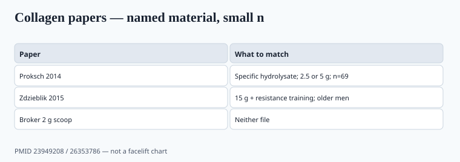

**Disclaimer.** Educational only. Not medical advice. Dietary supplements are not intended to diagnose, treat, cure, or prevent any disease (DSHEA; 21 U.S.C. § 321(ff); 21 CFR 101.93). This is not a treatment for osteoarthritis, wrinkles as disease, or bone pathology. Small industry-linked RCTs are not facelifts.

Collagen powder became a pantry item in the 2020s. The ads promised skin bounce and quiet knees. The literature promised less.

## What you are buying

<!-- graphics-pack:v1 -->

*Figure 1. Named hydrolysate and gram dose — a broker 2 g scoop has neither file.*

Hydrolyzed collagen (peptides) is **gelatin that was cut smaller**. Amino-acid profile is glycine-, proline-, hydroxyproline-heavy. It is **not** a complete protein in the whey/egg sense (low tryptophan). Morton 2018's hypertrophy plateau is about *total* protein quality and dose, not about 10 g of peptides replacing dinner. If the tub is the only protein a buyer adds, they still need the rest of the day's leucine.

Bovine hide, fish skin, eggshell membrane, "vegan collagen" (usually vitamin C + amino acids + marketing — you cannot vegan-extract a triple helix you did not make). Source is an allergen and a religion. It is also a metals and prion-paperwork question for bovine.

Named peptides matter. The papers that get quoted used specific hydrolysates (VERISOL-class, FORTIGEL-class, and cousins). A broker 10 g "collagen peptides" is not automatically that article. Same lesson as ashwagandha extracts (piece 07): the RCT follows the named material, or it does not follow.

Dose in the skin papers is often 2.5–5 g/day. Dose in the training paper below is 15 g. A beauty stick with 2 g of mystery powder has neither file.

## Skin

Proksch, Segger, Degwert, Schunck, Zague, Oesser, *Skin Pharmacology and Physiology* 2014, PMID 23949208: 69 women aged 35–55, 2.5 g or 5 g of a specific collagen hydrolysate vs placebo, 8 weeks, 23 per arm. The authors reported a statistically significant improvement in skin elasticity vs placebo (they describe a mean on the order of 7% relative to placebo at 4 and 8 weeks). Moisture and TEWL did not reach significance in the main analysis. Industry-linked. Modest n. Short.

A second 2014 Proksch paper from overlapping authors looked at wrinkle measures with a related peptide. `[VERIFY]` the wrinkle percent against that paper before a sales deck reprints it. Choi's 2019 *J Drugs Dermatol* review collected oral-collagen skin studies and found a signal on hydration/elasticity in several small trials, with the usual risk-of-bias problems.

This is cosmetic-adjacent structure/function territory if you stay honest ("helps support skin hydration in studied adults taking X g of Y peptide"). It is not a melanoma story and not a facelift. It is not "clinically proven to erase wrinkles" on a 2 g serving of an unnamed powder.

## Joints

Activity-related joint comfort trials exist (specific peptides, athletes or active adults, often 12 weeks). Osteoarthritis treatment is a **disease** claim. Do not put a KL-grade x-ray on the PDP. The file is not a 2,000-person WOMAC megatrial I can name that settled the aisle. `[CITE NEEDED]` for a numeric WOMAC delta on *your* peptide.

Zdzieblik et al., *British Journal of Nutrition* 2015, PMID 26353786, is the paper people steal for "collagen builds muscle." Fifty-three older men with sarcopenia, 15 g collagen peptides vs silica placebo, both groups on a 12-week supervised resistance program. Fat-free mass and quadriceps strength moved more in the collagen arm. It is a training-plus-protein study in older men, not a knee-OA drug trial, and not a beauty scoop. Collagen is still an incomplete protein; Morton still applies to the rest of the day.

## Bones

Collagen is a bone-matrix protein. Eating it does not, by itself, become a bisphosphonate. Calcium/D/protein-plus-training is the adult bone conversation (piece 15, piece 27). König-class papers on bone markers exist and are small. `[CITE NEEDED]` before a BMD percent goes on a carton.

"Prevents osteoporosis" is a disease claim. You will not get it through as a supplement.

## QA that Instagram skipped

- **Hydroxyproline assay** or a peptide-specific method so you did not buy maltodextrin.
- **Heavy metals** — bone and hide concentrates have a lead/cadmium story; fish skin has a mercury question. CR's 2025 protein work (piece 10) is the consumer mood even when they did not test *your* collagen.
- **Glycine dumping** in "protein" blends (piece 06).
- Flavor systems that add sugar enough to make a "wellness" scoop a dessert.
- Allergen SOP for fish vs bovine vs egg. "Vegan collagen" that is vitamin C + amino acids must not imply a hydrolyzed animal peptide.

Prop 65 math is per serving (piece 37). A 20 g scoop concentrates whatever the hide carried.

## The named-peptide rule

Proksch 2014 used a specific hydrolysate at 2.5 or 5 g. Zdzieblik 2015 used 15 g plus supervised lifting in older men. A broker bag labeled "collagen peptides 10 g" is a food ingredient until you can show it is the same article.

Write the source (bovine hide, fish skin), the hydrolysis method, the hydroxyproline spec, and the metals-per-scoop math. If the tub is the buyer's only protein, Morton 2018 still applies to the rest of the day — collagen is incomplete. "Vegan collagen" that is vitamin C plus amino acids must not imply a hydrolyzed triple helix.

Do not put a WOMAC chart on the tub unless the paper used *this* peptide at *this* dose. Osteoarthritis treatment is a disease claim. Skin elasticity percents from n=23-per-arm industry papers are not facelifts.

## What changed since 2020 (box)

Collagen left the beauty counter and sat next to whey. The RCT file grew slowly and stayed small: Proksch-class skin n in the dozens, Zdzieblik-class training n = 53, joint papers still waiting for a WOMAC megatrial. A brand that sells 10–15 g of a named peptide, prints the study that used *that* peptide, and assays hydroxyproline will survive a skeptic. A brand that sells "beauty from within" with 2 g of mystery powder will not survive a lab.
