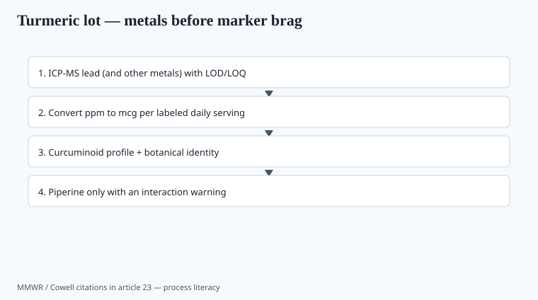

**Disclaimer.** Educational only. Not medical advice. Dietary supplements are not intended to diagnose, treat, cure, or prevent any disease (DSHEA; 21 U.S.C. § 321(ff); 21 CFR 101.93). This is not a treatment guide for arthritis, depression, or cancer.

Turmeric sold through the 2020s as an anti-everything powder. Two facts traveled slower than the ads: curcumin's oral bioavailability is poor unless you change the formula, and **economic adulteration with lead chromate** is a documented way to make ground turmeric look expensive.

## Lead is not a rumor

<!-- graphics-pack:v1 -->

*Figure 1. Process literacy — ICP-MS per serving before a curcumin percent brag.*

Cowell, Ireland, Vorhees, Heiger-Bernays, *Public Health Reports* 2017, PMID 28358991: a US commentary collecting childhood lead-poisoning cases tied to culinary spices, including turmeric, and arguing for intentional adulteration with lead chromate to boost color and weight.

Kappel, Kraushaar, Mehretu, *MMWR* 12 November 2021 (70:1584–1585): Las Vegas, 2019 household investigation. Turmeric from a local market confirmed at **2,000 mg/kg** lead by an NLLAP lab. That is spice in a kitchen, not a rumor on a forum.

Angelon-Gaetz et al., *MMWR* 2018 (67:1290–1294): North Carolina childhood lead investigations, 2011–2018. Among edible items, turmeric was in the high-average group (paper's table: average 66 mg/kg; range 0.1–740). Spices were not the only objects — ceremonial powders ran higher — but turmeric was on the edible list.

FDA has used import alerts on turmeric lots with high lead. ABC's Botanical Adulterants program has a turmeric bulletin for a reason: color and weight are cheap to fake with chrome yellow.

If your COA is a curcumin % HPLC and a "heavy metals: conforms" with no ICP-MS numbers and no LOQ, you bought a color. Finished-product lead **per daily serving**, not just ppm in the powder, is the row that matters for Prop 65 and for children (piece 10, piece 37). A 1,500 mg serving of a 2 ppm powder is a different daily microgram budget than a pinch in a curry.

Lead chromate is a pigment. It makes a dull rhizome look expensive on a stall. Forsyth-class supply-chain work in Bangladesh and India has described that incentive in food turmeric; `[VERIFY]` the specific paper you quote. The US MMWR cases are the downstream kitchen. A supplement capsule made from the same powder is the same metal with a Supplement Facts panel. Import alerts catch lots. They do not catch a broker who blended a clean drum with a dirty one after the alert.

## Curcumin the molecule

Curcuminoids are a fraction of *Curcuma longa* rhizome. Isolated 95% curcumin extracts are not "a teaspoon of kitchen turmeric." Doses in human trials are often grams of extract, not 50 mg fairy dust. Outcomes (joint comfort, "inflammation" markers) are mixed, often industry-linked, often short. Inflammatory-marker changes are not a disease treatment. Do not put rheumatoid x-rays on the PDP.

I will not invent a 2023 megatrial. `[CITE NEEDED]` for a specific WOMAC or CRP number on *your* extract.

Species mix-ups (*Curcuma* vs cheaper cousins) belong on the incoming HPTLC. Marker-only specs are how you buy spiked material (piece 02, piece 07).

## Piperine and "enhanced absorption"

Shoba et al., *Planta Medica* 1998, PMID 9619120: a small human PK study often cited for piperine raising curcumin appearance in plasma. `[VERIFY]` the fold-change against the paper before a sales deck prints "2000%." The number that circulates on Amazon A+ modules is not a reason to skip the interaction file.

Piperine **inhibits drug-metabolizing enzymes**. That is a feature for the curcumin graph and a bug for a buyer on a narrow-therapeutic-index drug. A "better absorbed" claim that hides the interaction is the 2020s version of a footnote nobody reads.

Phytosomes, nanoparticles, "theracurmin" — each is a **different article** with its own PK paper, or it is a word. Do not transfer one branded extract's RCT onto a generic 95% from a broker.

If you add piperine, the warning set is not optional. If you do not add piperine, do not imply you have the Shoba PK.

## Kitchen spice vs SKU

Food turmeric in a curry is a dietary pattern. A 1,500 mg curcuminoid capsule with piperine is a concentrated product. Labels that show a spice photo and a drug-sized dose are doing a bait. Residual solvents on extracts, pesticides on rhizomes, and the lead math above belong on the incoming ID.

A food-spice lot that assays at 2,000 mg/kg lead is a public-health object. A supplement lot that "conforms" without numbers is how that object becomes a capsule.

## What a 2026 turmeric spec actually lists

Plant part (rhizome), species (*Curcuma longa*), solvent, native-extract vs excipient weight, curcuminoid profile (not a single %), HPTLC identity, ICP-MS metals with LOD/LOQ, pesticides, residual solvents if extracted (piece 36). Convert lead to mcg/day at the labeled serving. Compare that number to your internal spec and to Prop 65 (piece 37).

Piperine: yes or no. If yes, the interaction warning is 12-point, not a footnote. If no, do not imply Shoba 1998 PK.

## Finished-product math a buyer can repeat

ppm in the powder is not the number a child eats. Convert: (ppm × grams per serving) = mcg per serving. A 1 g capsule at 2 ppm lead is 2 mcg. Prop 65's reproductive MADL for lead has long been 0.5 mcg/day — `[VERIFY]` the live OEHHA figure. A "conforms to USP" line that never does this multiplication is how a kitchen-spice scandal becomes a capsule scandal.

Ask for ICP-MS, not AAS-only, on a botanical you already know is a chromate risk. Ask for the LOQ. A non-detect above the MADL is not a non-detect you can live with. Split-sample a new supplier to a second 17025 lab once. Piece 16 is the COA read. This piece is why turmeric is the teaching botanical.

## What changed since 2020 (box)

Demand stayed high. Lead stories kept landing because the incentive (color + price) did not die — Las Vegas MMWR 2021 used a 2019 kitchen. A 2026 turmeric SKU that I would ship has ICP-MS metals, a curcuminoid profile (not a single number), no piperine unless the interaction warning is in 12-point type, and no "replaces your NSAID" joke.
