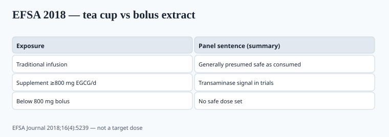

**Disclaimer.** Educational only. Not medical advice. Dietary supplements are not intended to diagnose, treat, cure, or prevent any disease (DSHEA; 21 U.S.C. § 321(ff); 21 CFR 101.93). This is not a weight-loss program and not a treatment for liver disease.

A cup of tea is not a 400 mg EGCG capsule taken fasted. The 2020s "fat burner" and "clean energy" lines kept pretending they were.

## The signal

<!-- graphics-pack:v1 -->

*Figure 1. 800 mg/day is a trial-signal line, not a target dose (EFSA Journal 2018;16(4):5239).*

LiverTox (NCBI Bookshelf, Green Tea chapter, NBK547925): concentrated green tea extracts have been linked to clinically apparent liver injury, usually hepatocellular, often within the first few months, sometimes severe. Causality is messy in multi-ingredient "thermogenics," but single-ingredient cases exist. People with existing liver disease are the wrong customers.

EFSA's 2018 ANS panel (*EFSA Journal* 2018;16(4):5239, PMID 32625874) looked at EGCG from green tea. Catechins from traditional infusions were not the same problem as **high-dose bolus supplements**. Mean EGCG from infusions in EU adults: roughly 90–300 mg/day; high-level consumers estimated up to 866 mg/day. Food supplements in the dossier ranged about 5–1,000 mg EGCG/day.

The panel's operational sentence: intake **at or above 800 mg EGCG/day** as a food supplement was associated with statistically significant increases in serum transaminases in intervention trials, often after four months or longer, in a small percentage of subjects (the opinion says usually less than 10%). They could **not** set a safe supplement dose below that. Rare idiosyncratic injury has been reported even with infusions. The 18 April 2018 EFSA press note is the public version of the same split: tea as a drink vs bolus extract.

USP's botanical experts have published cautionary labeling notes for green tea extract (take with food; stop if liver-trouble symptoms; not for people with liver disease). If you sell the extract and skip that warning, you are behind a pharmacopeia.

800 mg is not a target. It is the trial-signal line EFSA named. A proprietary blend that hides the EGCG milligrams is how a buyer crosses it without knowing.

Oketch-Rabah and USP colleagues have written the US pharmacopeial cautionary-labeling case for green tea extract in the same window. `[VERIFY]` the live USP admission-evaluations language before you freeze a warning. LiverTox's chapter is a clinician's object: latency, pattern, and the messy multi-ingredient "fat burner" that makes causality hard. Your label still has to name EGCG milligrams so a hepatologist can do that work if someone turns yellow.

## What the efficacy file does not do

Green tea catechins have a modest, often-cited effect on energy expenditure and fat oxidation in some small trials. It is not semaglutide (piece 21). It is not a substitute for a calorie deficit. "Detox" and "melts fat" are the sentences that turn a tea into an FTC problem.

Caffeine in the extract is a second active. Decaf extracts still carry EGCG. Assay both if both are present. A "green tea 20:1" line with no EGCG milligram is a ratio (piece 36), not a dose.

## Fasted vs with food

Many case narratives involve concentrated extract taken on an empty stomach. USP-style language says with food. That belongs on the label, not in a "pro tip" Instagram story.

Thermogenic culture loves fasted morning capsules. That is the opposite of the cautionary note.

## QA

- EGCG and total catechin assay, not "green tea 20:1" as a vibe.
- Caffeine number.
- Solvents (piece 36).
- Heavy metals and pesticides (tea leaves accumulate both).
- Multi-herb fat burners: when DILI happens, you will not enjoy the deposition.

Caffeine + EGCG + synephrine-class stimulants in one "thermogenic" is how adverse-event reports get written. Even when each piece has a thin file, the combination does not have a trial. Proprietary blends hide the EGCG milligrams from the person who should stop if they turn yellow.

I would rather sell bagged tea and a nutrition label than a 50-ingredient burner with 300 mg EGCG hiding in a proprietary blend.

If you stay in the extract business: print the EGCG milligrams, print the with-food line, print the stop-if-jaundice line, and stay under the dose you can defend — knowing EFSA did not hand you a green light below 800.

## How a label should talk about a tea that is not a cup

Print the EGCG milligrams. Print caffeine if it is there. Print "take with food." Print "stop and seek care if you notice yellowing of skin or eyes, dark urine, or unusual fatigue" — that is USP-style cautionary language, not a disease claim. Print "not for use in liver disease" as a warning, not as a targeting strategy.

A proprietary "thermogenic blend 800 mg" that does not break out EGCG is how a buyer crosses EFSA's 800 mg/day trial-signal line without knowing. 800 was never a target. The 2018 panel could not set a safe supplement dose below it. Rare idiosyncratic injury exists even with infusions.

If you cannot print those lines, sell bagged tea. If you print "melts fat" next to them, FTC 2022 reads the net impression and the warning does not save the headline (piece 12).

## What changed since 2020 (box)

The liver file was already there in 2018–2019. The 2020s added more thermogenic SKUs and more social copy. NAMS-style honesty (piece 15) has not reached this aisle. Put the warning on before a retailer or a plaintiff's firm writes it for you.

A retailer that asks for your cautionary-label file in 2026 is doing what FDA and USP already signaled in 2018. Have the EGCG milligrams, the with-food line, and the stop-if-jaundice line in the MMR before the buyer asks — not after the first adverse-event report.
