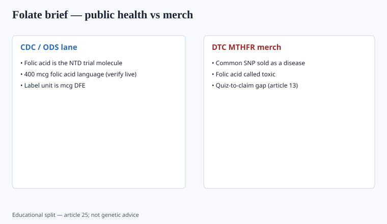

**Disclaimer.** Educational only. Not medical advice. Dietary supplements are not intended to diagnose, treat, cure, or prevent any disease (DSHEA; 21 U.S.C. § 321(ff); 21 CFR 101.93). This is not prenatal care and not genetic counseling.

Public-health folate is a folic-acid story. The internet's folate is a **MTHFR** story. Those are not the same brief.

## What CDC and ODS still say

<!-- graphics-pack:v1 -->

*Figure 1. Educational split — not genetic counseling.*

Folate is a B vitamin. Deficiency is a real hematologic and, in pregnancy, a neural-tube problem. The US fortification program and CDC's recommendation for people who can become pregnant use **folic acid** at a stated daily amount. CDC's current page has long said **400 mcg folic acid** daily, plus more in some clinical settings. `[VERIFY]` the live mg/mcg number when you freeze copy.

Food folate and folic acid have different dietary folate equivalents. 21 CFR 101.9 / 101.36 use **mcg DFE** on the label now. Get the unit right (piece 35). A prenatal that prints "800 mcg" without DFE is a 2014 label.

ODS professional fact sheet is the ballast: UL for **folic acid** (not food folate) exists because high supplemental folic acid can mask B12 deficiency. That UL is why a 5-MTHF "because more is more" prenatal is not automatically safer — you still have to think about B12.

The neural-tube trials and the fortification program used folic acid. That is the molecule with the public-health file. Brands that call folic acid "toxic" are arguing with CDC, not with a blog.

Crider-class CDC genetics work has been used for years to say that MTHFR variants do not cancel the folic-acid recommendation. `[VERIFY]` the live CDC page if you quote a specific sentence. A 2020s Shopify ad that treats C677T as a diagnosis is doing the opposite of that public-health file. Piece 13 is the quiz. This piece is the vitamin.

## The SNP that ate the category

MTHFR C677T and A1298C are common. They change enzyme kinetics. They do **not**, for most heterozygous buyers, create a requirement to buy 5-methyltetrahydrofolate from a Shopify brand. Medical-genetics sources do not treat garden-variety MTHFR as a disease that a capsule treats. CDC's folic-acid materials have addressed the variant question in plain language: people with MTHFR variants can still process folic acid; the agency did not switch the NTD campaign to 5-MTHF. `[VERIFY]` the live CDC wording if you quote it.

FTC 2022 will read "your 23andMe says you can't process folic acid, therefore our methylfolate prevents [disease]" as a health claim with a genetic hook. Piece 13 covers the quiz problem.

Some clinicians do prefer 5-MTHF in specific cases. That is a clinic. It is not a Facebook ad with a DNA helix.

Homocysteine talk is a lab conversation. "Lowers homocysteine, therefore prevents heart disease / dementia" is a disease claim the 1990s already over-promised.

## Forms

- **Folic acid** — the fortification molecule, the trial molecule for NTD prevention.
- **5-MTHF (methylfolate)** — the circulating form; more expensive; used in some psych and prenatal SKUs.
- **Folinic acid** — another clinical form, not a wellness default.

Do not say "folic acid is toxic." Do not say "methylfolate is the only kind humans use." Both sentences show up in 2020s copy. Both are wrong as written.

Assay the form you printed. A "methylated B complex" that lists 5-MTHF and assays as folic acid is a COA problem, not a branding problem.

## Prenatal lane

A prenatal is one of the few supplement SKUs with a public-health reason to exist. Iron, iodine, D, choline (the last one got more attention after 2020 in professional guidelines — `[VERIFY]` ACOG/ODS current choline language), folic acid at the CDC dose. "Methylated everything, no folic acid, because MTHFR" is a branding choice that may fight the fortification evidence. Counsel + a clinician advisor, not a TikTok midwife.

If you offer both a folic-acid prenatal and a 5-MTHF prenatal, say why without insulting the CDC molecule. Print mcg DFE. Print the UL logic for supplemental folate. Do not put a neural-tube photo on a DTC page as if the capsule were a procedure.

## How a prenatal label gets the units wrong

mcg DFE is the panel unit. Folic acid, when used, is listed separately. A "800 mcg methylfolate" line that ignores DFE math is a 2014 label (piece 35). The UL conversation is about supplemental folic acid masking B12 deficiency, not about food folate.

If you drop folic acid because of a Shopify MTHFR story, you are arguing with the fortification molecule. Say so in the science folder. Do not say "folic acid is toxic" on a carton. Do not put a neural-tube photo on a DTC page as if the capsule were a procedure.

Choline, iodine, iron, and D are the other prenatal nouns that got louder after 2020. `[VERIFY]` ACOG/ODS current choline language. Iron belongs in a prenatal and does not belong in a 65+ "women's" multi (piece 26). Those two SKUs should not share art.

## What a 23andMe screenshot is not

A common MTHFR variant is not a diagnosis, not a reason to call folic acid toxic, and not a license to put a neural-tube photo on a Shopify page. CDC's folic-acid materials have addressed the variant question in plain language: people with MTHFR variants can still process folic acid. `[VERIFY]` the live wording if you quote it.

FTC 2022 plus the 2023 endorsement guides (piece 13, piece 31) will read a DNA-helix ad as a health claim with a genetic hook. The substantiation file is the fortification trials and the CDC dose — folic acid — unless you are in a clinic arguing a specific exception.

Assay the form you printed. A "methylated prenatal" that lists 5-MTHF and assays as folic acid is a COA problem. mcg DFE on the panel (piece 35). B12 in the same formula, because the UL conversation is about masking deficiency, not about winning a Reddit argument.

## What changed since 2020 (box)

DTC genetics got cheaper. Methylfolate SKUs multiplied. CDC did not switch the NTD campaign to 5-MTHF. A serious prenatal still starts from ODS/CDC and then argues exceptions, not the other way around.
