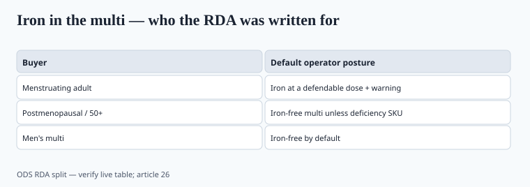

**Disclaimer.** Educational only. Not medical advice. Dietary supplements are not intended to diagnose, treat, cure, or prevent any disease (DSHEA; 21 U.S.C. § 321(ff); 21 CFR 101.93). Iron deficiency and hemochromatosis are clinical diagnoses. This is not a treatment protocol.

Iron is the mineral that justifies a blood test and ruins a gummy. The 2020s "women's multi" still often ships **18 mg** to everyone with a double-X karyotype, including people 20 years past menopause.

## ODS numbers, used as numbers

RDA for iron is **higher** in menstruating adults than in men and in postmenopausal women. ODS's live table has long used **18 mg/day** for menstruating women 19–50 and **8 mg/day** for adult men and for women 51+. UL is **45 mg/day** from all sources for adults. `[VERIFY]` the live ODS table when you freeze a label.

Accidental pediatric iron overdose is an old, ugly toxicology story — child-resistant closures exist because of this mineral more than because of vitamin C. Piece 34 is the candy problem. This piece is the adult catalog problem.

A 65-year-old on an "adult women" 18 mg tablet is not "being safe." She may be stacking iron on a high-meat diet with no menstrual losses. Hereditary hemochromatosis is not rare enough to ignore in copy — northern-European HFE homozygosity is often cited around 1 in 200–300; `[VERIFY]` the prevalence sentence if you print it. "Not for use in men or postmenopausal women unless a clinician says so" is a legitimate label sentence on a standalone iron.

Ferritin TikTok made everyone an amateur hematologist. A low-feeling Tuesday is not a CBC. Do not target undiagnosed fatigue as if you ran the lab.

## Forms

Ferrous sulfate works and wrecks stomachs. Ferrous fumarate, gluconate, and **bisglycinate** are the usual rotation. Bisglycinate has a human file for better GI tolerance vs sulfate in some trials. `[CITE NEEDED]` if you want a specific dropout-rate delta. Elemental iron is the panel number, not "50 mg ferrous something." Do the percent-elemental math (sulfate is about 20% elemental; the label lies if you print salt weight as iron).

Food-form "carbonyl" and polysaccharide complexes: ask for the elemental assay and a reason.

Gummies are a poor iron matrix and a worse pediatric object. If a kids' line includes iron, you have a critical-error SKU, not a flavor extension.

## The all-ages multi

<!-- graphics-pack:v1 -->

*Figure 1. ODS RDA split as operator posture — verify the live table.*

Piece 15 already said age-split formulas are not a gimmick. Here is the operator version:

- Premenopausal multi: iron at a dose you can defend, plus a warning.
- 50+ / postmenopausal multi: **iron-free** unless the SKU is clearly a deficiency product.
- Men's multi: iron-free by default.
- Prenatal: iron is expected; constipation is expected; bisglycinate is a tolerance conversation.

Assay iron. It is cheap to underfill. It is also how you fail a pediatric critical-error check if a gummy looks like candy (piece 34).

COSMOS-class older-adult multis (piece 18) are a reminder that the 2020s outcome trials were not "18 mg iron for everyone" trials. Match the bottle to the buyer.

A standalone iron SKU is easier to defend than a kitchen-sink multi. Print elemental milligrams. Print a "talk to a clinician / get a lab" line. Print the pediatric overdose warning even on an adult bottle — kids get into adult bottles. Bisglycinate vs sulfate is a tolerance conversation you can have without pretending one salt treats anemia and the other does not.

If the CMO's "women's 50+" formula still carries 18 mg because the 1990s art file said so, that is a formula change, not a font change. The MMR, the COA spec, and the carton all have to move together (piece 35, piece 37).

## Claims

"Treats anemia" is a disease claim. "Helps replenish iron when dietary intake is low" is the structure/function neighborhood — still take it to counsel, and do not target people with undiagnosed fatigue as if you ran a CBC.

"Women's formula" is not a clinical indication. It is a merchandising noun that has been wrong for half the age curve since the RDA split existed.

## Elemental math on the panel

Ferrous sulfate is about 20% elemental iron. A "50 mg ferrous sulfate" capsule that prints 50 mg iron is a lie. Bisglycinate, fumarate, gluconate — same rule: panel = elemental. The COA assay unit must match (piece 35).

Child-resistant closure on any iron SKU. Pediatric overdose is why the closure exists. Gummies that look like candy and contain iron are a critical-error line (piece 34). Many kids' gummies omit iron for that reason; if yours includes it, you need a dose a poison-control card can understand.

Hemochromatosis copy: "not for men or postmenopausal women unless a clinician says so" is a legitimate standalone-iron sentence. "Women's formula" is not a CBC.

## What changed since 2020 (box)

Ferritin TikTok made everyone an amateur hematologist. That is not a reason to put 18 mg in the 60+ bottle. It is a reason to sell a **standalone iron** with a "get a lab" line and an iron-free multi for everyone else.
