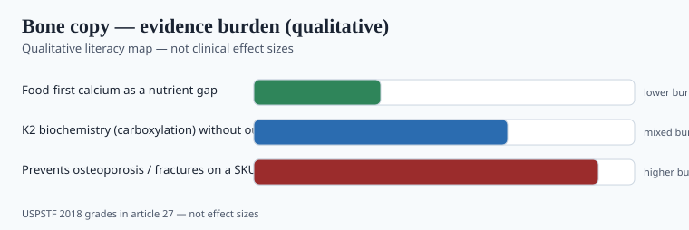

**Disclaimer.** Educational only. Not medical advice. Dietary supplements are not intended to diagnose, treat, cure, or prevent any disease (DSHEA; 21 U.S.C. § 321(ff); 21 CFR 101.93). This is not a treatment for osteoporosis.

Calcium is a nutrient with an RDA, a UL, and a political history. Vitamin K2 (menaquinone, often MK-7) is the 2020s add-on that promised to "put calcium in the bone, not the artery." That sentence is a cardiology claim in yoga pants.

## Calcium the mineral

<!-- graphics-pack:v1 -->

*Figure 1. Qualitative map — USPSTF grades stay in the body text; no fracture effect sizes.*

ODS: RDA in the 1,000–1,200 mg/day range for many adults, food first. UL exists (kidney stones, and the CVD argument around high-dose *supplements*). `[VERIFY]` live numbers. Carbonate needs a meal; citrate is the achlorhydria / PPI conversation. Elemental calcium is the panel, not calcium carbonate gram weight.

USPSTF 2018 (*JAMA* 2018;320:1402–1412): **against** daily supplementation with **400 IU or less of vitamin D and 1,000 mg or less of calcium** for primary fracture prevention in community-dwelling postmenopausal women (**D**). **I** statements for higher doses in that group, and for men and premenopausal women. The recommendation does **not** apply to people with osteoporosis, prior osteoporotic fracture, or vitamin D deficiency. Stones were in the harm column.

December 2024: USPSTF posted a **draft** update that is harsher — recommending against vitamin D with or without calcium for primary fracture prevention in community-dwelling postmenopausal women and men 60+, and against vitamin D for fall prevention in that group. Draft is not final. `[VERIFY]` the live grade before you write "prevents fractures" next to a 600 mg tablet.

VITAL was not a calcium trial (piece 04). "Prevents osteoporosis" is a **disease claim**. You will not get it through FDA as a supplement.

Food-first calcium is still a nutrient conversation. High-dose supplement calcium as a fracture drug is the conversation USPSTF keeps declining.

## K2

Vitamin K is required for carboxylation of osteocalcin and matrix Gla protein. That biochemistry is real. The jump to "MK-7 reverses arterial stiffness / prevents heart disease / treats osteoporosis" is the 2020s leap. Human MK-7 trials on vascular and bone endpoints are smaller than the Instagram graphs. `[CITE NEEDED]` for any pulse-wave-velocity number.

K1 (phylloquinone) is the leafy-green molecule and the one in many clotting conversations. K2 MK-4 and MK-7 are different doses and different half-lives. Japanese MK-4 osteoporosis *drug* doses are not a 90 mcg MK-7 softgel. Do not import a prescription-dose Japanese trial onto a US supplement.

**Warfarin and other VKAs:** vitamin K is not a casual add-on. If you sell K2, the interaction warning is not optional. DOACs are a different conversation; still a clinician.

Natto is a food. A 90 mcg MK-7 capsule is a concentrated article. Do not put a CT angiogram on either.

## The "calcium + K2 + D3" brick

Three nutrients, three files, one proprietary blend. D3 has VITAL (piece 04). Calcium has USPSTF caution. K2 has biochemistry plus thin outcomes. Stacking them does not multiply the evidence. It multiplies the assay list and the warfarin phone call.

If you sell the brick: print elemental calcium, print D in mcg (piece 35), print the K form and micrograms, print the VKA warning, and do not promise a DEXA.

Knapen-class MK-7 papers on arterial stiffness and bone markers exist and are smaller than the Instagram graphs. `[CITE NEEDED]` before a pulse-wave or BMD percent. WHI calcium/D is the older megatrial people still argue about — stones, a CVD debate, and a population that is not your 90 mcg MK-7 softgel. Do not average WHI, VITAL, and a 24-person MK-7 pilot into one "clinically proven bone bundle."

Carbonate vs citrate is a meal and acid conversation. A 600 mg elemental serving split across the day is a different GI object than 1,200 mg at bedtime. Assay elemental calcium. A "calcium complex 1,000 mg" that is mostly carbonate salt weight is the iron-salt trick with a new noun (piece 26).

## Stones, WHI, and what USPSTF did not bless

The 2018 D recommendation was specific: ≤400 IU D plus ≤1,000 mg calcium, community-dwelling postmenopausal women, primary fracture prevention. It was not "calcium is useless," and it was not a license to print "prevents osteoporosis." The I statements covered higher doses and other sexes; the 2024 draft, if it finalizes as written, is harsher. `[VERIFY]` the live grade. USPSTF put kidney stones in the harm column in 2018.

WHI calcium/D is the older megatrial people still argue about — stones, a CVD debate, a population that is not your 90 mcg MK-7 softgel. Do not average WHI, VITAL, and a 24-person MK-7 pilot into one "clinically proven bone bundle." K2 does not rescue a disease claim: carboxylation biochemistry is real, but a 90 mcg MK-7 softgel is not Japanese MK-4 drug doses and not a CT-angiogram product.

Carbonate vs citrate is a meal and acid conversation (PPI, achlorhydria). Split elemental calcium across the day if GI tolerance is the brief. Assay elemental, not salt weight — the iron-salt trick with a new noun (piece 26). Warfarin/VKA warning is not optional; DOACs are still a clinician. If you cannot print that warning, do not sell K2.

## What changed since 2020 (box)

K2 left the naturopathic catalog and sat in every "bone bundle." The RCT file did not become VITAL. USPSTF 2018 stayed the US preventive-statement to beat, with a 2024 draft that is not kinder. Sell calcium as a gap-filler for people who do not eat dairy, with elemental math and a stone/CVD-honesty paragraph. Sell K2 only if you can say the biochemistry without promising a CT angiogram.
