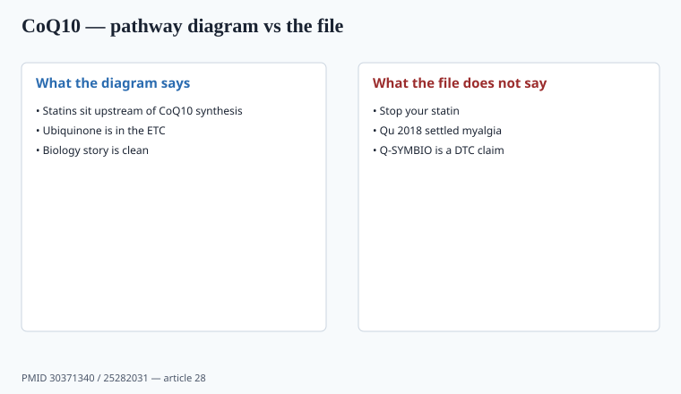

**Disclaimer.** Educational only. Not medical advice. Dietary supplements are not intended to diagnose, treat, cure, or prevent any disease (DSHEA; 21 U.S.C. § 321(ff); 21 CFR 101.93). This is not advice to start or stop a statin.

Coenzyme Q10 is in the electron-transport chain. Statins inhibit HMG-CoA reductase, which sits upstream of CoQ10 synthesis. That diagram launched a thousand SKUs. The diagram is not a trial.

## What people buy

**Ubiquinone** (oxidized) and **ubiquinol** (reduced). Ubiquinol costs more and is sold as "the form your body uses." Plasma numbers can differ; outcome differences in heart-failure or myalgia trials are not a settled ubiquinol-wins literature I will fake. `[CITE NEEDED]` before "3× better" on a carton. Both need a fat-containing meal or an oil softgel if you care about appearance in blood.

Assay is HPLC. Softgels oxidize. A 2-year warehouse ubiquinol story needs stability data, not a purple capsule.

Dose in the myalgia trials is usually not 30 mg. If you sell 50 mg to hit a price point, you do not have those trials. 100–300 mg is the band that shows up in the papers people quote. That is not a reason to print a myalgia claim.

Stability is the quiet QA problem. Ubiquinol in a clear bottle on a warm 3PL dock (piece 11, piece 37) is how you sell a different molecule than the one on the COA. Nitrogen flush, opaque pack-out, a retain HPLC at expiry — or sell ubiquinone and stop paying for a purple story you cannot keep.

## Statin-associated muscle symptoms

<!-- graphics-pack:v1 -->

*Figure 1. Diagram is not a trial — Qu 2018 did not become a guideline.*

The biology story is clean. The RCTs are not.

Qu, Guo, Chai, Wang, Gao, Shi, *Journal of the American Heart Association* 2018, PMID 30371340: 12 RCTs, 575 patients (294 CoQ10, 281 placebo). The authors reported improvements in symptom scores (pain, weakness, cramp, tiredness) and **no** reduction in plasma CK. Small trials, mixed methods, symptom scales that are easy to over-read. Earlier metas (Banach-class) were more null. Lipid societies have not written CoQ10 into the statin algorithm as a required add-on.

A 2022-era systematic review you put on a PDP needs a PMID and a risk-of-bias paragraph. I will not treat Qu's WMDs as a carton number. The honest operator sentence: **inconsistent human file, no CK signal in the 2018 pool, not a reason to stop a statin.**

Young, Caso, Bookstaver, Fedacko — the named RCTs inside those metas disagree with each other on pain scales and on whether people could stay on the statin. That disagreement is the file. A Shopify page that picks the one positive 30-day study and hides the null 12-week study is FTC 2022 net impression (piece 12, piece 31).

AHA/ACC lipid guidance still treats statins as the cardiovascular intervention. A supplement page that says "so you can stop your statin" is a drug claim and a clinical disaster. The allowed conversation is: some people discuss CoQ10 with the clinician who prescribed the statin; the evidence for muscle relief is inconsistent; do not stop the drug.

## Heart-failure and "mitochondrial" copy

Q-SYMBIO (Mortensen et al., *JACC: Heart Failure* 2014, PMID 25282031) is the paper founders want. Heart failure is a **disease**. Do not go there on a DTC page. "Supports cellular energy metabolism" is the most I would even walk toward counsel, and I would still expect a no.

Sports "mitochondria" copy is the same diagram with a barbell. ISSN-shaped books already have creatine (piece 06); CoQ10 does not replace it.

## Other files people steal

Migraine and male-fertility papers exist in the CoQ10 pile. They are **disease or clinic** files. A DTC page that leads with ejection fraction or a sperm-count chart is asking for a letter.

If a clinician uses CoQ10 in a named condition, that is a clinic. If a brand uses Q-SYMBIO as a Shopify hero, that is a letter.

## Softgel QA and what lipid societies did not write

HPLC assay, oil vehicle, opaque pack-out, nitrogen if you paid for ubiquinol, retain at expiry. A purple capsule after a July 3PL ride (piece 37) is a different article than the COA. Print the form (ubiquinone vs ubiquinol) and the milligrams. Do not print "so you can stay off your statin."

AHA/ACC cholesterol guidance still treats the statin as the intervention. CoQ10 is not in that algorithm as a required add-on. Banach-class earlier metas were more null than Qu 2018; the named RCTs inside those pools (Young, Caso, Bookstaver, Fedacko) disagree on pain scales and on whether people could stay on the drug. That disagreement *is* the file — not a carton WMD. A Shopify page that picks the one positive 30-day study and hides the null 12-week study is FTC 2022 net impression. Q-SYMBIO (Mortensen 2014, PMID 25282031) is a heart-failure trial; heart failure is a disease. Do not go there on a DTC page. Thirty milligrams does not inherit 200 mg myalgia papers; 200 mg does not inherit Q-SYMBIO.

## What changed since 2020 (box)

Statins did not get less common. Ubiquinol marketing got louder. Qu 2018 is still the meta people cite; it did not become a guideline. A 200 mg assayed ubiquinone softgel with a boring label is the adult SKU. A "statin rescue" bundle is the letter.

If the buyer's cardiologist did not mention CoQ10, your PDP should not imply they should have. "Ask your prescriber" is a real sentence. "Fix your statin side effects" is not. Piece 12 is the claims file; this piece is the evidence file behind it.
