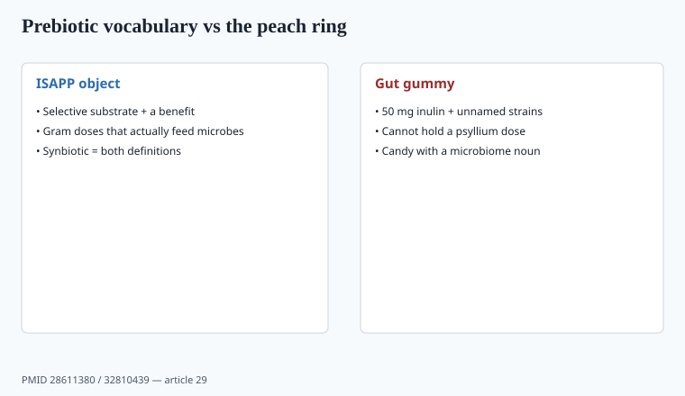

**Disclaimer.** Educational only. Not medical advice. Dietary supplements are not intended to diagnose, treat, cure, or prevent any disease (DSHEA; 21 U.S.C. § 321(ff); 21 CFR 101.93). This is not a treatment for constipation, IBD, or cholesterol as disease.

ISAPP defined a **prebiotic** in 2017 (Gibson et al., PMID 28611380): a substrate that is selectively utilized by host microorganisms conferring a health benefit. That is a higher bar than "contains inulin." A **synbiotic** (Swanson et al., 2020, PMID 32810439) is a mixture of live microbes and substrate(s) that meet the definitions — complementary or synergistic, not "we dumped powder B into powder A." Salminen et al. 2021 (PMID 33948025) then gave **postbiotic** a consensus definition. Three nouns. Retail used all three on 50 mg blends.

## Fiber law vs Instagram

FDA's nutrition-label rules decide which isolated fibers may be declared as dietary fiber (a list that moved in the late 2010s–2020s: some fibers needed a citizen petition showing a physiologic benefit). `[VERIFY]` the current FDA fiber list before you print "5 g fiber" on an isolated-inulin gummy. Inulin, FOS, GOS, and several resistant starches have had to earn the word. Psyllium husk is the old, boring one that already had a **health-claim** path for soluble fiber and coronary heart disease *as a food claim with specific wording and dose* — that is 21 CFR 101.81 territory, not a TikTok "gut reset." If you use that claim, use the **exact** regulatory sentence and the qualifying amount. Most supplement PDPs that say "heart healthy fiber" are not doing that.

Psyllium also gels. People choke on dry powder. A warning to mix with a full glass of water is not optional. Drug interactions (it can bind other orals) belong in the file.

A health claim under 101.81 is not a structure/function you can paraphrase. It is a regulated sentence plus a dose. If you cannot print the sentence, you do not have the claim.

## Inulin, FOS, GOS, resistant starch

These can increase gas and bloating at doses that actually feed microbes (often several grams, not 200 mg). A "prebiotic blend 50 mg" is a label, not an ISAPP object. Human endpoints, when they exist, are stool frequency, breath hydrogen, or a specific bifidobacteria rise — not "cures IBS." AGA 2020 (piece 05) did not make inulin a DTC disease product.

Selectivity is the word ISAPP spent ink on. A fiber that feeds everything is not thereby a prebiotic. A strain plus a substrate is not a synbiotic unless both sides of the definition hold.

If you pair a named probiotic strain with a named gram-dose of GOS because a paper used that pair, you have a complementary-synbiotic conversation. If you pair "15 strains" with 50 mg inulin, you have a peach ring.

## The gummy problem

<!-- graphics-pack:v1 -->

*Figure 1. Vocabulary from Gibson 2017 / Swanson 2020 — not a 50 mg peach ring.*

A gummy cannot hold a therapeutic psyllium dose without becoming a brick. "Gut gummies" are usually a fairy-dust probiotic (no strain ID) plus a fairy-dust inulin plus sugar. That SKU is candy. Sell a powder with a gram dose or do not use the word fiber.

Sugar alcohols in a "gut + hydration" stack will write their own reviews (piece 39). That is formulation, not a detour.

Piece 05 is the live-microbe half of this aisle. This piece is the substrate half. Neither half is a 50 mg blend.

Psyllium QA is identity plus swell. Incoming husk that was cut with cheaper fiber, or with sand, is an old adulteration story. Assay the fiber you declared. A choke warning on the label is not optional; dry powder in a throat is a case report waiting for a lawyer. If you use 21 CFR 101.81, you also inherit the qualifying amount and the exact sentence. Paraphrase is how you leave the health-claim path and enter FTC's net-impression path with a weaker file.

## 21 CFR 101.81 is a sentence, not a vibe

If you want the soluble-fiber-and-CHD claim, you print the **exact** regulatory sentence and you hit the qualifying amount. Paraphrase ("heart healthy fiber") is how you leave that path. Most gummy PDPs are not on that path.

ISAPP's 2017 prebiotic definition requires selective use plus a benefit. A 50 mg inulin dusting is neither. Synbiotic (2020) requires both sides. Postbiotic (2021) is a third noun. Retail used all three on peach rings.

Psyllium: mix with a full glass of water. Binding of other orals belongs in the file. Identity plus swell. A choke case is a lawyer. Sell a canister with grams or do not use the word fiber.

## What changed since 2020 (box)

ISAPP's synbiotic consensus (2020) and postbiotic consensus (2021) gave serious formulators a vocabulary. Retail used the vocabulary on 50 mg blends. FDA's fiber-declaration list kept lawyers employed. The adult product is still a canister of psyllium or a measured inulin with a gas warning, not a peach ring.
