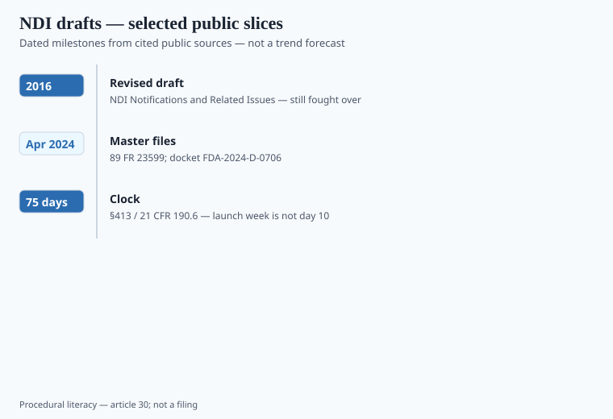

**Disclaimer.** Educational only. Not medical advice. Dietary supplements are not intended to diagnose, treat, cure, or prevent any disease (DSHEA; 21 U.S.C. § 321(ff); 21 CFR 101.93). This is not legal advice and not an NDIN.

A new dietary ingredient is not a vibe. Section 413 (21 U.S.C. § 350b): if the ingredient was not marketed in the US before 15 October 1994, and it is not present in the food supply as an article used for food without chemical alteration, you notify FDA **at least 75 days** before you introduce the supplement. 21 CFR 190.6 is the procedural rule. No notification, when one is required, is an adulteration theory.

## The draft that ate a decade

<!-- graphics-pack:v1 -->

*Figure 1. Procedural dates — filing is not a safety finding.*

FDA's 2011 draft, then the **2016 revised draft** "NDI Notifications and Related Issues," is still the document people fight about: what counts as an NDI, when a notification is required, what safety package to send. Industry hated pieces of it (old botanicals, synthetic copies of food constituents, "chemically altered"). FDA has been slicing the draft into parts.

**3 April 2024:** FDA announced draft guidance *New Dietary Ingredient Notification Master Files for Dietary Supplements*. **4 April 2024:** Federal Register 89 FR 23599, docket FDA-2024-D-0706. Comments were due 3 June 2024. The draft expands and **replaces** the master-file chunk of the 2016 document. Master files are voluntary. They let a manufacturer authorize others to reference identity, manufacturing, or safety data. They do not waive the 75-day clock. `[VERIFY]` which sections of the 2016 draft are live drafts on the day you file.

Filing is procedural. FDA's NMN ack letters in 2022 said that out loud: acceptance for filing is not a safety finding. Then FDA sent exclusion letters on the drug-preclusion clause (piece 08). An NDIN that is "filed" can still die on a different statute.

The 75 days are calendar days before introduction. Launch week is not day 10. Marketing cannot override the clock.

FDA has also finalized slices of the 2016 draft on notification procedures and timeframes — industry trade press covered a 2024 procedures final. `[VERIFY]` the live guidance index on the day you file; this pack should not be your docket. A master file you cannot produce the authorization letter for is not a master file. A supplier who says "we filed" and sends a screenshot of an acknowledgment is sending you the 2022 NMN lesson: acknowledgment is not a finding.

## What founders get wrong

1. **"Amazon has 40 listings."** Commerce is not 1994 marketing evidence.
2. **"Self-affirmed GRAS, so no NDIN."** FDA has not treated GRAS as a free pass for the NDI duty in the way founders hope. NMN commentary after the 2025 letters was explicit that GRAS is not a substitute. Counsel, not a tweet.
3. **"My supplier filed, so I am done."** Maybe, if you are really selling *that* manufacturer's article. A second plant is a second story. A master-file authorization is paperwork, not a vibe.
4. **"It's just a vitamin."** New *forms* and new synthetic routes can still be NDIs. The 2016 draft's examples are why people hire regulatory shops.
5. **75 days means 75 days.**

Identity of the article is the first page: CAS, spec, impurity profile, particle size if it matters, residual solvents if it was synthesized. A safety package that matches **expected intake**, not a mouse LD50, is the second page. A notification that describes a 50 mg serving and a label that says 500 mg is a different article.

## How this sits next to NAC and NMN

NAC: exclusion + discretion (piece 17). NMN: exclusion then 2025 reinterpretation, **NDI still on the table** (piece 08). CBD: never cleared the definition (piece 14). Three ingredients, three gates. A white-label book that adds a "longevity" molecule because a competitor did is how you buy a 413 problem.

Urolithin A, next year's postbiotic isolate, a new synthetic "bioidentical" — same folder. The 2020s catalog is full of molecules that feel like food and file like NDIs.

## A practical folder

- Dated evidence of pre-1994 marketing, or a food-article theory, or an NDIN you can show.
- Identity of the article (CAS, spec, impurity profile).
- Safety package that matches **expected intake**, not a mouse LD50.
- A 75-day calendar that marketing cannot override.
- If you are referencing a 2024-style master file: the authorization letter, not a screenshot of someone else's NDIN number.

## Identity of the article

CAS, spec, impurity profile, particle size if it matters, residual solvents if synthesized, expected intake — not a mouse LD50. A notification that describes 50 mg and a label that says 500 mg is a different article. A second plant is a second story. A master-file authorization is a letter, not a Slack screenshot.

Amazon listings are not 1994 marketing evidence. Self-affirmed GRAS is not an NDIN. NMN's 2022 ack-then-exclusion and 2025 reinterpretation are the teaching case (piece 08). NAC is exclusion plus discretion (piece 17). CBD never cleared the definition (piece 14). File them in three folders.

## Filing is not a finding — the NMN teaching case

Kingdomway-class NDIN acknowledgments in 2022 were procedural. FDA then sent exclusion letters on §201(ff)(3)(B). September 2025 petition answers reinterpreted marketing history. None of that is a safety finding, and none of it is an NDIN you can skip (piece 08). NAC is still exclusion plus discretion (piece 17). CBD never cleared the definition (piece 14). Three ingredients, three folders.

A 2024 master file (89 FR 23599, docket FDA-2024-D-0706) is voluntary. It lets a manufacturer authorize others to reference identity, manufacturing, or safety data. It does not waive 75 days. An authorization letter you cannot produce is not a master file.

Amazon listings are not 1994 marketing evidence. Self-affirmed GRAS is not an NDIN. A second plant is a second article. Launch week is not day 10.

## What changed since 2020 (box)

More synthetic "bioidentical" molecules (NMN, urolithin, next year's thing) ran into 413 and 201(ff)(3) at the same time. The 2016 draft did not become a clean final. The April 2024 master-file draft is a slice. Treat NDIN as a live control, not a historical exam question.
