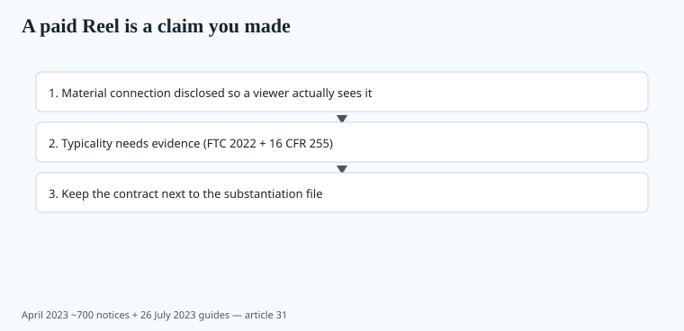

**Disclaimer.** Educational only. Not medical advice. Dietary supplements are not intended to diagnose, treat, cure, or prevent any disease (DSHEA; 21 U.S.C. § 321(ff); 21 CFR 101.93). This is not legal advice.

FDA reads intended use. FTC reads the ad. In 2023 FTC updated the **Endorsement Guides** and mailed a stack of penalty-offense notices that should have reached every supplement marketer's counsel.

## 26 July 2023

Federal Register 88 FR 48092 (document 2023-14795): revised Guides Concerning the Use of Endorsements and Testimonials (16 CFR 255). The review started with a 2020 request for comments (pandemic-extended), a 2022 proposal, then the 2023 adoption. The revisions tighten what "clear and conspicuous" means in a platform where the disclosure is a gray 7-pixel "#ad" at the end of a 40-second Reel. Material connections (payment, free product, employee) still have to be disclosed. Fake reviews and bought stars are not a gray area.

A testimonial that implies a typical result needs substantiation for that typicality. "I lost 20 pounds on berberine" is the claim *you* made if you paid for it or posted it (piece 21).

"Clear and conspicuous" is a viewer test, not a hashtag test. A disclosure that a reasonable person misses on a phone is not a disclosure. Superimposed text that lasts one second on a 4K story is the example the guides were updated to catch.

Employee posts and founder "what I take this morning" videos are endorsements when the connection would matter to a buyer. So is an athlete who "just loves the brand" and has a contract in a drawer.

## April 2023: ~700 notices

On 13 April 2023 FTC announced it had warned **almost 700** companies that they could face civil penalties if they could not back product claims. The notices restated: reasonable basis for objective claims; competent and reliable scientific evidence for health/safety; **at least one well-controlled clinical trial** if you claim to cure, mitigate, or treat a **disease**. They attached the endorsement penalty-offense notice and pointed at the December 2022 *Health Products Compliance Guidance*.

That last sentence is the 2020s stack: 2022 health-product guide + 2023 endorsement guides + penalty-offense mail. A founder who only read DSHEA is under-read.

Penalty-offense authority is how FTC talks about civil penalties without inventing a new statute for each Reel. The mail was the warning. The next step is the case.

## What counts as your ad

<!-- graphics-pack:v1 -->

*Figure 1. 16 CFR 255 + April 2023 notices — the speaker is part of the ad.*

- Affiliate YouTube with a unique code.
- Founder's podcast "what I take."
- Athlete Instagram, even if they "just love the brand."
- Amazon Vine-style reviews you induced without disclosure.
- Customer photos you boost.
- A "day in the life" that happens to open a bottle you sent.

If you cannot show the same human evidence you would need on the PDP, do not buy the Reel. A "results not typical" mouse type does not always save a net impression (FTC 2022).

CGM screenshots, waist tape, and "I quit my GLP-1" are claims. Sleep-through-the-night videos of a child are claims (piece 19, piece 34). "Replaced my statin" is a claim (piece 28).

## Process

Write influencer briefs as **claim lists**, not "be authentic." Ban virus names, GLP-1 comparisons, "replaced my statin," kid sleep miracles. Require a disclosure that a reasonable viewer sees. Keep the contract. Keep the substantiation file next to the media invoice.

A claim list is shorter than a creative brief. If the list is empty, you do not need the creator. If the list has a disease noun, you need counsel, not a media buyer.

Fake reviews are their own 2023 problem. Bought stars, recycled testimonials, and "review farms" sit in the same Endorsement Guides revision. A supplement brand that pays for five-star density on Amazon and then cites "4.8 from 12,000 reviews" as evidence is citing an ad, not a trial. FTC's health-product guide already said competent and reliable scientific evidence. The endorsement mail said the speaker is part of the ad. Together they close the 2020 move of putting the illegal sentence in someone else's mouth.

## The substantiation file next to the invoice

A media invoice without a claim list is how a Reel writes your intended use. Ban virus names, GLP-1 comparisons, "replaced my statin," kid-sleep miracles, cancer secondaries stolen from COSMOS (piece 18). Require a disclosure a reasonable viewer sees — not a 7-pixel #ad.

Typicality: if the creator lost 20 pounds, you need evidence that is typical, or you need to not post it. FTC 2022 already said that. The 2023 guides said the speaker is part of the ad. The April mail said civil penalties are not theoretical. Keep the contract.

## What changed since 2020 (box)

COVID letters taught disease-claim speed. 2022 taught health-claim evidence. 2023 taught that the *speaker* is part of the ad. The cheap customer-acquisition channel (unlabeled founder energy) got more expensive. Price it in.
