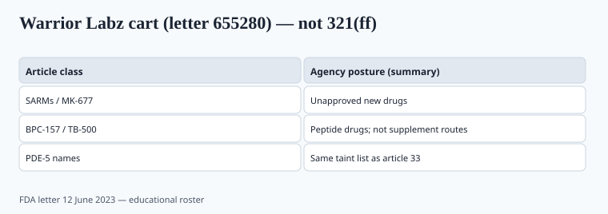

**Disclaimer.** Educational only. Not medical advice. Dietary supplements are not intended to diagnose, treat, cure, or prevent any disease (DSHEA; 21 U.S.C. § 321(ff); 21 CFR 101.93). This is not advice to use SARMs, peptides, or PDE-5 analogues.

12 June 2023. FDA letter **655280** to Warrior Labz SARMS. The website sold RAD-140, MK-677, ostarine, LGD-4033, andro products, **BPC-157** and **TB-500** (injectable and nasal), plus sildenafil and tadalafil knockoff names. FDA's theory was simple: unapproved new drugs. Not "poorly labeled supplements." Drugs.

## These articles are not in 321(ff)

<!-- graphics-pack:v1 -->

*Figure 1. Educational roster from the 12 June 2023 letter — not a shopping list.*

Selective androgen receptor modulators were never vitamins. FDA has said for years that SARMs in bodybuilding products are illegal drugs with liver, cardiovascular, and lipid risks. DoD's Operation Supplement Safety exists because service members kept buying them in "research" bottles. NSF Certified for Sport and Informed-Sport exist in part so a creatine SKU can prove it is **not** this aisle.

BPC-157 and TB-500 are peptides that showed up in the 2020s gray market as "recovery." Injectable and nasal spray are not dietary-supplement routes. "Oral BPC" as a capsule does not become a 1994 food article because a gym bro said so. Treat it as a drug/NDI/exclusion mess you do not want in a white-label book.

Sildenafil/tadalafil in "male" capsules is the older taint scandal (piece 33). Warrior Labz just sold them under their own names.

"For research only" on a checkout page that also sells a stack is not a research exemption. Intended use is read from the cart.

MK-677 (ibutamoren) is a ghrelin-receptor story, not a sleep mineral. Adding it "for GH" is a clinic and a letter.

## Why this belongs in a supplement R&D pack

Because the **same CMOs, 3PLs, and Amazon tactics** sit next to legitimate creatine. A founder who "just wants a strong pre-workout" will be offered a proprietary blend that hides a SARM or a stimulant analogue. Incoming ID and a banned-substance screen (NSF/Informed-Sport, piece 10) are how you refuse.

WADA's list is not US food law, but it is the buyer's list if you sell to tested athletes. DMAA, DMHA, oxilofrine — the analogue treadmill did not stop in 2020. A "natural stimulant" with no CAS on the spec is how the treadmill enters a vitamin book.

If a formulator will not name the milligrams, you do not have a sports SKU. You have a blend that can hide a drug.

Incoming identity for a "pre" is not optional. Caffeine, beta-alanine, citrulline, creatine — name the milligrams (piece 06). A banned-substance screen (NSF Certified for Sport or Informed-Sport in the **directory**) is how a team-sport buyer sleeps. A Canva badge is not a directory listing (piece 10). DoD OPSS exists because service members kept failing tests they did not mean to take. Your civilian catalog can still stain a military buyer.

WADA's list moves. Analogues move faster. A 2020 formula that was "clean" can pick up a new cousin in 2024 if the stimulant house got creative. Re-screen when the flavor house or the "energy blend" changes.

## Copy and procurement

Do not carry "research chemicals" as a sister brand. Payment processors and 3PLs will stain the vitamin line. Do not let a formulator add MK-677 "for sleep GH." That sentence is a clinic and a letter.

A serious sports book is creatine, caffeine, beta-alanine, citrulline — named doses — and a sport mark in the **directory**, not in Canva (piece 06, piece 10). Everything in the Warrior Labz shopping cart is the other industry.

If you already have a "recovery peptide" sample in a drawer, that is a disposal conversation, not a flavor conversation.

FDA's 2023 health-fraud letter roster is public. Warrior Labz is the teaching cart because it sold the whole set under one roof. Other letters that year named similar articles. `[VERIFY]` a letter number before you put it in a brief. The legal object does not change: these are unapproved new drugs. A white-label book that "just wants a strong pre" will be offered a blend that hides one. Name milligrams or walk.

## What a legal pre-workout prints — and the stimulant treadmill

Caffeine mg. Beta-alanine mg. Citrulline mg. Creatine mg if it is there. No proprietary "energy blend." No MK-677 "for sleep GH." No RAD-140, ostarine, LGD-4033, BPC-157, TB-500, sildenafil knockoffs — those are the Warrior Labz cart (letter 655280). Oral BPC-157 as a capsule does not become a 1994 food article because a gym caption said "recovery peptide."

Incoming ID plus a banned-substance screen when you sell to tested athletes. NSF Certified for Sport or Informed-Sport in the **directory**, not in Canva (piece 10). WADA's list moves; DMAA, DMHA, oxilofrine, and the next cousin move faster. Re-screen when the flavor house or the blend changes. DoD Operation Supplement Safety exists because service members kept buying "research" bottles — a sister brand in the Warrior Labz aisle stains the vitamin 3PL (piece 37). Name the milligrams or walk.

## What changed since 2020 (box)

The research-chem storefront moved from forums to Instagram checkout. FDA's 2023 letters show they still know how to read a cart. A serious sports book stayed boring on purpose.

Procurement should treat a "proprietary energy matrix" the same way finance treats a vendor who will not show invoices: pause the PO. The legitimate pre-workout aisle names milligrams. The Warrior Labz cart named drugs. Your incoming spec is which side of that line you are on. Piece 10 is the sport-cert directory; piece 37 is why a stained 3PL account is hard to unwind.
