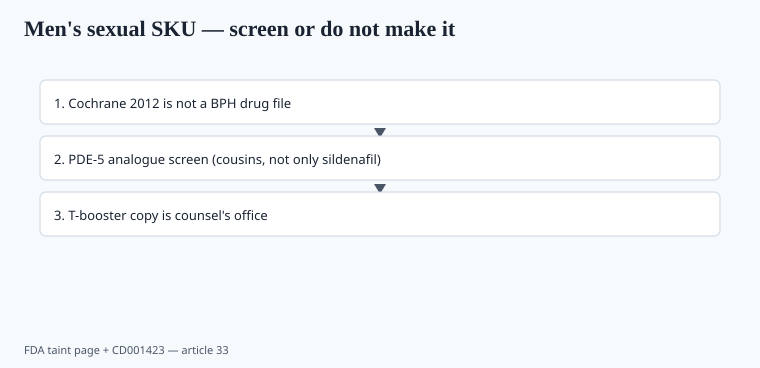

**Disclaimer.** Educational only. Not medical advice. Dietary supplements are not intended to diagnose, treat, cure, or prevent any disease (DSHEA; 21 U.S.C. § 321(ff); 21 CFR 101.93). This is not a treatment for BPH, erectile dysfunction, or hypogonadism.

The men's shelf is three businesses taped together: a prostate herb with a disappointing Cochrane review, a "T booster" with gym copy, and a sexual-enhancement capsule that keeps failing as a **drug**.

## Saw palmetto

Tacklind et al., Cochrane 2012 (CD001423): *Serenoa repens* did not improve LUTS/BPH symptoms versus placebo in the analyses that mattered. BPH is a disease. A 2026 PDP that says "clinically proven prostate relief" is arguing with Cochrane and with 321(g). ABC BAPP has saw palmetto adulteration bulletins (cheap oils cut into berry extract). If you still sell it, you are selling a traditional herb with identity risk and a weak outcome file — not a urology product.

Identity is HPTLC plus a fatty-acid profile that matches berry, not a generic oil. Marker-only specs are how you buy the cheap cut (piece 02, piece 36).

## Fenugreek, ashwagandha, "T"

Fenugreek seed extracts have small trials on libido or testosterone numbers in specific populations. Ashwagandha has a couple of male hormone papers and a liver file (piece 07). "Increases testosterone into the eugonadal range" is a drug-shaped claim unless a trial on *this* extract showed that, and even then you are in counsel's office. TRT is a prescription practice. A capsule is not TRT.

Zinc and vitamin D deficiency can sit under low-T labs. That is a clinician + ODS conversation, not a fenugreek megadose. Do not treat a multi as TRT.

## The taint list

<!-- graphics-pack:v1 -->

*Figure 1. Screen or do not make it — analogues, not only sildenafil.*

FDA's public "tainted products marketed as dietary supplements" page is a running graveyard: sildenafil, tadalafil, sibutramine, steroids, SARMs. Sexual-enhancement and weight-loss SKUs dominate. The 2020s did not fix this. Warrior Labz (letter 655280, piece 32) sold PDE-5 drugs under their own names. Most of the graveyard hid them.

A CMO that also runs a "male rocket" line is a supply-chain decision. Ask for a **PDE-5 analogue screen** on any men's sexual SKU, or do not make one. Analogues are the point — a screen that only looks for sildenafil will miss the cousin that still hits the receptor.

## What a boring men's book looks like

Creatine, protein, vitamin D if they are low, a multi without iron, caffeine dosed in mg. That is the ISSN-shaped catalog (piece 06). Prostate and bedroom SKUs are where letters and taint live. Price the risk honestly or leave the aisle.

NSF/Informed-Sport still do not cover "pharmacy in a capsule." If you sell to tested athletes, this aisle is how they fail a test they did not mean to take.

## Pump, citrus, and the pre that hides a drug

Citrulline and arginine are the legal pump story (nitric oxide is a structure/function neighborhood — still no ED disease copy). When a "male pre-workout" works *too* well, send it for a PDE-5 screen before you celebrate. The taint list is not theoretical. Piece 32 is the SARM/peptide cousin.

Citrus extracts and "natural Viagra" plants are where the hidden tablet lives. If the CMO will not run the screen, you do not have a SKU.

Fenugreek identity is a botanical problem (piece 36). "Testofen-class" extracts are named materials; a broker seed powder is not that paper. Ashwagandha in a T-booster inherits the liver file (piece 07) and still does not become TRT. A men's multi without iron (piece 26) plus creatine (piece 06) plus a vitamin D if they are low is the boring book. The bedroom rocket is the taint page. Price them as different businesses. A shared CMO is a shared deposition if the rocket fails a PDE-5 screen.

## Identity of the berry, Cochrane, and the analogue screen

Saw palmetto adulteration is cheap oil cut into berry extract (ABC BAPP). HPTLC plus a fatty-acid profile that matches berry, or you bought the cut. Tacklind et al., Cochrane 2012 (CD001423): *Serenoa repens* did not improve LUTS/BPH symptoms versus placebo in the analyses that mattered. BPH is a disease. A 2026 PDP that says "clinically proven prostate relief" argues with Cochrane and with 321(g). Later branded-extract papers exist; `[CITE NEEDED]` before you transfer one onto a broker oil.

FDA's tainted-supplements page is not a historical exhibit. Sexual-enhancement and weight-loss SKUs keep landing sildenafil, tadalafil, sibutramine, steroids, SARMs. PDE-5 analogue screen on any sexual SKU — cousins, not only sildenafil. When a "male pre" works too well, screen before you celebrate. "Increases testosterone into the eugonadal range" is a drug-shaped claim; TRT is a prescription practice. Zinc and vitamin D deficiency can sit under low-T labs — that is ODS plus a clinician, not a fenugreek megadose.

## What changed since 2020 (box)

T-booster ads followed the podcast boom. The Cochrane saw-palmetto conclusion did not move. FDA's taint page kept growing. A serious book stayed boring on purpose.

A shared CMO between the boring book and the bedroom rocket is a deposition you bought on purpose. If the rocket fails a PDE-5 analogue screen, the creatine line sits in the same building. Price them as different businesses or leave the aisle. NSF/Informed-Sport still will not cover "pharmacy in a capsule."

When a sexual SKU clears a screen once, re-screen at formula change — not only at launch. Analogue chemistry does not wait for your annual catalog refresh. Piece 32 is the full Warrior Labz roster; this aisle is where taint and weak outcome files overlap on one shelf.
