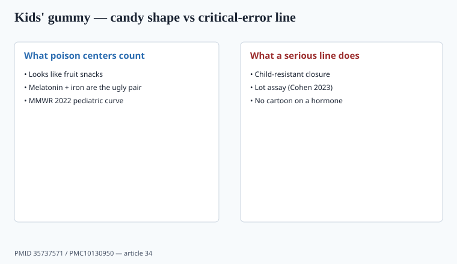

**Disclaimer.** Educational only. Not medical advice. Dietary supplements are not intended to diagnose, treat, cure, or prevent any disease (DSHEA; 21 U.S.C. § 321(ff); 21 CFR 101.93). This is not pediatric dosing advice. Keep supplements away from children unless a clinician directed a specific product.

Gummies turned vitamins into candy. Candy is what poison centers count.

## Two papers, one aisle

<!-- graphics-pack:v1 -->

*Figure 1. MMWR 2022 + Cohen 2023 — cartoon on a hormone is an operator choice.*

Lelak et al., MMWR 2022, PMID 35737571: 260,435 pediatric melatonin ingestions over a decade, a 530% rise, mostly young children, two deaths reported in that surveillance window. Cohen et al., *JAMA* 2023: 88% of tested melatonin gummies missed the label, one was CBD with no melatonin (piece 19).

Together: the product that looks like fruit snacks is **mislabeled** and **in the house where toddlers eat fruit snacks**.

Surveillance is not a randomized harm trial. It is still the reason a cartoon on a hormone is an operator decision, not a brand-color decision.

## The rest of the children's multi

Vitamin A UL is easy to smash when a gummy serving is "2" and a kid takes 6. Iron is a classic fatal overdose in children — many kids' gummies omit iron for that reason; if yours includes it, you need a CR closure and a dose a poison-control card can understand. Fat-soluble vitamins accumulate. "More gummies = healthier kid" is the ad the 2020s ran anyway.

AAP-shaped advice, as a brand posture: food first; a basic multi only if the diet is actually poor; **no melatonin as a parenting tool** without a clinician. I am not pretending to be the AAP. `[VERIFY]` any pediatric-society sentence you want to quote.

Unit math (piece 35) is how a "100% DV" gummy becomes a UL problem when the serving is candy-shaped. Iodine, D, and A are the usual overshooters. Folate DFE mixups belong here too (piece 25).

## Critical errors

- Serving size that looks like a snack count.
- Adult 10 mg melatonin in a bottle with a cartoon.
- Look-alike packaging next to real candy.
- No child-resistant closure (melatonin and iron especially).
- Assay skip-lot on a matrix Cohen already showed is hostile.
- A 2021 carton with a 2024 formula (piece 37).

If the CMO cannot hold ±10% on melatonin in pectin, the answer is not a wider spec. The answer is exit.

Look-alike packaging is not a cute problem. A bottle that sits next to actual fruit snacks in a pantry will be eaten as fruit snacks. Color, shape, and a cartoon animal are intended-use signals for a toddler even when the legal intended use is "dietary supplement for adults." Child-resistant closures fail if the cap is left off. Your warning set still has to say keep away from children. Iron and melatonin are the two nouns poison-control cards already know. A gummy multi that also hides 5 mg melatonin in a proprietary "calm blend" is how you inherit both files at once (piece 19, piece 20).

## FTC

"Helps kids focus / calm / sleep through the night" is a health claim aimed at parents. 2022 guidance + 2023 endorsements (piece 31) apply. A smiling pediatrician actor is an endorsement.

School-grade before/after videos are claims. So is a teacher testimonial you paid for.

ODS vitamin A ULs are easy to hit when a gummy serving is candy-shaped and a second handful feels like a snack. `[VERIFY]` the live UL for the age band you print. Iodine and D overshoot the same way. A "100% DV" front panel does not save a six-gummy afternoon.

If you stay in kids' multis: tiny doses, CR packaging, lot assay, no melatonin unless a clinician-directed SKU with adult-looking art — and I would still rather exit melatonin for children entirely. Piece 19 is the assay scandal. This piece is the pantry.

## Serving size as a critical-error control

"2 gummies" next to a bowl is how a child takes 6. Vitamin A UL is easy to smash. Fat-solubles accumulate. Iron, if present, is the old fatal overdose. Melatonin, if present, is the MMWR curve. A proprietary "calm blend" that hides 5 mg melatonin inherits Cohen and Lelak at once.

Look-alike art next to real candy is intended use for a toddler. Child-resistant closure. Lot assay. No cartoon on a hormone. Food-first multi only if the diet is actually poor — and `[VERIFY]` any AAP sentence you quote. FTC 2022 + 2023 endorsements apply to the smiling pediatrician actor (piece 31).

## Two numbers a brand has to be able to say out loud

Lelak 2022: 260,435 pediatric melatonin ingestions, 2012–2021, a 530% rise, mostly ≤5 years, two deaths in that surveillance window. Cohen 2023: 22 of 25 gummies missed the label; one had no melatonin and 31.3 mg CBD. Together they say the fruit-snack shape is mislabeled and in the house where toddlers eat fruit snacks.

Vitamin A UL is easy to smash when "2 gummies" sits next to a bowl. `[VERIFY]` the live ODS UL for the age band you print. Iron, if present, is the old fatal overdose — CR closure, a dose a poison-control card can read, or omit it. Fat-solubles accumulate. "More gummies = healthier kid" is the ad the 2020s ran.

A smiling pediatrician actor is an endorsement (piece 31). School-grade before/after videos are claims. Exit melatonin for children, or treat it as a drug-adjacent critical-error line: tiny dose, adult art, CR cap, every-lot assay. The peach-ring option funds the next MMWR table.

## What changed since 2020 (box)

Pandemic routines and sleep panic grew the kids' sleep SKU. MMWR and Cohen made the cost visible. A serious brand either exits pediatric gummies or treats them like a drug-adjacent critical-error line: tiny doses, CR packaging, lot assay, no cartoons on melatonin. The third option — peach rings with 5 mg and a bear — is how you fund the next MMWR table.
