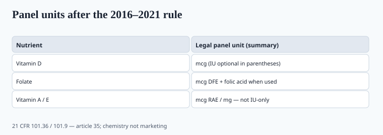

**Disclaimer.** Educational only. Not medical advice. Dietary supplements are not intended to diagnose, treat, cure, or prevent any disease (DSHEA; 21 U.S.C. § 321(ff); 21 CFR 101.93). This is not a labeling-compliance opinion for a specific SKU.

The 2016 Nutrition Facts final rule dragged supplement facts with it. Compliance staggered into 2020–2021. A lot of PDPs still talk in 2015 units. That is how you ship 125 mcg of D3 and a customer thinks they bought 125 IU.

## Units that changed

<!-- graphics-pack:v1 -->

*Figure 1. Chemistry conversions — a 40× spreadsheet error is a recall.*

**Vitamin D:** label unit is **mcg**, with IU in parentheses optional. 1 mcg = 40 IU. 25 mcg = 1,000 IU. 125 mcg = 5,000 IU. The 2020 immune aisle sold "5,000 IU" as a personality. The panel should have said 125 mcg. ODS still discusses IU in the narrative. Your printer has to pick the legal panel.

**Folate:** mcg **DFE**, and folic acid listed separately when used. Food folate and folic acid are not 1:1. A prenatal that prints "800 mcg" without DFE is a 2014 label (piece 25).

**Vitamin A:** mcg RAE, not just IU. Retinol and carotenoids convert differently. A gummy that stacks retinol + beta-carotene can look modest in IU and rude in RAE.

**Vitamin E:** mg, not IU. The conversion depends on the form (d-alpha vs dl-alpha). Get the factor from ODS, not from memory.

These conversions are chemistry, not marketing. A spreadsheet that multiplies D3 IU by 40 instead of dividing is a recall.

## Serving size is a claim engine

"Suggested use: 6 capsules." The %DV is per serving. A buyer who takes 2 because the bottle is expensive is not on your studied dose. A buyer who takes 6 of a 2-capsule study product is on 3×. Gummies: "2 gummies" next to a bowl of them is how MMWR gets rows (piece 34).

Proprietary blends: you can hide amounts of everything except the blend total. That is legal and usually contemptible. Sports buyers and clinicians will not take you seriously. ISSN-shaped SKUs print milligrams (piece 06, piece 32).

A "clinically studied 600 mg extract" on a 6-capsule serving that delivers 50 mg per capsule is a math problem, not a clinical problem.

## Dual columns and "per scoop"

Protein tubs that list "per 30 g scoop" and ship a 40 g scoop in the jar: the nitrogen is correct and the serving is a lie. Weigh the scoop. Put the gram weight on the panel. Kjeldahl vs Dumas vs amino-acid (piece 06, piece 10).

Dual-column panels (per serving and per 100 g, or "as prepared") are where omega-3 milligrams get lost in carrier oil (piece 38). Print EPA and DHA separately.

## What QA matches

The COA assay unit must convert to the panel unit. I have seen D3 assayed in IU and labeled in mcg with a 40× error in the spreadsheet. That is a recall, not a rounding.

Lot-release specs should be written in the **panel unit**. If the lab reports IU, the MMR does the conversion once, in a locked cell, with the factor named.

Artwork freeze during 2020 overtime (piece 11) is why dual-unit stickers exist. 2026 is late to still be shipping them as the system of record. A D3 "5,000 IU" hero on the front and 125 mcg on the panel is legal if the math matches. A 5,000 IU hero and 125 IU on the panel is a recall. Folate DFE vs "mcg folic acid" is the prenatal version of the same spreadsheet (piece 25). Vitamin E d-alpha vs dl-alpha is the one QC people still do from memory and still get wrong.

Piece 16 is how you read the COA. This piece is why the first five matches include units.

## The spreadsheet that becomes a recall

D3: 1 mcg = 40 IU. Divide, do not multiply. Folate: DFE, plus folic acid listed when used. Vitamin A: mcg RAE. Vitamin E: mg, form-specific factor from ODS. Write the conversion once in a locked MMR cell. The COA unit must match the panel unit (piece 16).

Serving size is a claim engine. Six capsules of a two-capsule study is 3×. A 40 g scoop in a "30 g" tub is a nitrogen lie. Proprietary blends hide everything except the blend total — legal, and usually contemptible. 2026 is late for IU-only D3 as the legal panel.

## What changed since 2020 (box)

The new panel became mandatory while plants were running COVID overtime (piece 11). Artwork froze. Dual-unit stickers appeared. 2026 is late to still be shipping IU-only D3 as the legal panel. Fix the template, then the next SKU.
