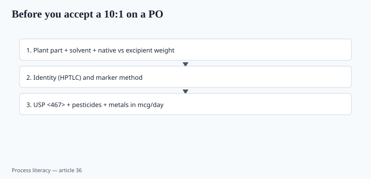

**Disclaimer.** Educational only. Not medical advice. Dietary supplements are not intended to diagnose, treat, cure, or prevent any disease (DSHEA; 21 U.S.C. § 321(ff); 21 CFR 101.93).

"10:1 extract" is the most common number on a botanical PO that nobody can defend. Ten kilos of *what* to one kilo of *what*, with *which* solvent, standardized to *which* marker? If the purchasing email cannot answer, the drum is a story.

## Ratios are not doses

<!-- graphics-pack:v1 -->

*Figure 1. Plant part, solvent, and methods — a ratio without those is a non-answer.*

A 10:1 water extract of leaf is not a 10:1 ethanol extract of root. Marker % can be spiked (piece 02, piece 07, piece 23). Native-extract equivalent (NEE) math belongs on the batch record so the label's "500 mg, equivalent to 5 g herb" is a calculation you can show, not a vibe.

Some 2020s SKUs print "50:1" because it looks like potency. It may mean they started with a weak herb and a lot of maltodextrin. Ask for the **native extract** weight and the **excipient** weight separately.

A RCT that used 600 mg of a 5% withanolide hydroalcoholic extract is not a 50 mg leaf-powder capsule. Piece 07 is the ashwagandha version of this sentence. Piece 24 is the EGCG version. Piece 23 is the curcumin version.

## USP <467>

Residual solvents: Class 1 (avoid — benzene, carbon tetrachloride, and the rest of the "should not be there" list), Class 2 (limit), Class 3 (less severe). Ethanol, methanol, hexane, acetone, dichloromethane show up in extract COAs when someone is being honest. If the process used a solvent and the finished-product COA has no <467> row, you do not have a finished-product story (piece 16). "Food-grade ethanol" is still a residual if it is there.

Hexane-extracted botanicals and some oils: the number matters more than the adjective.

Class 1 detections are not a rounding conversation. They are a supplier-kill conversation.

## Pesticides

Botanical incoming should have a multi-residue panel appropriate to the crop (USP, EPA tolerances where they apply, or a tighter internal spec). Tea, roots, and imported powders are not "organic" because the website is green. Organic certificates do not replace a lab row.

A "pesticides: conforms" line with no method and no LOQ is the same costume as "heavy metals: conforms" (piece 10, piece 23).

## Heavy metals again

Extracts can **concentrate** lead as well as the marker. A leaf at 0.3 ppm lead can become an extract that blows a daily-serving budget. Convert to mcg/day at the labeled dose (piece 10, piece 23). Prop 65 safe-harbor math is per day, not per kg of powder (piece 37).

Turmeric is the public example. Tea and cacao are the quiet ones.

## Water vs ethanol is a different product

Ashwagandha root water extract and a hydroalcoholic extract do not share a withanolide chromatogram. Elderberry "juice concentrate" and a 10:1 maltodextrin spray-dry do not share an anthocyanin profile (piece 02). Write the solvent on the spec. If the supplier refuses, that is data.

Mycotoxins (aflatoxin, ochratoxin) on some roots and grains belong on the same incoming list as pesticides when the crop warrants it. `[CITE NEEDED]` for a crop-specific action level you print as if it were USP.

Identity (HPTLC against a reference) **and** a marker assay. Marker alone is how you buy spiked material.

A purchasing email that only asks "10:1, 5% marker, best price" is how COVID-era elderberry and ashwagandha lots got cheap (piece 02, piece 07). Write the plant part, the solvent, the native-extract weight, the excipient, the method, and the metals-per-serving math. If the broker cannot answer, you do not have a drum. You have a story that will fail the first grown-up buyer's COA read (piece 16).

## Native extract versus maltodextrin

Ask for native-extract weight and excipient weight separately. A 50:1 that is weak herb plus carrier looks like potency and assays like powder. Solvent on the spec: water vs ethanol is a different chromatogram (ashwagandha, elderberry, turmeric — pieces 07, 02, 23).

USP <467> Class 1 detections kill a supplier. Class 2/3 need numbers. Pesticides: method and LOQ, not "conforms." Metals: mcg/day at the labeled dose, because extracts concentrate lead with the marker. Organic ink does not replace the row.

## What changed since 2020 (box)

COVID demand (elderberry, ashwagandha) rewarded the cheapest 10:1. ABC's adulteration warning was about that incentive. 2026 purchasing should treat a ratio without a solvent, a plant part, and a marker method as a non-answer. Pay for the chromatogram.
