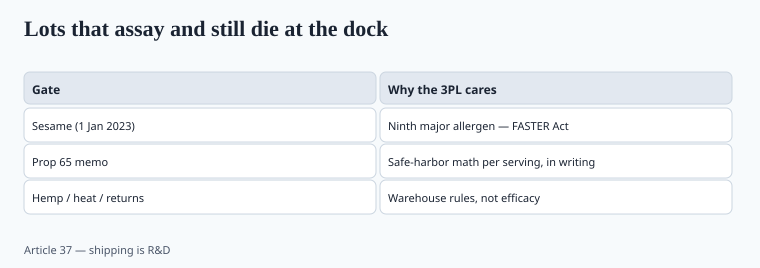

**Disclaimer.** Educational only. Not medical advice. Dietary supplements are not intended to diagnose, treat, cure, or prevent any disease (DSHEA; 21 U.S.C. § 321(ff); 21 CFR 101.93).

A lot can assay on potency and still die at the dock. Allergens and California warnings are how.

## Sesame, 2023

The FASTER Act made **sesame** the ninth major US food allergen, with labeling in effect **1 January 2023**. Shared lines that dust tahini-class ingredients, or flavor systems that quietly use sesame, became a recall theory overnight. If your CMO's allergen SOP still lists eight, the SOP is stale. Ask for the line matrix: milk, egg, fish, shellfish, tree nuts, peanuts, wheat, soy, sesame.

Undeclared soy lecithin after a "clean label" swap (piece 11) is the 2020s classic. FALCPA does not care that the lecithin was 0.3%.

Fish-oil and algae plants that share a line are an allergen SOP, not a sustainability slide (piece 38). "Vegan collagen" next to bovine hide is the same conversation (piece 22).

## Prop 65

OEHHA's list and safe-harbor levels are not federal GMPs. Lead in botanicals, protein, and cacao will trip warnings at servings that still "pass" a loose internal ppm spec (piece 10). Lead's reproductive MADL has long been **0.5 mcg/day**; `[VERIFY]` the live OEHHA number for the analyte you are deciding. A 3PL that ships to CA will ask whether you have a warning decision **in writing**. "We'll handle it if we get a letter" is how you fund a plaintiff's firm.

Do not print "Prop 65 free." Print a decision memo: serving, analyte, lab, comparison to safe harbor, warning yes/no.

Turmeric (piece 23) and protein (CR 2025, piece 10) are why this memo is not theoretical. A 20 g collagen scoop concentrates whatever the hide carried (piece 22).

## 3PL realities

<!-- graphics-pack:v1 -->

*Figure 1. Lots that assay and still die at the dock.*

- Heat: probiotics, omega-3, ubiquinol. Recorders on the trailer (piece 11).
- Amazon prep: label claims they will scrape for disease words (piece 12).
- Hazmat-adjacent: some essential-oil SKUs, high-proof tinctures.
- Hemp/CBD in the same warehouse as vitamins (piece 14) — processors panic.
- Returns: opened gummies are not resellable. Your COGS model is wrong if you assumed they were.
- SARMs/peptide "sister brands" (piece 32) will stain the vitamin account.

Retain samples in *your* closet, not only the CMO's (piece 16). When a CA notice or an allergen complaint lands, you will want the lot.

## Packaging that is also labeling

Induction seals, lot codes that match the COA (piece 16), and a "contains" statement that matches the flavor house's allergen matrix. A 2021 carton with a 2024 formula is a recall shape. Piece 35 is the unit math; this piece is the ink that a warehouse worker can read.

Gluten-free, vegan, and "made in a facility" claims are specifications. If the CMO cannot show a line-clearance SOP, do not print the halo.

Child-resistant closures are packaging and they are labeling-adjacent when the SKU is melatonin or iron (piece 19, piece 34).

A 3PL that refuses a lot for a missing sesame line is doing you a favor. A 3PL that ships hemp next to children's gummies is writing a story you will not like in discovery. Keep the vitamin book in a warehouse that does not also run the Warrior Labz cart (piece 32). Heat recorders on probiotic and omega-3 trailers are cheaper than a summer assay fail. Returns of opened gummies are trash. Price them as trash.

Amazon's prep rules will scrape disease words off a label image (piece 12). A 3PL that applies those labels cannot "fix" a COVID or GLP-1 noun you printed. High-proof tinctures and some essential-oil SKUs trip hazmat-adjacent rules. Ask before the trailer is booked, not after the dock refuses the pallet.

Gluten-free, vegan, and "made in a facility that also processes…" are specifications. If the CMO cannot show line clearance and an allergen swab SOP, do not print the halo. A 2021 carton on a 2024 formula is a recall shape even when the assay is fine.

## The decision memo a 3PL will ask for

Serving, analyte, lab, LOD/LOQ, comparison to OEHHA safe harbor, warning yes/no. Lead's reproductive MADL has long been 0.5 mcg/day — `[VERIFY]` live. Do not print "Prop 65 free."

Sesame since 1 January 2023 is the ninth major allergen. An SOP that lists eight is stale. Undeclared soy lecithin after a clean-label swap is the 2020s classic. Fish vs algae lines (piece 38), bovine vs "vegan collagen" (piece 22), hemp next to vitamins (piece 14) — warehouse rules, not efficacy. Retain samples in *your* closet.

## What changed since 2020 (box)

Sesame joined the list on 1 January 2023. Prop 65 did not get friendlier. 3PLs got pickier about hemp and about paperwork after the inspection-quiet year. Packaging/shipping is R&D if your formula dies in July freight.
