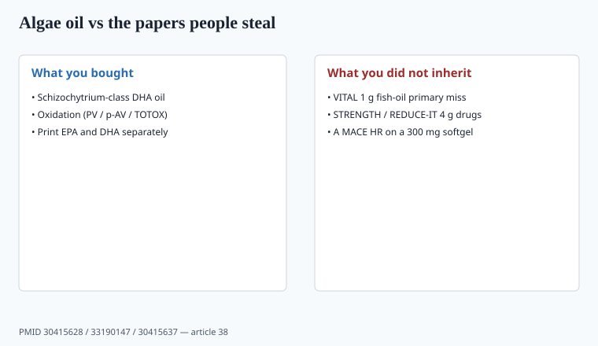

**Disclaimer.** Educational only. Not medical advice. Dietary supplements are not intended to diagnose, treat, cure, or prevent any disease (DSHEA; 21 U.S.C. § 321(ff); 21 CFR 101.93). Prescription EPA drugs are not algae softgels.

Fish-oil freight and fishery stories pushed brands toward **Schizochytrium** and other microalgae DHA in the 2020s. Vegans got a SKU. Sustainability decks got a slide. The trial file did not move with the organism.

## What algae oil is

<!-- graphics-pack:v1 -->

*Figure 1. Organism changed; VITAL / STRENGTH / REDUCE-IT did not move with it.*

A fermented or photobioreactor oil, usually **DHA-heavy**, sometimes with a little EPA depending on the strain. It is not krill. It is not icosapent ethyl. VITAL used 1 g marine omega-3 (EPA+DHA in a fish-oil capsule) and missed its primary CVD and cancer endpoints (piece 04). STRENGTH and REDUCE-IT were **4 g drug** products. An algae 300 mg DHA capsule inherits **none** of those HRs.

Prenatal DHA conversations (food + clinician) are a different use case than a 70-year-old buying "heart oil." Do not mash them.

Print the genus. *Schizochytrium* and *Crypthecodinium* are not interchangeable strains. EPA content is a strain and process question, not a brand color.

## Why people switched anyway

- **Allergen / diet:** no fish protein if the process is clean. Still ask for the allergen SOP — some plants share lines (piece 37).
- **Contaminants:** algae skips the fish-PCB story; it has its own residual-solvent and heavy-metal story. Assay them.
- **Supply:** 2020–2022 fish-oil tanks and shipping (piece 11) made fermentation look like dual-source. It is dual-source only if you qualified two algae plants.

Sustainability copy is a claim if you print it. A fermentation slide is not a life-cycle assessment. `[CITE NEEDED]` before a carbon number.

ODS's omega-3 fact sheet remains the public ballast: EPA and DHA are the marine fatty acids people mean; ALA from flax is a different conversion story. An algae SKU that prints "omega-3 1,000 mg" when 700 mg is carrier oil is piece 35's scoop lie with a climate sticker. Krill is a third oil (phospholipid + astaxanthin). It inherits neither Vascepa nor a *Schizochytrium* DHA paper.

## Oxidation

Algae oil goes rancid. PV, p-AV, TOTOX on retain, nitrogen-flushed bottles, dark packaging, a real expiry. "Plant-based" does not mean stable. Lemon flavor hides a lot of aldehydes.

GOED voluntary monographs are the trade conversation for oxidation limits. `[VERIFY]` the live GOED numbers if you print a TOTOX cap as if it were USP. Your spec still has to exist in the MMR (piece 16).

A 24-month expiry with no retain TOTOX is a hope, not a shelf life.

Algae plants are still plants. Residual solvents from extraction, heavy metals from media, and an allergen SOP if the site also runs fish oil belong on the incoming list (piece 36, piece 37). Dual-source means two qualified fermentation sites, not two brokers with the same tank. 2020–2022 fish-oil freight made algae look easy. Qualification backlog made it slow (piece 11).

## EPA gap

Many algae SKUs are DHA-only. If the marketing graph is about EPA-index or REDUCE-IT, you have the wrong oil. Some newer strains add EPA; then you still have a *supplement* dose problem. Print EPA and DHA milligrams separately. Do not say "omega-3 1,000 mg" when 700 mg is carrier oil (piece 35).

Icosapent ethyl is a drug. A 300 mg DHA algae softgel is a food oil. The HR from REDUCE-IT stays with the drug.

## Prenatal vs "heart"

Third-trimester DHA conversations in obstetric guidance are about fetal development and food/supplement *intake*, not about a 70-year-old's MACE composite. Do not put a pregnant model on a REDUCE-IT headline or a retiree on a prenatal dose without saying which file you mean. `[VERIFY]` current ACOG/ODS prenatal DHA language before you freeze a number.

Krill oil (phospholipid) is a third product. It does not inherit algae or Vascepa. Astaxanthin in krill is a color and a second assay.

## GOED oxidation numbers on retain — still write a spec

GOED's voluntary monograph for unflavored EPA/DHA oils has long used PV ≤ 5 meq/kg, p-AV ≤ 20, TOTOX ≤ 26, where TOTOX = (2 × PV) + p-AV. `[VERIFY]` the live monograph version you cite (v9.0 circulated in 2026). p-AV and TOTOX do **not** apply cleanly to flavored, strongly colored, krill, or some virgin oils — lemon flavor is why. Algae oil still oxidizes: PV on retain, nitrogen flush, opaque pack-out, a real expiry. Lemon flavor hides aldehydes.

Print EPA and DHA milligrams separately. A 300 mg DHA algae softgel inherits none of VITAL's 1 g fish-oil miss, STRENGTH's 4 g drug futility, or REDUCE-IT's icosapent ethyl HR (piece 04). Prenatal DHA intake talk is a different file than a 70-year-old's MACE composite. Dual-source means two qualified fermentation sites, not two brokers with the same tank (piece 11).

## What changed since 2020 (box)

Algae DHA became the default vegan prenatal and a climate talking point. The cardiovascular evidence bar stayed where VITAL/STRENGTH/REDUCE-IT left it — and those papers were not algae. Sell a named mg of DHA with an oxidation spec. Leave the drug HRs on the drug.

Prenatal buyers care about DHA milligrams and allergen lines. Cardiovascular buyers care about EPA content and trial names. One softgel cannot wear both stories without lying to one of them. Piece 04 is where VITAL and REDUCE-IT live; piece 35 is where the EPA/DHA milligrams must print on the panel.
