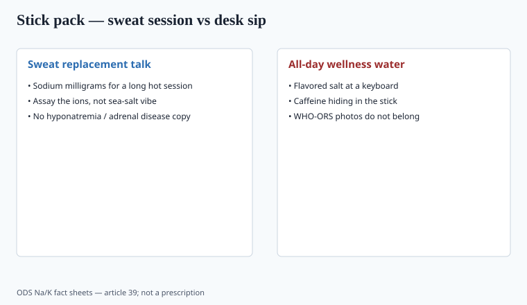

**Disclaimer.** Educational only. Not medical advice. Dietary supplements are not intended to diagnose, treat, cure, or prevent any disease (DSHEA; 21 U.S.C. § 321(ff); 21 CFR 101.93). This is not a treatment for dehydration, heat stroke, or adrenal disease.

Stick packs ate the 2020s. "Hydration" became a lifestyle. The packet is usually **sodium, potassium, a sugar or a sweetener, and a flavor system**. That is a food science problem with a supplement facts panel taped on.

## What actually replaces sweat

<!-- graphics-pack:v1 -->

*Figure 1. Print milligrams — leave adrenals and the ER off the carton.*

ACSM/ISSN-shaped exercise nutrition: fluid and sodium losses scale with sweat rate, which scales with heat, duration, and the human. A 200–500 mg sodium stick can be a reasonable *starting* packet for a long hot session. It is not a prescription for a desk day. "Adrenal cocktail" copy is a disease story. "Prevents hyponatremia" is a disease claim. "Replaces electrolytes lost in sweat" is closer to a structure/function — still take the wording to counsel.

Potassium: ODS has AIs and a UL conversation for **supplements** because high-dose potassium salts have cardiac logic in the wrong patient (ACE inhibitors, potassium-sparing diuretics, kidney disease). A 99 mg potassium citrate tablet is a legal-looking number for a reason (old OTC threshold folklore — `[VERIFY]` current labeling limits before you joke about it). A 1,000 mg potassium stick is a different object.

Desk-day "wellness water" is flavored salt. That can be fine if you print the milligrams and skip the adrenal story. It is not ACSM fluid replacement.

ACSM and ISSN position stands on fluid replacement are about sweat rate, duration, and heat. They are not about a 2 p.m. Slack status. A stick that copies those documents should copy the uncertainty: humans vary, indoor desks are not field studies, and "prevents heat stroke" is a disease claim. `[VERIFY]` the live ACSM/ISSN sentence if you quote one.

## Sugar vs "zero"

Oral rehydration solution logic (glucose + sodium, SGLT1) is why some packets still use sugar. "Zero sugar" sticks can still hydrate if the person drinks water; they are not WHO-ORS. Do not put a cholera ward on the mood board.

Sugar alcohols in a "gut + hydration" stack: you will get reviews about bathrooms. That is formulation, not a detour.

A stick that is also a prebiotic (piece 29) is two products. Gas plus a marathon is a support ticket.

## QA and labeling

Chloride, sodium, potassium, magnesium — assay the ions, not just "sea salt blend." Heavy metals in mined salts and in cacao-flavored sticks. Serving size vs "use 4 sticks during a marathon." %DV for sodium will scare people who should not be scared during a 3-hour ride and will not scare people on a high-salt rest day. The panel cannot do that teaching. The blog can.

Caffeine in a "hydration" stick is a second SKU hiding in the first. So is a proprietary "focus" blend.

Prop 65 on cacao-flavored sticks is a real memo (piece 37). Sea salt is not exempt from a metals row.

If the stick is a dietary supplement, 21 CFR 101.36 applies. If it is a food, 101.9 applies. Pick one and stop mixing the panels.

ISSN/ACSM fluid-replacement language is about sweat rate, not about a 2 p.m. Zoom. A 1,000 mg sodium stick on a rest day is a different object than 300 mg in hour two of a hot ride. Potassium in the 99 mg tablet is a labeling habit; a gram-class potassium packet is a clinician conversation for the wrong patient. Do not put "prevents hyponatremia" or "adrenal support" on either. Assay sodium, potassium, chloride, magnesium as ions. "Sea salt blend" is not an ion. Cacao-flavored sticks inherit a metals memo (piece 37). Caffeine in the same stick is a second SKU (piece 32's lesson: name the milligrams).

## Ions, not a sea-salt story

Assay sodium, potassium, chloride, magnesium as ions. "Sea salt blend" is not an ion. 200–500 mg sodium can be a starting packet for a long hot session; it is not an adrenal protocol and it is not hyponatremia prevention. A 1,000 mg potassium stick is a different object than a 99 mg tablet — `[VERIFY]` current K limits before you joke.

Sugar vs zero: SGLT1 logic is why some packets still use glucose. They are not WHO-ORS. Sugar alcohols write bathroom reviews. Caffeine in the stick is a second SKU. Pick 101.36 or 101.9 and stop mixing panels. Desk-day wellness water is flavored salt. Print the milligrams.

## ORS logic is not a cholera ward on the mood board

WHO-style oral rehydration uses glucose plus sodium (SGLT1). Some sports packets still use sugar for that reason. They are not a cholera protocol, and a zero-sugar stick is not WHO-ORS. Do not put a ward on the carton. Sugar alcohols in a "gut + hydration" stack write bathroom reviews (piece 29).

ACSM/ISSN fluid-replacement language is about sweat rate, duration, and heat — `[VERIFY]` the live sentence if you quote one. A 200–500 mg sodium stick can be a starting packet for a long hot session. It is not an adrenal cocktail and it is not "prevents hyponatremia." A 1,000 mg potassium stick is a different object than a 99 mg tablet; high-dose potassium salts have cardiac logic in the wrong patient (ACE inhibitors, potassium-sparing diuretics, kidney disease).

Assay the ions. Pick 21 CFR 101.36 or 101.9. Caffeine in the stick is a second SKU. Cacao flavor inherits a metals memo (piece 37).

## What changed since 2020 (box)

Remote work and "wellness water" turned a sports product into an all-day sip. The physiology did not. Sell milligrams of sodium and potassium for sweat. Leave the adrenals and the ER out of the carton.
