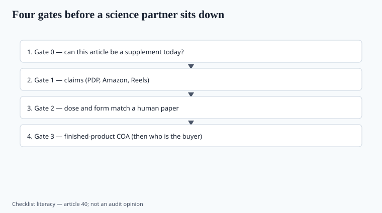

**Disclaimer.** Educational only. Not medical advice. Dietary supplements are not intended to diagnose, treat, cure, or prevent any disease (DSHEA; 21 U.S.C. § 321(ff); 21 CFR 101.93). This is not an audit opinion on a live catalog.

A future science/QA partner should not inherit a junk drawer. This pack is 40 drafts. Here is the order I would sort a real book, using those drafts as knives.

## Gate 0 — status

<!-- graphics-pack:v1 -->

*Figure 1. Status, claims, dose, paper — forty essays do not replace a failed assay.*

Can this article be a supplement *today*?

| Kill or hold | Why | Draft |
| --- | --- | --- |
| CBD / most intoxicating hemp | FDA Jan 2023: not a supplement pathway | 14 |
| SARMs, BPC-157, injectable peptides, PDE-5 | Drugs (letter 655280 and the taint list) | 32, 33 |
| NMN without an NDIN theory | 2025 status ≠ a free pass | 08, 30 |
| NAC sold as a lung/COVID protocol | Discretion dies on disease copy | 17 |

If gate 0 fails, do not talk about flavor. A beautiful COA on an excluded article is a souvenir.

## Gate 1 — claims

Highlighter on the PDP, Amazon bullets, Reels (piece 31). Any virus, cancer, GLP-1 name, HRT, "reverse aging," "treats menopause," "replaces your statin" — delete or send to counsel as a *no*. Structure/function + 101.93 notice + DSHEA line, or it does not ship. FTC 2022 is the second statute.

Net impression includes the cartoon on the melatonin gummy and the waist photo next to berberine. The footer does not un-say the hero.

## Gate 2 — dose and form match a human paper

Strain ID and CFU through expiry (05). Elemental magnesium, iron, calcium (09, 26, 27). Melatonin milligrams that survive Cohen (19). EGCG with a liver warning (24). Creatine 3–5 g monohydrate, not an ester (06). If the study used extract A at 600 mg and you ship 50 mg of leaf, you do not have that study.

Named peptides (22), named withanolide methods (07), named EPA/DHA milligrams (38) — same test. A ratio without a solvent is not a dose (36).

## Gate 3 — finished-product COA

Lot match, method, ISO 17025 scope, metals in mcg/day, micro, solvents if extracted, pesticides if botanical (16, 36). Supplier PDF ≠ release. Gummies get assayed, not skip-lot (19, 34).

Prop 65 memo in writing if you ship to CA (37). Allergen matrix includes sesame after 1 January 2023.

## Gate 4 — who is the buyer

Kids' melatonin gummies: CR closure or exit (34). Postmenopausal iron in the "women's" multi: split the SKU (26). Athletes: NSF or Informed-Sport in the **directory**, not in Canva (10). Warfarin + K2: warning or no SKU (27).

If the buyer is a toddler, you are in the MMWR. If the buyer is a tested athlete, you are in the OPSS folder.

## What I would keep first in a small book

Creatine monohydrate. Protein with a metals program. Vitamin D3 with mcg math and no COVID copy. Magnesium glycinate with elemental numbers. A boring multi split by iron. Omega-3 or algae DHA with oxidation specs and no REDUCE-IT theft. Maybe melatonin **tablets** at 0.5–3 mg, assayed.

That list is boring on purpose. COSMOS (18) did not make the multi a hero. VITAL (04) did not make D3 a COVID SKU. ISSN (06) still likes creatine.

## What I would park

Longevity stacks. Berberine-as-Ozempic. Liposomal everything. 15-strain probiotics with no deposit numbers. Adaptogen dust. Men's bedroom rockets. Thermogenic EGCG bombs. "Personalized" quizzes that diagnose. Kids' sleep gummies with cartoons. K2 that promises a CT angiogram.

Park is not "never." Park is "not until a paper, a COA, and a claim file exist."

## The empty seat

Do not invent a medical director in the footer to bless the leftovers. The partner who shows up later should be able to fail a lot and hold a launch. This checklist is the inbox, not their signature.

No invented lab. No chief scientist who does not exist. The drafts in this folder are operator notes. They are not a white-coat costume.

## How to run the four gates in a week

Day 1: status table (CBD, SARMs/peptides/PDE-5, NMN without NDIN, NAC disease copy). Day 2: highlighter on PDP, Amazon, Reels. Day 3: dose vs paper (strain, elemental math, Cohen melatonin, EGCG warning, named extracts). Day 4: finished-product COAs, sesame, Prop 65 memos. Day 5: who is the buyer — kids, 50+ iron, athletes, warfarin+K2.

Keep the boring book (creatine, protein, D3, glycinate, iron-split multi, assayed DHA, 0.5–3 mg melatonin tablets). Park the loud book. Do not invent a medical director to bless leftovers. Forty essays tell you which SKU to assay first. They do not replace the assay.

## What changed since 2020 (box)

The category got louder and the large trials got more nulls. Quality theater got better at PDFs. The audit is still four gates: **status, claims, dose, paper**. Forty essays do not replace a failed assay. They tell you which SKU to assay first.
