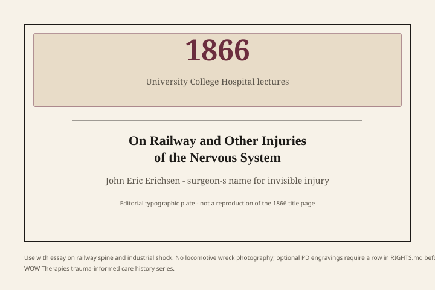

**Educational note.** This is history for a general reader. It is not a diagnosis, not a treatment plan, and not a substitute for care with a licensed clinician.

In 1866 the London surgeon John Eric Erichsen published *On Railway and Other Injuries of the Nervous System*, lectures he had given at University College Hospital. Trains were no longer a novelty.

<figure class="wt-figure wt-figure--document" itemscope itemtype="https://schema.org/ImageObject">
  
  <figcaption itemprop="caption">
    <strong>Fig. 1.</strong> Erichsen’s 1866 lectures as a historical object (editorial typographic plate — not a reproduction of the title page). No wreck photography; optional PD engravings require <code>RIGHTS.md</code> clearance.
    WOW Therapies — original SVG.
  </figcaption>
</figure> They were a system that could stop a body without leaving a wound a coroner admired. Passengers walked away from collisions and then, days later, could not. Erichsen gave the trouble a name the newspapers could spell: railway spine.

He was not writing a trauma-informed pamphlet. He was writing as a surgeon in a country that had invented both the passenger railway and the personal-injury bar. The book is a door into a problem this whole series keeps meeting: a person is injured in a way a spectator cannot see, and an institution has to decide whether the person is a patient, a malingerer, or a bill.

## A lesion you could argue about

Erichsen’s cases mix concussion of the spine, “molecular” disturbance he could not show under a knife, and the ordinary wreckage of a new machine. He believed something physical had happened even when the autopsy — if there was one — disappointed. That belief made him useful to plaintiffs. It made him a problem for railway companies.

Herbert W. Page, surgeon to the London and North Western Railway, answered in 1883 with *Injuries of the Spine and Spinal Cord without Apparent Mechanical Lesion, and Nervous Shock*. Page had seen the same passengers. He thought fear, suggestion, and the lawsuit did more work than Erichsen’s hidden lesion. “Nervous shock” in his title is not a kindness. It is a rival theory of what a train does to a mind when it does not break a bone.

The quarrel is easy to cartoon: humane Erichsen versus corporate Page. The cartoon is lazy. Erichsen was a famous surgeon protecting a diagnosis he could not photograph. Page was a company doctor who had also watched people get well when the case settled, and people stay ill when the case did not. Both men were doing nineteenth-century medicine in a courtroom. Both left a residue the twentieth century would rename without always citing the trains.

Allan Young, in *The Harmony of Illusions* (1995), treats railway spine as one of the industrial rehearsals for later trauma medicine. The point is not that Erichsen “discovered PTSD.” He did not. The point is that a modern transport system produced a class of complaints that forced medicine to talk about invisible injury, time-lag, and compensation. Those three problems did not go away when the word *trauma* became fashionable.

## Compensation as a clinical fact

A pension, a jury award, and a VA rating are different papers. They do the same social work: they decide whether a story about an unseen injury will be paid. Railway companies in Britain and the United States hired surgeons the way later armies hired psychiatrists — to sort the deserving from the expensive. That sorting is part of the history of trauma, even when the later literature prefers trenches and rape-crisis wards.

This essay will not take Erichsen’s side against Page or Page’s side against every passenger who shook. It will say that the *argument* is the artifact. Once an injury can be claimed without a visible wound, medicine inherits a credibility problem it never quite solves. Myers’s 1915 shell-shock papers inherit it. The DSM-III committee inherits it. Memory-wars lawyers inherit it. A school that prints “trauma-informed” on a handbook inherits a polite version of it: how do you take a child’s story seriously without turning every difficult day into a claim?

## What the trains do not give us

They do not give us a method. Erichsen recommended rest, time, and the ordinary surgical caution of his decade. Page recommended skepticism and, often, less money. Neither man described a talking cure. Charcot’s Tuesday lessons and Janet’s *automatisme* are a different city and a different decade. Do not drag a Salpêtrière hysteric onto a Great Western carriage because both stories involve shaking.

They do not give us permission to diagnose a reader. If you were in a crash last year, this page is not your chart. If you are in danger, call local emergency services. Railway spine is a historical name. It is not a checklist.

They do not give WOW Therapies a service line. A speech-language practice in Southeast Arkansas may later meet a person whose voice or swallow changed after an accident. That is a referral and an evaluation, described on service pages, not a reason to advertise “trauma treatment” under a nineteenth-century heading.

## A name that leaked

“Railway spine” leaked into American case law and into jokes. By the 1890s a person who had never seen Paddington could use the phrase. That is how medical names behave when they are useful in court. “Shell shock” would leak the same way in 1915. “PTSD” leaked after 1980. “Trauma-informed” leaked after 2001 and again after 2014. Leakage is not proof of truth and not proof of fraud. It is proof that institutions needed a word.

Erichsen died in 1896. Page outlived the first generation of the argument. The trains got safer; the invisible-injury problem moved to factories, then to trenches, then to bedrooms and borders. The next essays pick it up in Paris and Wiesbaden, where the machine is no longer a locomotive and the courtroom is sometimes a psychoanalytic congress.

If you want the figure, the Erichsen essay in this pack stays with the surgeon. This piece stays with the *system*: steel, speed, insurance, and a medicine that had to invent a lesion it could not hold in a jar.

## What a Victorian jury was being asked to believe

Erichsen’s lectures were not written for a trauma conference. They were written for students who would soon be expert witnesses. A passenger who had been in a collision, had perhaps a bruise, and then developed pain, tremor, or a failure of will that lasted past the week — that passenger needed a story a jury could follow. “Concussion of the spine” was a surgeon’s attempt to give the story a lesion. The lesion was, by his own admission, often invisible. Invisibility is why Page could answer.

Railway companies in Britain kept their own medical staff and their own statistics. They had reasons to prefer a theory in which fear and the lawsuit did the work. They also had reasons to prefer a theory that limited payouts. A historian who cannot hold both reasons will write a morality play. This pack will not. The 1866 and 1883 books are the two poles of a compensation science that later armies and later VA boards would reinvent without always citing the trains.

American courts borrowed the phrase. By the 1890s a Midwestern collision could be discussed in London’s vocabulary. That is how industrial names travel: not as science first, as usefulness first. “Shell shock” would travel the same way in 1915. “PTSD” would travel after 1980. “Trauma-informed” would travel after 2001 on laminated cards. The travel is not proof. It is the phenomenon.

A speech-language clinician who meets an adult after a motor crash is not doing railway-spine medicine. Swallow and cognitive change after injury have their own exams. The useful inheritance is only the old warning: an unseen injury will attract both compassion and suspicion, and a building has to decide which one it will fund. Harris and Fallot’s later desk is a distant cousin of that decision. Do not make Erichsen their grandfather. Do not use that banned kinship word. He is a dated door.

If a later editor wants a museum object, the 1866 title page is enough. No generated wreck. No stock photograph of a sobbing passenger. Period engravings of collisions exist; log license before use. The argument does not need the engraving.

## Sources

Erichsen 1866; Page 1883; Young 1995 on industrial rehearsals. For the later military renaming, see the shell-shock and DSM-III essays in this pack.

*WOW Therapies educational series on the history of trauma-informed care. Complementary to the counseling-heritage pack. This lane is history, not a service menu. WOW Therapies is a speech-language practice in Southeast Arkansas; these posts do not claim a trauma-therapy clinic.*
