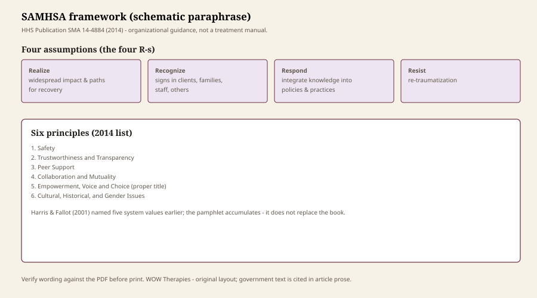

**Educational note.** This is history for a general reader. It is not a diagnosis, not a treatment plan, and not a substitute for care with a licensed clinician.

In 2014 the Substance Abuse and Mental Health Services Administration issued HHS Publication SMA 14-4884, *SAMHSA’s Concept of Trauma and Guidance for a Trauma-Informed Approach*. The same year it issued TIP 57, *Trauma-Informed Care in Behavioral Health Services*. Two federal objects, two thicknesses. The pamphlet is the one that escaped into schools, hospitals, and grant applications. This essay stays with the pamphlet as a historical document — a stabilization of other people’s work — not as a treatment manual.

## The four R’s, in the pamphlet’s own verbs

<figure class="wt-figure wt-figure--diagram" itemscope itemtype="https://schema.org/ImageObject">
  
  <figcaption itemprop="caption">
    <strong>Fig. 1.</strong> SAMHSA’s four R’s and six principles (schematic paraphrase of SMA 14-4884, 2014). Organizational guidance — verify wording against the federal PDF before print.
    WOW Therapies — original layout; government text cited in article.
  </figcaption>
</figure>

SAMHSA wrote that a program, organization, or system that is trauma-informed:

- *realizes* the widespread impact of trauma and understands potential paths for recovery;
- *recognizes* the signs and symptoms of trauma in clients, families, staff, and others involved with the system;
- *responds* by fully integrating knowledge about trauma into policies, procedures, and practices;
- and seeks to actively *resist* re-traumatization.

Those are assumptions about a building. They are written in a prose only a federal office could love. They are also, if you strip the polish, Harris and Fallot’s 2001 claim plus a decade of network talk (NCTSN, ACE, a hundred trainings). The pamphlet says as much in its notes. It does not pretend to have invented the argument.

“Resist re-traumatization” is the verb that later orientation slides remember. It is also the verb a building can fake. A seclusion room with a poster about safety is still a seclusion room. The pamphlet’s own example — restraint of a person with a sexual-abuse history, seclusion of a neglected child — is more concrete than most of the trainings that cite it.

## Six principles, not a recipe

The 2014 list:

1. Safety
2. Trustworthiness and Transparency
3. Peer Support
4. Collaboration and Mutuality
5. Empowerment, Voice and Choice
6. Cultural, Historical, and Gender Issues

Harris and Fallot had five values. SAMHSA split and renamed, and added the sixth. Peer support is the addition that most clearly belongs to a federal behavioral-health decade: recovery movement, consumer/survivor language, the idea that people who have used services are not only objects of policy. Cultural, historical, and gender issues is the addition that gestures at Brave Heart, at race, at the fact that a Kaiser ACE sample is not a boarding-school history. A gesture is not a scholarship. The historical-trauma essay in this pack exists because a bullet on a federal list is not Maria Yellow Horse Brave Heart’s 1998 papers.

The pamphlet also named ten implementation domains: governance and leadership; policy; physical environment; engagement and involvement; cross-sector collaboration; screening, assessment, treatment services; training and workforce development; progress monitoring and quality assurance; financing; evaluation. That list is the most honest page in the document. It admits that “trauma-informed” is a management problem — budgets, boards, buildings — not a feeling the staff had after a half-day in-service.

## What a pamphlet is for

SMA 14-4884 exists so a state agency, a Medicaid health home, a child-welfare RFP, and a hospital quality office can point to the same object. Pointing is not nothing. American human services run on shared objects. The cost of a shared object is thinning. By 2016 you could find the six principles on a laminated card in a building that had changed no policy in domain 2 or domain 9.

TIP 57 is thicker and more clinical. It is still a SAMHSA TIP: guidance for behavioral-health providers, not a consumer workbook, not a license for a speech clinic to treat PTSD. This pack will not mash the two publications into one citation. If you mean the four R’s, say 14-4884. If you mean the behavioral-health protocol, say TIP 57.

## What the pamphlet is not

It is not a diagnosis. It is not an efficacy trial. It does not settle EMDR against CPT. It does not tell you your ACE score. It does not make WOW Therapies a trauma clinic. A speech-language practice in Southeast Arkansas may later decide, on a service page and after review, to describe how it tries not to surprise people at the jaw, the neck, or the swallow exam. That description would be manners and safety. It would not be SMA 14-4884 implemented in all ten domains, and anyone who claims otherwise is selling.

Derek Summerfield’s earlier *BMJ* critique (2001) was aimed at PTSD as a humanitarian export, not at this pamphlet. The critiques essay will still ask whether a federal approach can become another way to medicalize misery. The pamphlet is not innocent of that risk. It is also not the villain of that risk. Villain stories are for slides.

If you are in danger, call local emergency services. This page will not write your safety plan. It will not walk your board through domain 1. Read the PDF if you run a program. Do not quote it as a method you can do at home.

## Ten domains, or a laminated card

The pamphlet’s most honest page is not the four R’s. It is the ten implementation domains: governance, policy, physical environment, engagement, cross-sector work, screening and services, workforce, quality assurance, financing, evaluation. That list admits that “trauma-informed” is a management problem. A hospital that trains for an hour and keeps the same restraint numbers has bought a principle. A clinic that changes doors, interpreters, chaperones, and who has to retell the worst day has bought a domain.

Peer support is the addition that belongs to a federal recovery-movement decade. Cultural, historical, and gender issues is the addition that gestures at Brave Heart, at race, at the fact that a Kaiser sample is not a boarding-school history. A gesture is not a scholarship. This pack’s historical-trauma and racial-trauma essays exist because a bullet is not a people.

TIP 57 is the thicker 2014 cousin: behavioral-health protocol, still not a consumer workbook, still not a license for a speech clinic to treat PTSD. If you mean the four R’s, say SMA 14-4884. If you mean the TIP, say TIP 57. Do not mash them.

By 2016 the six principles lived on cards in buildings that had changed no policy in domain 2 or domain 9. Thinning is the cost of a shared federal object. Shared objects are also how American human services run. This pack will not sneer the pamphlet out of existence. It will not quote it as a method you can do at home. WOW Therapies will not claim ten-domain implementation on a history URL.

## TIP 57 is a different 2014 object

SMA 14-4884 is guidance for an *approach*. TIP 57 (*Trauma-Informed Care in Behavioral Health Services*, SMA 13-4801 on the cover line) is a treatment-improvement protocol aimed at behavioral-health programs. Two federal objects, same year, different jobs. A speech-language office is neither the pamphlet’s whole audience nor TIP 57’s. Citing both as if they were one laminated card is how a systems idea becomes a treatment claim.

The ten implementation domains — governance, policy, physical environment, engagement, and the rest — are the pamphlet’s most honest page because they are expensive. A card is cheap. A domain is a budget line. This series will keep saying that. It will not turn the domain list into a fidelity checklist for Monticello.

## Sources

SMA 14-4884 (2014); TIP 57 (2014); Harris & Fallot 2001 as cited thought-leaders. Related: `harris-fallot-service-systems`, `nctsn-and-the-child-trauma-network`.

*WOW Therapies educational series on the history of trauma-informed care. Complementary to the counseling-heritage pack. This lane is history, not a service menu. WOW Therapies is a speech-language practice in Southeast Arkansas; these posts do not claim a trauma-therapy clinic.*
