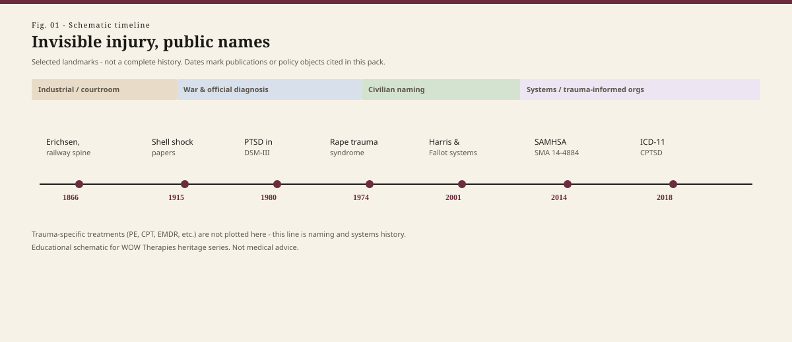

# Embed — series-overview

```html
<figure class="wt-figure wt-figure--spread" itemscope itemtype="https://schema.org/ImageObject">
  
  <figcaption itemprop="caption">
    <strong>Fig. 1.</strong> Selected landmarks in naming invisible injury (schematic). This line tracks publications and policy objects cited in the pack — not trauma-specific treatment manuals.
    <span class="figure-credit">WOW Therapies educational series — original SVG. Not medical advice.</span>
  </figcaption>
</figure>
```
