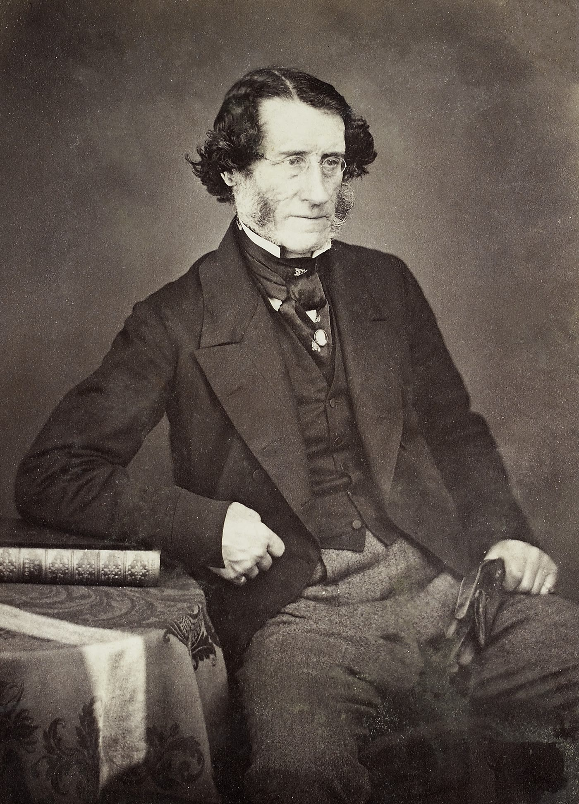

# Benjamin Guy Babington

*Educational history for SLPWOW. Not a treatment plan and not a substitute for evaluation by a licensed clinician.*

<!-- figure-id: benjamin-guy-babington.lead-portrait -->
<figure class="slpwow-figure slpwow-figure--portrait">
  
  <figcaption>
    <strong>Benjamin Guy Babington</strong> (1794–1866), London physician who demonstrated a glottiscope to the Hunterian Society in 1829.
    Photographer unknown. Wellcome Collection / Wikimedia Commons. CC BY 4.0.
  </figcaption>
</figure>

On 18 March 1829 the Hunterian Society in London watched a physician hold up a small mirror-and-shank device and call it a glottiscope. Benjamin Guy Babington was not presenting a new hospital. He was presenting a thought: the glottis might be looked at in a living person if you could get a reflecting surface past the tongue and some light to follow it.

## A physician of parts

Babington was born 5 March 1794 and died 8 April 1866. He became a London physician of standing — later president of the Royal Medical and Chirurgical Society — and, in another life that was the same life, president of the Royal Asiatic Society. The Sanskrit-and-Tamil work is not a cute aside. It tells you he was the kind of nineteenth-century doctor who collected languages the way later doctors collected instruments.

The glottiscope demonstration is secure as an event. What remains argued is the image. Did he, or anyone in that room, *resolve* a living glottis the way García would resolve his own in the 1850s? Historical papers split. This pack prints the demonstration and refuses the miracle.

## Why he is not García

No Royal Society physiology paper. No school of singers. No hundredth-birthday dinners. Babington’s glottiscope is a date in a priority footnote and a warning against origin myths. The British story likes to keep him so that 1855 is not a French raid on London’s honor. The honest story keeps him because the *idea* of a laryngeal mirror is older than the *use*.

Additional engravings may be logged in `PORTRAIT_SOURCES.md` if a clearer scan is found; do not generate a substitute face for a man who already sat for real ones.

## A society demonstration is not a school

The Hunterian Society minute, or the later report of it, is the kind of source historians fight over in footnotes. This pack treats 18 March 1829 as the public London date and refuses to invent the conversation after the demonstration. No one in that room opened a throat hospital the next morning. Mackenzie’s Golden Square is a generation away. García’s paper is twenty-six years away.

Babington’s other presidency — the Royal Asiatic Society — is why some biographical pages barely mention the glottiscope. A man can be important in two guilds and famous in neither’s origin myth. Voice heritage keeps the smaller fame because the larger one will not.

**Further in this series.** Before the mirror (essay 01). García (19). Mackenzie’s London (essay 04).
