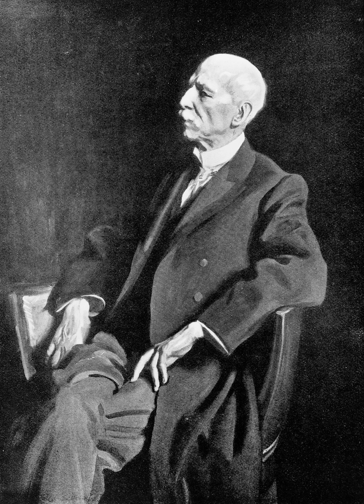

# Manuel García Jr.

*Educational history for SLPWOW. Not a treatment plan and not a substitute for evaluation by a licensed clinician.*

*Manuel García Jr. (1805–1906). Wellcome Collection (M0010222) / Wikimedia Commons. CC BY 4.0.*

He taught people to sing for a living and, one afternoon, used a dentist’s mirror to watch himself do it. Manuel Patricio Rodríguez García — Manuel García Jr. in every later clinic sentence — was born in Madrid on 17 March 1805 and died in London on 1 July 1906. One hundred and one years. The last of them were ceremonial.

## A family trade

His father, Manuel García Sr., was a tenor and a teacher. His sisters, Maria Malibran and Pauline Viardot, were the famous ones. The son wrote *École de García* (1840, expanded 1847) and taught in Paris and then for decades in London. He did not take a medical degree. He did not want one. The 1854–55 autolaryngoscopy was a teacher’s experiment: if registers have a mechanism, the mechanism ought to be visible.

“Observations on the Human Voice,” read to the Royal Society on 24 May 1855, is the public act. The private Paris window is the legend. This profile follows essay 02: the Society date is the document; the Paris window is the reported experiment — no diary line has been verified.

## What he was not

He was not the first person to think of a laryngeal mirror. Babington had shown a glottiscope in 1829. He was not a laryngologist. Türck and Czermak would make the patient exam a medical job. He was not a speech-language pathologist. The credential did not exist.

He was a man who lived long enough to watch medicine take his party trick and build hospitals on it. The 1905 birthday dinners mixed those hospitals with Conservatoire piety. The mixture is the point of his afterlife. Every later “interdisciplinary” symposium is, in one of its moods, a García birthday without García.

## Residue

A paper. A myth that needs the paper. A reminder, useful in staffing meetings, that the first person to see a living glottis in the English scientific record was listening for a register, not a tumor.

Portraits exist. Many are late photographs. The Wellcome image is the pack default; log any swap in `PORTRAIT_SOURCES.md`. Do not use a painted “young García” of unknown date as if it were a studio fact.

## London years, a hundred candles

The long London teaching life is the part medical histories skip. He trained singers while laryngology trained itself. By the 1905 dinners the two trades needed each other for the photograph. Students who only meet García as “inventor of the laryngoscope” never meet the Conservatoire argument he was actually having: what is a register if you can see the glottis change?

Sisters famous, father famous, son useful — the family is a European music story that medicine borrowed. Borrowing is allowed. Renaming him a doctor is not.

**Further in this series.** Essay 02. The singing-teacher door (essay 06). Vienna 1858 (essay 03).
