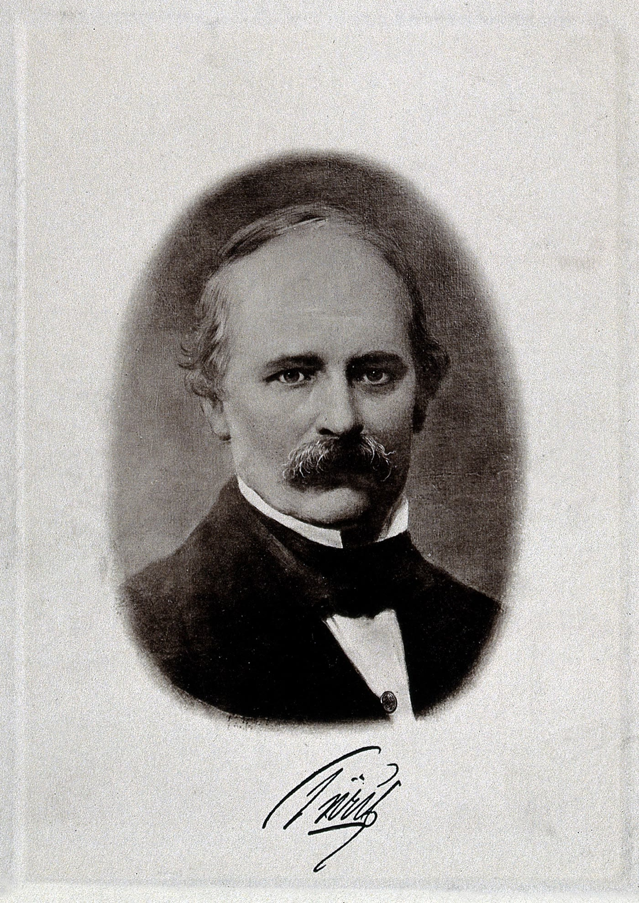

# Ludwig Türck

*Educational history for SLPWOW. Not a treatment plan and not a substitute for evaluation by a licensed clinician.*

<!-- figure-id: ludwig-turck.lead-portrait -->
<figure class="slpwow-figure slpwow-figure--portrait">
  
  <figcaption>
    <strong>Ludwig Türck</strong> (1810–1868), Viennese laryngologist who made mirror laryngoscopy a routine medical exam.
    Photogravure. Wellcome Collection V0027275 / Wikimedia Commons. CC BY 4.0.
  </figcaption>
</figure>

Ludwig Türck waited for the sun.

Born 22 July 1810, died 25 February 1868 in Vienna, he was a neurologist and laryngologist in a city that would soon have too many of the second. In 1857–58 he turned a laryngeal mirror toward patients when daylight allowed. Then Johann Nepomuk Czermak, younger, quicker in print, added a lamp and a tour. The priority fight is essay 03. The life is a man who believed a method you could not use in November was still *his* method.

## What he actually did

He examined living patients, not only himself. That is the jump from García. He wrote. He defended. He lost the popular history to the man with the condenser and won the footnote. Viennese medicine in those years ran on footnotes.

Türck’s neurologic work is easy to skip in a voice pack. Skip it and you miss why a “throat man” in 1858 might also be a nerve man. The larynx was not yet a department. It was a region a careful physician could claim if he had a view.

## Residue

A name that still appears in double with Czermak on the first slide of every decent laryngology history. A lesson about weather: clinics that depend on a window do not scale. He died six years before Czermak, at fifty-seven, with the quarrel unfinished because quarrels of that kind do not finish. They get taught.

## Neurology and a seasonal method

Türck’s neurologic writing is why a voice pack should not file him as “the other mirror man.” A larynx in 1858 was still a nerve story as much as a local one. Semon’s later “law” would make that official in London. Türck was already living it in Vienna.

The seasonal limit is the humane fact in the quarrel. A physician who can only examine when the sun cooperates will lose the popular history to a physician who bought a lamp. That is not the same as losing the first patient. Print both sentences.

Vienna would spend the rest of the century inventing other firsts. Türck’s is the unfashionable one: he looked, in season, at people who were not himself, and then watched a younger man take the weather out of the method. The pamphlets are bitter because the work was real.

**Further in this series.** Essay 03. Czermak (21). García (19).
