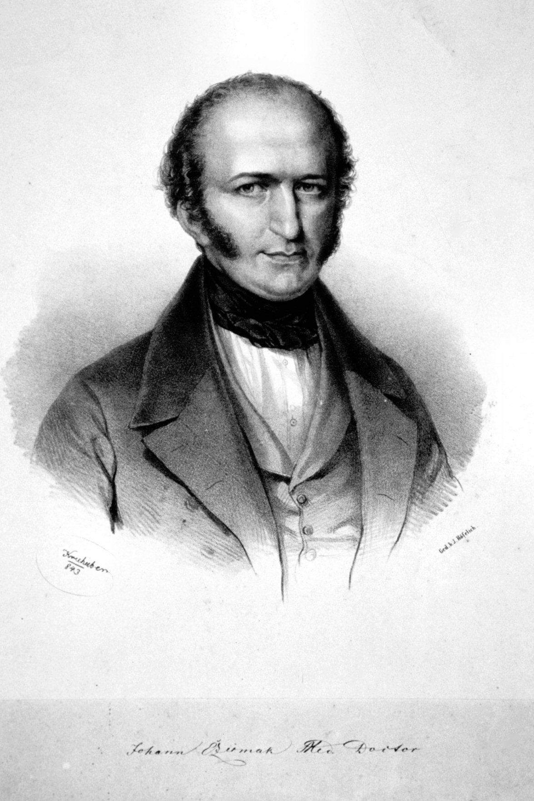

# Johann Nepomuk Czermak

*Educational history for SLPWOW. Not a treatment plan and not a substitute for evaluation by a licensed clinician.*

*Johann Nepomuk Czermak (1828–1873). Lithograph after Josef Kriehuber. Wikimedia Commons. Public domain.*

Johann Nepomuk Czermak made the mirror a weekday instrument.

He was born in Prague on 17 June 1828 and died in Leipzig on 16 September 1873, at forty-five. Physiology, not only laryngology, was his trade. In Vienna in 1858 he took the laryngeal mirror that Ludwig Türck had already been using in sunlight and added what a clinic actually needs: artificial light, a condenser, a demonstration that could be repeated after dusk. *Der Kehlkopfspiegel und seine Verwerthung für Physiologie und Medizin* (1860) is the book that traveled. Türck’s priority pamphlets stayed closer to home.

## The tour, not only the lamp

Czermak understood publicity the way later American surgeons would understand film. He showed the method. He let other cities watch. A technique that lives in one man’s weather is a hobby. A technique that lives in a book and a lamp is a trade. Essay 03 tells the quarrel without picking a mascot. This profile can say the obvious residue: the afternoon voice clinic is his weather.

He worked in Pest and in Leipzig. He was not only a “throat man.” The physiologic papers — on the larynx as an organ in a living system — are why a voice-science pack keeps him and a purely surgical honor roll sometimes drops him. Killian and Jackson would go further down the airway. They went through a door he had already forced open at the glottis.

## The quarrel he did not outlive

Türck died in 1868. Czermak died five years later. Neither got the last word, which is the only fair ending for a priority fight. Later textbooks that print “Czermak invented laryngoscopy” are doing the lamp’s work and erasing García and Türck and Babington. Later textbooks that print “Czermak stole the mirror” are doing Vienna’s work. Print the lamp. Print the book. Print the age at death. Forty-five is young enough that the afterlife had to be written by other people.

Portraits exist in the Central European engraving trade. Confirm the Commons license on the file page before swapping the lithograph. Do not use a cropped textbook woodcut of unknown date as if it were a studio photograph.

## Physiology first

Later ENT honor rolls remember the tour. Physiologists remember a man who thought the larynx was an experimental organ. The 1860 title says *Physiologie und Medizin* in that order. A voice-science pack is allowed to prefer the order. A surgical pack will flip it. Both readings are in the German.

Forty-five is young. The method was not. Within a decade London had a hospital and Berlin was preparing a different kind of chair. Czermak’s afterlife is other people’s departments.

**Further in this series.** Essay 03. Türck (20). García (19). London (essay 04).
