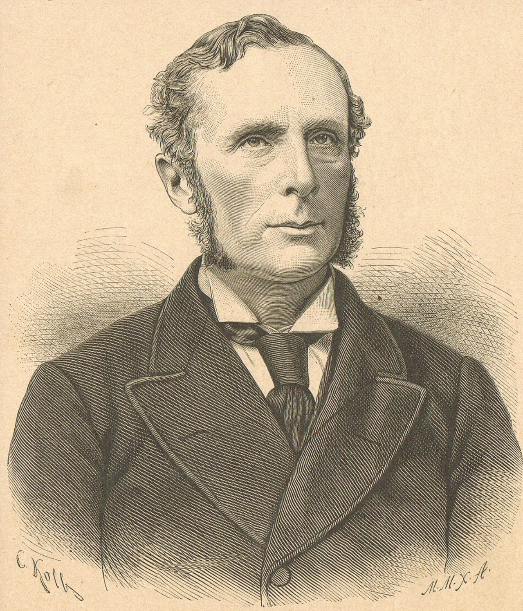

# Morell Mackenzie

*Educational history for SLPWOW. Not a treatment plan and not a substitute for evaluation by a licensed clinician.*

<!-- figure-id: morell-mackenzie.lead-portrait -->
<figure class="slpwow-figure slpwow-figure--portrait">
  
  <figcaption>
    <strong>Morell Mackenzie</strong> (1837–1892), London laryngologist who built Golden Square into a voice-disorders hospital.
    Wood engraving after C. Kolb, 1888. Wikimedia Commons. Public domain.
  </figcaption>
</figure>

Morell Mackenzie built a hospital for a region of the body and then became, against his will, a character in a German tragedy.

He was born 7 July 1837 and died 3 February 1892. He learned the new mirror work on the continental circuit — Vienna, Budapest — and opened, in Golden Square in 1865, the Hospital for Diseases of the Throat. Secondary lists sometimes print 1863 for an earlier outpatient start. This profile follows essay 04: 1865 for the hospital the specialty later cited; a minute book can move the door.

## The book that is not the scandal

*The Hygiene of the Vocal Organs* (1886) is the Mackenzie most singing teachers still meet: rest, weather, alcohol, the manners of a voice. It is a genre, not a protocol. It is also a claim — that laryngology owns the *speaking and singing* throat, not only the cancerous one. Felix Semon, his London contemporary, would put a “law” on paralysis. Mackenzie put a lintel on a square.

He is tied to the early *Journal of Laryngology*. The journal culture matters more than the celebrity case, and gets less ink. A specialty that can publish monthly can survive a pamphlet war.

## Frederick

In 1887 Crown Prince Frederick of Prussia developed a laryngeal illness. Mackenzie’s examinations, the German opinions of Bergmann and Gerhardt, the brief reign of 1888, the death in June of that year, Mackenzie’s *The Fatal Illness of Frederick the Noble* — essay 04 refuses to retry the slides. The life has to name the cost. Mackenzie became, in German print, the foreigner who had killed an emperor with caution. He became, in English print, the careful man ruined by Bismarck’s doctors. Both portraits are weapons.

A modern clinician who wants a lesson from Frederick III can have this one: a young specialty plus a famous neck plus nationalism will not produce a clean case report. It will produce a legend that eats the hospital.

## Residue

A door in Golden Square. A hygiene genre later American paperbacks would inherit. A caution about famous patients that Gould’s generation would ignore and then professionalize. Wood-engraved portraits are common; confirm Commons status before replacing the current image.

## The journal and the lintel

If you take away Frederick III, Mackenzie still has a hospital and a hygiene book and a role in the *Journal of Laryngology*. That is already a founder’s haul. The scandal is what made him a character. Characters get movies. Lintels get hours. This pack is in the hours business.

British portraits are common in wood-engraved medical pages. Commons file pages still need a reading. Do not upload a textbook scan with a publisher’s watermark and call it PD.

**Further in this series.** Essay 04. After the knife (essay 15). Brodnitz’s paperback (29).
