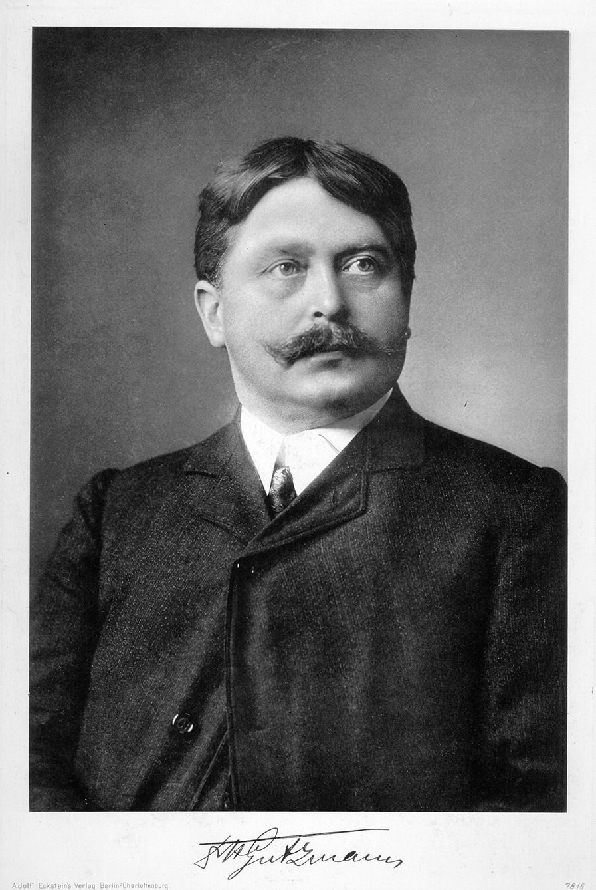

# Hermann Gutzmann Sr.

*Educational history for SLPWOW. Not a treatment plan and not a substitute for evaluation by a licensed clinician.*

<!-- figure-id: hermann-gutzmann-sr.lead-portrait -->
<figure class="slpwow-figure slpwow-figure--portrait">
  
  <figcaption>
    <strong>Hermann Gutzmann Sr.</strong> (1865–1922), Berlin phoniatrist whose breathing and articulation drills shaped German voice therapy.
    Published by Adolf Eckstein. Wikimedia Commons. Public domain.
  </figcaption>
</figure>

The Eckstein portrait shows a Wilhelmine physician: beard, stiff collar, the look of a man who has just come from a lecture. Hermann Carl Albert Gutzmann (29 January 1865 – 4 November 1922) is the person European phoniatricians mean when they say the specialty has a father. This pack needs him for the voice book and the Charité hallway, not as a second copy of the stuttering dissertation.

The Eckstein plate is logged in `PORTRAIT_SOURCES.md` as a Commons-PD ingest. The sibling speech-pathology pack holds the same publisher’s plate under a different filename.

## Bütow to the throat clinic

Born in Bütow, Pomerania, first of seven children, he took the Abitur at the Friedrichswerdersches Gymnasium in 1883 and studied medicine in Berlin under Ernst von Bergmann and Carl Gerhardt among others. The 1887 dissertation, *Über das Stottern*, was the family subject: his father Albert taught deaf children and already published on speech errors. In 1890 they founded the *Medizinisch-pädagogische Monatsschrift für die gesamte Sprachheilkunde*. Medicine and pedagogy, one monthly.

1891: private outpatient clinic for the speech-impaired in Berlin. 1896: sanatorium in Zehlendorf. 1904–05: a thesis on respiratory movements in speech disorders, then the 1905 inaugural lecture — *Die Sprachstörungen als Gegenstand des klinischen Unterrichts* — the year the Union of European Phoniatricians still prints as phoniatrics’ academic founding. 1907: clinic into the medical polyclinic. 1912: Gustav Killian brings the service into the Charité’s throat and nose clinic. A phonetic laboratory, first private, then attached to the Charité service.

*Des Kindes Sprache und Sprachfehler* (1894), *Physiologie der Stimme und Sprache* (1909), *Sprachheilkunde* (1912). Students from everywhere: Nadoleczny, Schilling, Stern, Seeman, Sokolowski, Panconcelli-Calzia, Wethlo, the son Hermann Jr. The 1909 physiology book is the spine of *this* profile. It treats voice as a measurable organ, not only as a school problem.

## The specialty he actually founded

Not “speech-language pathology” in the ASHA sense. A medical specialty of voice and speech, later joined to pediatric audiology in German training. Teachers came through his rooms; they did not get his title. That split — physician / therapist — is the European structure Americans keep rediscovering whenever they hire an ENT and an SLP for the same singer.

He died in Berlin-Lichterfelde at fifty-seven. Fröschels’s Vienna congress was two years off. The American academy was three. The son later ran the Charité phoniatric department. Nadoleczny stayed in Munich. The *specialty* survived. The Berlin door did not have to.

## How to read him in a voice clinic

Read him as a builder of rooms: journal, clinic, lecture, laboratory. Read the 1909 book as late-Wilhelmine physiology, not as a modern resonant-voice manual. Do not flatten him into “the German Boone.” Boone was a psychologist-clinician who wrote for American undergraduates. Gutzmann was a physician who wanted a chair. They share a subject. They do not share a job.

## Three hundred shorter works

European CVs like large counts. UEP and the German biographers print “more than three hundred” shorter pieces next to the named books. Treat the count as department pride and the 1909 physiology text as the object. The 1914 Hamburg phonetics congress he helped stand up — the war cut the afterparty — is the habit Fröschels would pick up in Vienna as a meeting. Rooms, again. Not a protocol.

**Further in this series.** Essay 05. Nadoleczny (24). The sibling pack’s Gutzmann profile, for the stuttering and school side.
