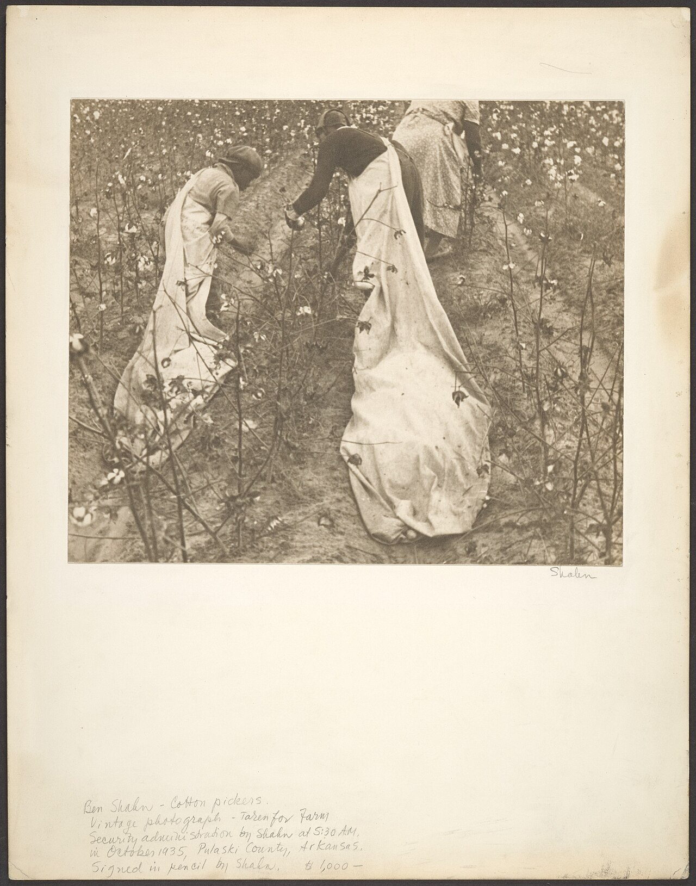

# Five Names in the Field

Simon Taylor. Lizza Taylor. Virginia Thurman. Wealthy Thurman. Gill Gordon.

Steven Teske puts the five names in a single sentence of the Encyclopedia of Arkansas, the way a careful archivist puts a label on a box and then refuses to let the box be reshelved as “labor.” They tended James Thomas Dionysius Anderson’s first corn on a five-acre clearing in what would become Wilmar. The year of the purchase was 1859. The county, two years later, would send men to a secession convention. The crop was corn. The hands were not hired.

A Ken Burns piece on this country can film a mill whistle and a college catalog and a Juneteenth table and still lie, if it treats those five names as atmosphere. They are not atmosphere. They are the first workforce the town’s origin story admits to. The record after the sentence is thin. This essay will not thicken it with invented diaries. It will stay with what the county’s own numbers and the encyclopedia’s own names force a reader to hold.

## What the county was counting

In 1860 Drew County listed 5,581 white citizens and 3,497 people held in bondage. Mary Heady’s county article does not bury the ratio. Almost two in five residents of the county were legally property. William Slemons, who sat for Drew at the 1861 secession convention, owned one enslaved person on the 1860 census. J. A. Rhodes, the other delegate, owned twenty. The convention vote is sometimes told as ideology. The census tells it as inventory.

Anderson’s five were not a plantation roll of the Bayou Bartholomew sort. Major Tillar’s later holdings, east of the dividing ridge, belonged to a different scale of cotton wealth — the 1907 *Advance* would still be boasting about those alluvial thousands of acres when Wilmar was already a mill town. On the pine side, bondage looked smaller and no less complete. Five people on seven hundred acres is not a small fact. It is a household economy that cannot be narrated as a yeoman romance.

The names themselves do a kind of work the county histories often refuse. Taylor and Thurman are family names twice. Simon and Lizza; Virginia and Wealthy. The doubled surnames may mean marriages, siblings, or the usual violence of renaming. The encyclopedia does not say. Gill Gordon stands alone in the list. We do not have ages. We do not have a sale paper. We do not have a Freedmen’s Bureau complaint filed from this clearing — or if we do, it has not yet been walked into this pack. Absence is not emptiness. It is a seam.

## 1861, a church, and a war that did not need a battle here

A Presbyterian church was built near Anderson’s land in 1861. Teske records the building. He does not record who sat where, or whether the five names were expected to stand at the back, or whether they were expected not to come. Associate Reformed Presbyterians would later matter to John Jefferson Lee Spence when he came to Monticello in 1892. The 1861 church is earlier and simpler: a white congregation putting up a house of worship in the year Arkansas left the Union, on land whose first crop had been made by enslaved people.

Drew County’s war, in Heady’s telling, is a calendar of skirmishes: January, March, June, and September of 1864; January, March, and May of 1865. The last shots at Rough and Ready came after Appomattox, because the telegraph was not the authority here. Colonel William F. Slemons, Second Arkansas Cavalry, became the local hero the United Daughters of the Confederacy would later name a chapter for. Thomas DeBlack’s *With Fire and Sword* is the statewide book for the years 1861–1874. This essay does not need his chapters to say the obvious: the people who had tended Anderson’s corn did not get to vote on secession, and they did not get a paragraph in the UDC minutes.

What they got, if the law meant what it said in 1865, was a legal end to the condition Teske names. Anderson “continued to tend his farmland after the Civil War.” The verb is tend. The encyclopedia does not say who stood in the rows in 1866. Share, wage, kinship, departure — all are possible, and none should be chosen for the sake of a smooth sentence.

## Reconstruction is not a fade

The Ku Klux Klan was active in Drew County during Reconstruction until around 1875. After the November 1868 election, Governor Powell Clayton declared martial law in fourteen counties, including Drew. Colonel Samuel W. Mallory led the state militia in the southeast. Four prominent local men offered Clayton a bipartisan “home guard.” A military commission tried, convicted, and executed one local Klansman for murdering a deputy sheriff and a Black man. Clayton lifted martial law in the southeast in February 1869.

That paragraph is Heady’s, compressed. It belongs in an essay about five names because the years after bondage were not a pastoral. Wilmar as a named post office did not yet exist. The ground did. The people who had been counted as property in 1860 were, by 1868, citizens someone was willing to kill to keep from the polls. A later Klan resurgence in the county (1915, dwindling by 1928) and a Wilmar chapter in 1923 are later essays. The first terror is this one.

Lynching in the county, when it is named, is named later: Buck Hunter in 1886; William Beavers in 1890 and Henry Beavers in 1892; James Jones in 1895; James Redd and Alex Johnson in the Monticello jail in 1898; Philip Slater in 1921. The Beavers brothers are a separate piece in this series. They are listed here so no reader of Anderson’s corn can pretend the later violence was a different country.

## How to film a name

If this were a Burns hour, the still would be a ledger line, not a reenactment. The voice-over would say the five names slowly, then the 1860 county counts, then stop. Music would be a mistake. The temptation in heritage writing is to promote the enslaved into a chorus that blesses the later mill, the later college, the later dinner. They do not owe the mill a blessing. The June Dinner, which is a Black institution and one of the oldest Juneteenth celebrations in Arkansas, is their descendants’ story, or the story of people who shared their condition. It is not a redemption arc for Anderson’s dollar.

A local history can say this without a sermon and without a product. The first recorded crop on this ground was made by people who could not leave. That is not a mill story and not a shop story. It is the ground under every later story. The camera, if it is honest, stays on the names long enough that a reader cannot skip them on the way to the whistle.

Simon Taylor. Lizza Taylor. Virginia Thurman. Wealthy Thurman. Gill Gordon.

The encyclopedia kept them. Teske’s sentence still uses the period noun *slaves*. This pack prefers *enslaved people* in its own voice and does not pretend that changing the noun recovered a biography. The names are the recovery. A later pass that finds a Freedmen’s Bureau complaint, a marriage, or a grave should add the paper, not a scene. Until then the five names and the 1860 county counts are the photograph. The mill, the college, and the dinner all happen on the same ground. They do not get to start the reel.

<figure class="wilmar-figure">

<figcaption>Figure 1. The ridge between two waters — where Anderson’s clearing sat. Schematic, not a survey. Pack graphic AS-MAP-01.</figcaption>
</figure>

<figure class="wilmar-figure wilmar-figure--period">

<figcaption>Figure 2. Cotton pickers in a Pulaski County, Arkansas field, early twentieth century photograph. Pulaski County, not Drew — used here as a period still for field labor the encyclopedia names but does not photograph. Credit: The Metropolitan Museum of Art / Wikimedia Commons. License: CC0 1.0.</figcaption>
</figure>

## Sources for this piece

Teske, “Wilmar (Drew County),” Encyclopedia of Arkansas. Heady, “Drew County,” Encyclopedia of Arkansas. DeBlack, *With Fire and Sword* (2003), as cited for the Reconstruction years. U.S. Census of 1860 as summarized by Heady. No Freedmen’s Bureau file is cited here because none was consulted in the making of this draft; that absence is marked on purpose.
