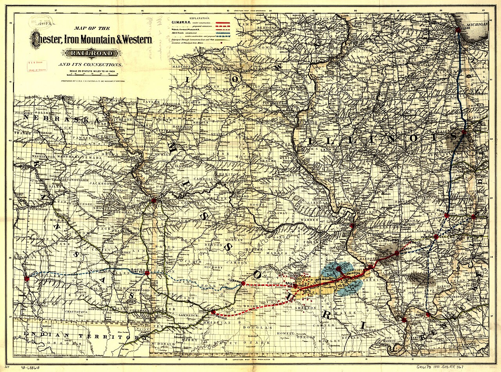

# Twenty-Five Miles of Track

Chartered in 1904. By 1907: twenty-five miles of track, four locomotives, fifty-five log cars, two log loaders. Interchange with the Iron Mountain — later the Missouri Pacific — at the Gates sawmill in Wilmar. Steven Teske’s paragraph is already a complete industrial short. The Wilmar and Saline Valley Railroad did not exist to take a family to Little Rock. It existed to take trees to a saw, and sawn lumber to a larger railroad that could take them out of Drew County.

The name is the first confusion this essay has to kill. *Wilmar and Saline Valley* is not the *Warren and Saline River Railroad*. The second road, incorporated in 1905 as the Warren, Johnsville and Saline River and reorganized in 1920, belonged to Bradley County’s hardwood and pine traffic, to Fullerton and Hermitage and a later cutback to Cloquet. It still exists, in remnant, under other owners. The first road belonged to Gates. It does not still exist. Confusing them is how a reader loses a county.

The house spelling in this pack is a fence. The W&SVR is a logging road with a town at one end. The W&SR is a neighbor this series will not absorb as a second mill monograph. Warren, Bradley Lumber, and that short line appear here as river and rail neighbors. The Bradley County timber pack owns that woods.

## A company railroad, which is a kind of honesty

Darling and Bragg, writing about Crossett’s early mills and camps, put the W&SVR on the same map as the other feeder lines that walked into virgin pine. Gates used it to log north of Crossett before the Wilmar mill closed (their date: 1924). Teske’s date for the equipment transfer is the late 1920s. The road’s job, in either telling, ended when the trees that justified the charter were gone.

Twenty-five miles is a modest empire. It is also far enough to make a woods into a system. Four locomotives are not a toy. Fifty-five log cars are a fleet. Two loaders are the machines that replace a lot of men’s backs and also require men. A Ken Burns hour would want a photograph of a loader against winter woods. This pack does not have one on the desk. IMAGE_SOURCES lists a later need: an Iron Mountain or Missouri Pacific Warren Branch timetable or valuation map. The inventory will have to do what inventories do: stand in for the picture until the picture arrives.

The 1904 charter sits in a tight cluster of other dates this series already owns. Gates in Wilmar: 1889 or 1890, the seam the previous essay refused to iron. City of Wilmar: March 8, 1899. Beauvoir College: May 27, 1903. Smallpox: 1905, forty dead. Bryan in the five-hundred-seat auditorium: 1906. The *Advance* souvenir: December 17, 1907, already writing after Spence’s removal, still listing twenty-five miles as if the road were a civic ornament. The logging road is not an ornament. It is the method with locomotives. Balogh’s cut out and get out is easier to see when the mill stays put and the rails walk.

Russell Tedder’s essay in the *Drew County Historical Journal* (2004) is about a different Drew County road — the Ashley, Drew and Northern, born as Crossett’s Crossett Railway, then Crossett, Monticello and Northern, then AD&N. That line is the one that later nosed spurs into Drew from the south. It is a neighbor, not a synonym. The W&SVR’s interchange was at Wilmar, with the Iron Mountain, at the mill. The AD&N’s story is Crossett’s reach. A reader who wants the whole rail net will need both pieces and a map that does not lie about ownership.

The 1907 paper, promoting Monticello, already wanted a north-south road — the Arkansas, Louisiana and Gulf, surveyed Pine Bluff to Monroe — and reported grading toward Hamburg. Promoters always want a second line. Wilmar’s fate was tied to the first: the Warren Branch east to west, and the company road that fed it. When the mill left, the branch remained, thinner. The twenty-five miles did not.

## What interchange means

Interchange is a dry word for a violent convenience. A log that has ridden a company track can be set on a mainline car without being re-sawn. A board can leave Wilmar without a steamboat, without a winter rise on the Saline, without the *Gate City*’s luck. The Iron Mountain’s Warren Branch already crossed the county. Gates did not have to build to St. Louis. It had to build to its own mill and then shake hands with someone else’s rail.

The *Advance* locates the town with a rail sentence, not a river sentence: about eight miles west of Monticello on the Warren Branch. Monticello sat on the high part of the dividing ridge. Wilmar sat toward Warren and the Saline. The branch traversed Drew County east to west. Cotton could ride it. So could boards. Anderson as postmaster, storekeeper, depot agent, and resident — the four-function house that in 1907 “now serves as a depot” — is the human scale of that branch. The W&SVR is the industrial scale: not a depot for letters, a yard for logs.

Jann Woodard’s Saline River article notes that river shipping slacked off considerably with the advent of the rail system in 1880. Fifty-four steamboats have been documented on the Saline; captains among them Bob Withers, Len Moore, John Wesley Smith, Frank Keeling; cargo cotton, staves, and timber to New Orleans and Monroe; head of navigation at Bridges Bluff in Cleveland County. The *Gate City* sank on October 14, 1913, near Warren, one of the last boats up. The W&SVR is a late confirmation of the slackening. By 1904 the river was already losing the argument. The logging road did not restore the river. It ignored it, except as a name. *Saline Valley* in the charter is geography as letterhead. The cars did not need the water.

The geography the cars did need is the pine the 1907 paper said Gates controlled: Saline bottoms of about 8,000 acres, “not so good from an agricultural standpoint, but are heavily timbered,” and the south of the county. Bartholomew bottoms, about 100,000 acres, were cotton. The dividing ridge held both economies. A logging road named for a valley is announcing which economy it serves. Darling and Bragg’s “north of Crossett” is the other direction the same method walked: toward a larger tract that would become another town, not toward the bayou.

## After the last loader

When the equipment went to Crossett, Wilmar kept the Iron Mountain — the Missouri Pacific — and lost the reason a stranger would look at a map. Shortline ghosts are ordinary in south Arkansas. What is less ordinary is a town that had named a railroad for a river and then lived long enough to become a suburb of the county seat. The track figure, twenty-five miles, is the kind of number a documentary loves because it is finite. You can almost walk it in the head. You cannot walk it on the ground now without knowing which woods were whose.

Heady’s county paragraph and Darling and Bragg’s 1924 closure note are the end of the plant. Teske’s late-1920s equipment transfer is the end of the rolling stock as a Wilmar fact. The census of 1920, 1,034, is the last count that still believes in the job. The census of 1930, 627, is the count after the job has ridden the same flatcars south. Those numbers belong to the next essay. They sit here because twenty-five miles is how the job left: not as a mystery, as a transfer.

The men who loaded the fifty-five cars are unnamed in Teske. The charter never recorded their days. A later valuation map, if one survives, may give a milepost and a camp. This draft has not seen it. The honest film is the inventory, then the seam between 1924 and the late 1920s, then the empty place on a map that still says Saline.

A shop that works wood in this county and took the river’s name is not a reincarnation of the W&SVR. The logging road was extraction. The shop, if it is honest, is remnant and choice: hardwood, one-off, no twenty-five miles of anything. Soft-link, not hymn. The hymn, if there is one, is for the men who loaded the fifty-five cars, whose names Teske does not have, and whose days the charter never recorded.

## What the record will not say

It will not give a valuation map in this folder. It will not give a locomotive builder’s plate, a camp name, or a timetable for passengers, because passengers were not the point. It will not choose between Darling and Bragg’s 1924 and Teske’s late 1920s. It will not print a photograph of a loader against winter woods and caption it as a Gates still — IMAGE_SOURCES forbids generating that picture. It will not merge the W&SVR into the W&SR because the names share a river. It will not invent a quote from Tedder or from Darling and Bragg. Both are cited as existing neighbors to Teske’s inventory.

ICC notes and Wikipedia dates for the Warren, Johnsville and Saline River (incorporated August 7, 1905; reorganized 1920) are used only to keep the two roads apart. They are not color. Union Pacific’s later short-line note is secondary in the same way. The authority for twenty-five miles, four locomotives, fifty-five cars, and two loaders is Teske, writing from the sources the encyclopedia trusts. The authority for the road’s purpose is the method Balogh named and the closure Darling and Bragg dated.

Twenty-five miles of track is a short sentence. It is also the whole industrial film of Wilmar between the 1903 college charter and the 1924 mill death: a company built a road to finish a woods, handed the boards to a larger road, and then sent the tools to a better woods. The town at one end kept the daughter’s name and lost the fleet.

<figure class="wilmar-figure">

<figcaption>Figure 1. Two roads, one river word, two counties. Pack graphic AS-MAP-03. Not a survey.</figcaption>
</figure>

<figure class="wilmar-figure wilmar-figure--period">

<figcaption>Figure 2. Historic map of the Iron Mountain railroad and its connections. Credit: Library of Congress, Geography and Map Division / Wikimedia Commons. License: Public domain.</figcaption>
</figure>

## Sources for this piece

Teske, “Wilmar (Drew County)” (1904 charter; 1907 inventory; Iron Mountain / Missouri Pacific interchange at the mill; late-1920s equipment move). Darling and Bragg, *AHQ* 67 (2008) (W&SVR logging north of Crossett; Wilmar mill close 1924). Tedder, “The Ashley, Drew and Northern,” *Drew County Historical Journal* 19 (2004), as the neighboring Drew County road, not a synonym. Woodard, “Saline River” (rail after 1880; fifty-four boats; *Gate City*, 14 October 1913). Balogh, “Timber Industry,” for the method the road served. Heady, “Drew County,” for exhaustion and the 1924 land sale. Industrial & Souvenir Edition of the *Advance*, December 17, 1907 (Warren Branch location; four-function depot house; north-south promoter road). ICC / Wikipedia notes on the Warren, Johnsville & Saline River (1905; 1920) used only to keep the two roads apart.
