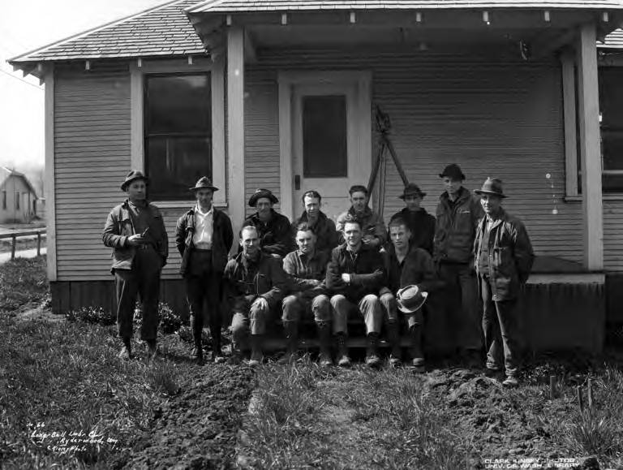

# Cap Gates Walks South

The Encyclopedia of Arkansas, in its Crossett article, calls Edgar Woodward “Cap” Gates a founder in all but the incorporation papers. Three investors in Davenport, Iowa — Edward Savage Crossett, Dr. John Wenzel Watzek, and Charles Warner Gates — put their names on the Crossett Lumber Company in 1899. They sent Charles’s brother south to acquire timber, to oversee the mill, and to build a town. The associates named the town for Crossett. They sent the brother.

Darling and Bragg add the Wilmar hinge. Cap Gates was “then of the Gates Lumber Company in Wilmar, Arkansas” when he learned of a 47,000-acre tract of virgin pine for sale in Ashley County and Morehouse Parish. The tract belonged to the Michigan firm of Hovey and McCracken. The price, in the Crossett company article, was seven dollars an acre, payable over seven years. No commercial timber sold until 1902. Investors had spent a million dollars before the first real crop of boards. Wilmar, by then, had already been a Gates mill town for a decade.

The walk is the essay. Not a reconstructed road, not a diary. A job that moved from a daughter’s postmark to a town that could be drawn on new paper. Anderson had paid a dollar an acre in 1859 for seven hundred acres and a farm. The Iowa men paid seven dollars an acre for a woods they intended to finish. Both prices are in the encyclopedia. Both belong on the same reel if the reel is honest about what a dollar buys.

## Two Gates firms, one family

It is easy, and wrong, to collapse Gates Lumber Company at Wilmar into Crossett Lumber Company at Crossett. The first is Teske’s 1890 Wilmar plant and Heady’s 1889 large-scale sawmill — the one-year seam this series will not iron. The second is the 1899 Iowa corporation. Charles W. Gates is the name on both stories. Cap is the hands. A commenter on the Crossett Lumber Company page, Phillip Gossage, notes that his people always called the Crossett mill “the Gates Lumber Co.” anyway. Memory does what memory does. The historian’s job is to keep the charters apart and the brother on the road.

Wilmar taught the job. Crossett scaled it. The first pine mill at Crossett, in 1899, was “an enormous operation” — two band mills, dry kilns, a planer, the machinery to smooth and ship. A second pine mill followed in 1905. Soon the company was producing 84 million board feet a year. Wilmar’s 1907 inventory, by contrast, is a town inventory: stave factory at 10,000 a day, bank at $25,000, five general stores, a Farmer’s Union warehouse, a college just emptied of its president. We do not have, in Teske, a board-footage number for the Wilmar mill. The absence is useful. It keeps us from pretending the two plants were the same size.

The 1904 Wilmar and Saline Valley Railroad — twenty-five miles, four locomotives, fifty-five log cars, two loaders, interchange with the Iron Mountain at the Gates sawmill — is the Wilmar plant’s industrial sentence. Darling and Bragg put that road on the same map as the feeder lines that walked into virgin pine, and they put it north of Crossett before the Wilmar mill closed. The brother who walked south did not abandon the first road on the day he saw the Hovey and McCracken tract. He used it. The method Balogh named — cut out and get out — is a walk with tools.

## The town that was owned

Crossett, the encyclopedia is frank, was a company town. The company owned the land, the mills, and the residential real estate. Restrictive planning pushed unincorporated North, South, and West Crossett into being. Wilmar, on the 1907 evidence, was a mill town that still had other merchants and a Farmer’s Union warehouse, the only one in Drew County that year. Kidd Bros. acted as commissary and were stockholders in the mill and the Bank of Wilmar. Five general stores stood beside that commissary. The difference matters if you are trying to understand why one place became “Forestry Capital of the South” and the other became a suburb of Monticello. Ownership of the houses is a kind of planning. So is the later decision, in 1926, to telephone Yale.

Cap Gates’s call to H. H. Chapman, and the hiring of W. K. Williams, is Balogh’s hinge from mine to crop. It happens in Crossett, not in Wilmar. The Wilmar mill, in Darling and Bragg’s note, closes in 1924. The lands around it have already been sold, in Heady’s telling, to Crossett Lumber Company that same year. Equipment follows, in Teske’s late 1920s. The brother who walked south did not walk back with a forestry school under his arm. He sent for a forester after the first town’s woods were gone.

L. K. Pomeroy and Eugene P. Connor opened Ozark Badger Lumber Company in Drew County in 1925 and pioneered selective cutting as a model in the 1930s. That is Heady’s sentence, and it is Drew’s later forestry, not Wilmar’s mill. The classroom moved. The first town kept the charter of March 8, 1899, and the census drop from 1,034 in 1920 to 627 in 1930.

Wilmar sat eight miles west of Monticello on the Warren Branch, on the ridge’s western opinion of itself, toward the Saline bottoms the 1907 paper put at about 8,000 acres, heavily timbered, poorer for the plow. Crossett sat on a larger tract in Ashley County and across a parish line in Louisiana. The Iowa money could have put the big mill in Drew County. It put the big mill on a larger tract with a cleaner chance to build a city from zero. Wilmar was already a place with a daughter’s name, a college, a June Dinner if the oral history is right about the late nineteenth century, and a Farmer’s Union warehouse. Crossett could be drawn on new paper.

## What to do with a brother’s ambition

A Ken Burns portrait of Cap Gates would want a face, a hat, a letter. This pack has encyclopedia sentences. They are enough to keep Wilmar from being a footnote that Crossett’s publicists forgot. People from Wilmar went south with the work. That migration is ordinary and mostly unnamed in the sources here. Gossage’s family memory — Gates, always Gates, even when the letterhead said Crossett — is the kind of oral stubbornness a documentary should keep. The brand on the paycheck is not always the brand on the charter.

The 1907 *Advance*, still needing Anderson alive, still dating Wilmar’s “real history” from Gates, could not see the walk. December 17, 1907, is the souvenir year of a town that still had a stave factory and a bank and a high school under W. B. Massey, and that had already lost Beauvoir. Cap’s Crossett mill had been selling boards for five years. The paper is a Wilmar document. It does not film Ashley County. A series that cares about Wilmar has to film the walk anyway, because the walk explains the silence after 1924.

Anderson’s 1859 dollar and the Iowa men’s seven dollars are not the same kind of purchase, and they are not opposites in a sermon. One bought a farm that enslaved people planted in corn. The other bought a woods that crews would finish and a town that would own its houses. Cap Gates’s job was the second purchase. He learned the first town’s mill, then built the second town’s mill. The method was the same until 1926. The ending was not.

This series will not follow Crossett into kraft paper, the 1940 strike, the 1985 strike, or Georgia-Pacific. Those are another county’s long film. The sibling boundary in the pack index is the same fence: do not absorb Warren, Bradley Lumber, or the Warren and Saline River Railroad as a second monograph. Do not absorb Crossett as a second mill town either. The walk south is Wilmar’s to tell because it explains the silence after 1924. The mill did not die of mystery. It died of a better woods and a method that had always planned to move.

UAM’s later School of Forest Resources, the only such school in Arkansas, sits eight miles east of Wilmar’s foundation lines. Students now walk a curriculum Gates’s 1890 plant did not have. That irony belongs to the agricultural-school essay. It sits here as a destination the brother did not intend. He intended boards. The county seat later intended yield. Wilmar intended, for a while, to be the place the boards were made. Then the brother walked.

## What the record will not say

It will not give Cap Gates a face in this folder. It will not give a letter from Davenport, a diary of the Hovey and McCracken inspection, or a reconstructed conversation with Charles, Crossett, or Watzek. Darling and Bragg are cited as existing; the phrase “then of the Gates Lumber Company in Wilmar, Arkansas” is their hinge as the encyclopedia and this series have already used it, not a freshly invented quotation from a page number this draft does not have. Gossage is a commenter, not an archive.

The record will not give the names of the Wilmar hands who went south. It will not give a board-footage series that would let a reader rank the two plants year by year. It will not say the brother abandoned Wilmar on a particular morning in 1899. The Crossett company is 1899; commercial timber there is 1902; the Wilmar mill runs until 1924; the W&SVR logs north of Crossett in the interval. Those dates are a career, not a single footstep.

A workshop that takes the river’s name is not in this walk. Soft-link: none required. The brother’s job is enough. Hardwood still grows on the ridge he left. The virgin pine he came for does not. Crossett learned to grow a crop. Wilmar learned to live after a payroll. Both sentences are true. Only one of them is this town’s.

<figure class="wilmar-figure">

<figcaption>Figure 1. The walk is south. The first interchange stayed at Wilmar until the tools moved. Pack graphic AS-MAP-03.</figcaption>
</figure>

<figure class="wilmar-figure wilmar-figure--period">

<figcaption>Figure 2. Logging survey crew at a lumber company camp office, circa 1929. Same seam as essay 08: method plate, not a Gates portrait. Credit: Kinsey Brothers Photography / Wikimedia Commons. License: Public domain.</figcaption>
</figure>

## Sources for this piece

“Crossett (Ashley County),” “Crossett Lumber Company,” and “Crossett, Edward Savage,” Encyclopedia of Arkansas. Darling and Bragg, *AHQ* 67 (2008). Teske, “Wilmar (Drew County).” Heady, “Drew County.” Balogh, “Timber Industry.” Industrial & Souvenir Edition of the *Advance*, December 17, 1907, for the Wilmar inventory the Crossett plant is not. Census of 1920 and 1930 as printed by Teske. Gossage comment on the Crossett Lumber Company encyclopedia page, as family memory.
