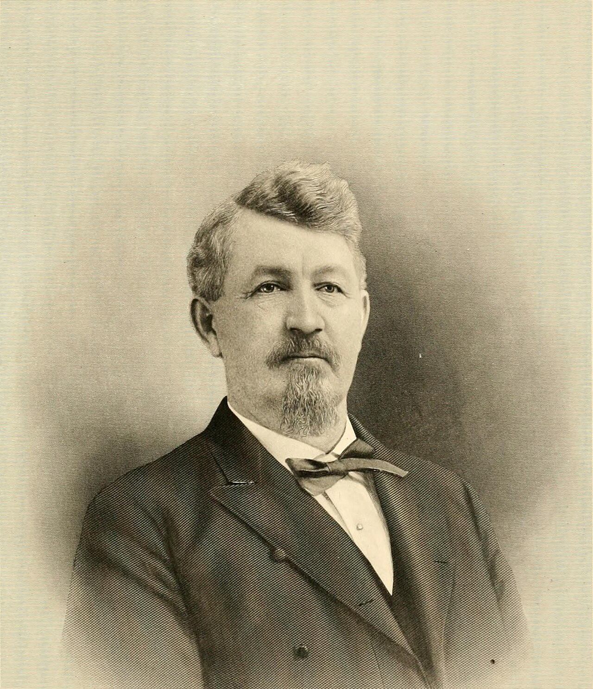

# The Pioneer Boarding School

John Jefferson Lee Spence came to Monticello in 1892, a University of Mississippi man, an Associate Reformed Presbyterian, intending — Paul Edwards writes in the Encyclopedia of Arkansas — to teach a few years and then read medicine. He looked around southeast Arkansas, saw a shortage of higher schooling for people who were not already going somewhere else, and changed his mind. Wilmar offered him land and half the cost of construction. Judge I. A. Bird and Major J. T. D. Anderson donated property. Colonel A. H. Gates, the mill name again, gave a 300,000-gallon artesian well. In 1897 the Drew Normal Institute opened. On May 27, 1903, the Arkansas Board of Education chartered it “with the privilege of conferring degrees.” The name became Beauvoir College, after the Mississippi house where Jefferson Davis spent his last years.

Edwards is careful about the school’s own advertising. It described itself as “The Pioneer Boarding School in Southeast Arkansas for Whites.” The last two words are not an accident we are required to soften. The school was independent, coeducational, and racially exclusive. It sought the working and rural white youth of the region. Tuition could be cash, crops, or livestock. Students could work on campus. They could even pay after they had a job. That generosity and that exclusion lived in the same catalog.

The next essay will stay with the bursar. This one stays with the naming, the donors, and the still of a mill town that wanted a college four years after it wanted a city.

## Why Wilmar, not the square

Monticello already had Hinemon University School (1890) and the habits of a county seat. Wilmar had a mill, a newness, and donors who owned the town site. Edwards says the town offered an ideal opportunity. The 1907 *Advance*, writing after the college had already followed Spence back to Monticello, still treats the school and the mill as the two institutions that “have been responsible for the existence of Wilmar as a town.” The paper’s past tense is doing mourning and advertising at once.

A mill town that wants a college is not a contradiction. It is a status move. Elocution and music — Edwards calls them the crown jewels — are how a timber stop tells itself it is not only a whistle. A 500-seat auditorium is a civic building that happens to sit on a campus. William Jennings Bryan came to that auditorium in 1906. Two essays from here will stay with the crowd. This one stays with the naming.

The dates around the opening are a cluster, not a coincidence. Anderson’s saw, 1881. Post office, 1884. Unnamed competitors, 1887 and 1890. Gates, 1889 or 1890. Methodist church organized, 1893. Stave mill, 1898. City of Wilmar, March 8, 1899. Drew Normal, 1897 — two years before the charter of the city, six years before the charter of the college. The school is older than the municipal person. The donors are the town site and the mill. Judge Ilrey A. Bird, Anderson’s brother-in-law — Elizabeth Eliza Bird had married Anderson in 1869 — would serve as Drew County judge from 1898 to 1902. The Birds are the civic in-laws of the origin story. A. H. Gates’s well is the mill’s water on a campus that would take pigs for tuition. Three kinds of capital in one gift list: land, kinship, industrial water.

Wilmar sat about eight miles nearly due west of Monticello on the Warren Branch, the 1907 paper’s location sentence. The dividing ridge put the seat on the highest ground and the mill town toward the Saline and the pine. A boarding school on the west slope is a school that has decided the timber stop can hold more than a commissary. Kidd Bros. would provision the mill. The Farmer’s Union warehouse would take a thousand bales. Beauvoir would take the children of households that had a bale and a shoat. The ridge held all three.

## Beauvoir, the borrowed house

Beauvoir, on the Mississippi coast, was Davis’s retirement. To put that name on a Drew County boarding school in 1903 is to plant a Confederate shrine-word on a campus that also took pigs for tuition. Kate Stewart, in an ARP magazine piece Edwards cites, called Beauvoir “the Erskine of the West,” a denominational compliment. William Tyler Spence, the founder’s kin, wrote the 1958 *Arkansas Historical Quarterly* narrative. The catalogs of 1904–5 and 1906–7 survive at Taylor Library, UAM. This draft has not had those catalogs in hand. It will not invent a course list. The name is already a course list: memory, race, and aspiration, bound.

Rex Nelson, in 2026, treated “Wilmar was a college town” as a fact few Arkansans know. He is right about the forgetting. He is writing a eulogy for a dying town. This series is not a eulogy. It is a record. The college lasted, in the Beauvoir name, four years. The Drew Normal years make ten if you are generous. Foundation lines remain in Wilmar, Edwards says. Half the structures were dismantled and hauled to Monticello. A town that can lose its college’s buildings to the county seat is a town whose gravity was always conditional.

The 1861 Presbyterian church near Anderson’s land is the older religious still. Spence was ARP. Kate Stewart’s 1990 piece on Associate Reformed Presbyterians in Drew County belongs to Monticello’s ARP story as much as Wilmar’s. The 1861 building Teske mentions may or may not be that stream. A later pass should not collapse Presbyterian into ARP without a minute book. The useful 1903 fact is the name on the charter. Beauvoir is not Erskine. It is Davis’s last house, spoken in a mill town, in the same decade the town also wanted a stave mill at 10,000 a day.

Black Drew County had Monticello Academy, opened in 1888 by Charles Mebane of Holmes Chapel Presbyterian, with help from Mary Emilie Holmes and the Presbyterian Board of Missions for Freedmen. It lasted until 1933. It is not Beauvoir. It is the other half of the sentence about higher schooling in this county. A series that talks about a pioneer boarding school without the academy is doing the catalog’s work. The catalog said “for Whites.” The academy is the institution the catalog refused.

## Enrollment as a still

469 in 1906–07, Edwards. The *Advance* says between 400 and 500. Teske says the school prospered a few years, then smallpox in 1905 and the Panic of 1907. Those blows are later pieces. The peak number belongs here because it is the only photograph we have of the school’s success that does not require a building. Four hundred and sixty-nine people, many of them boarding, in a city the 1900 census put at 844 and the 1910 census at 929. For a moment the school was not an ornament on the mill. It was a second population.

The booster’s thousand or twelve hundred for 1907 is high; the 1910 count would correct it. Even on Teske’s cooler numbers, a boarding college of 469 in a city of nine hundred is a civic fact the mill cannot monopolize. The 1907 paper, after the abandonment, still needed that fact as memory. It then pivoted to Wilmar High School under W. B. Massey: eleven grades, nine months, enrollment in round numbers 200, four literary teachers, one music, one expression, literary societies, a boarding department. Otto Mahling of Berlin taught violin and cornet. Edwards says Beauvoir’s music department had been a crown jewel with internationally trained instructors. Mahling looks like what remained, or what the high school hired to prove the jewel had not entirely rolled east.

Teacher training was the mission the state would later nationalize, in a way, with the 1909 agricultural schools. Music and elocution were the mission the state would not pay for. Spence’s later jobs — Hinemon University, then the Fourth District State Agricultural School — are the path from a private white boarding college to the public campus now called the University of Arkansas at Monticello. Wilmar was the rehearsal hall. Monticello kept the furniture.

Act 100 of 1909 and the bidding that put the southeast campus in the county seat are a later essay. They sit here as the public answer to a need Spence had already named in 1897. Wilmar had named it first and could not fund it through a panic. The rehearsal is this campus: donated land, mill water, a Confederate house-name, a color line, a sliding scale, a 500-seat hall. The performance is eight miles east.

## What the record will not say

It will not give a course list from the 1904–5 or 1906–7 catalogs, because those catalogs have not been opened for this draft. It will not quote William Tyler Spence’s 1958 *AHQ* article. The article is cited as existing; it is not a quarry for a first name, a sermon, or a reconstructed dedication speech. It will not invent a Bryan text for 1906. It will not give the artesian well a photograph. It will not say which half of the buildings moved and which half became the foundation lines Edwards can still point to.

The record will not name the 1887 mill competitors who were already on the ridge when Spence arrived. It will not give the 1897 student body a roll. It will not produce a minute of the Arkansas Board of Education for May 27, 1903, in this folder. DeArmond, Reaves, and Coleman’s “A School Tale” in the *Drew County Historical Journal* (1989) are bibliography leads. Until they are walked, Edwards and Teske are the stills.

A Ken Burns hour would film the name on a catalog cover, if Taylor Library will allow the plate, then the well, then the color-line phrase, then stop. Music under Davis’s house would be a mistake. The combination is the South, not a puzzle. A mill town asked for a college. Donors who owned land and water gave it. The school named itself for a shrine and advertised itself for whites and took livestock at the door. Ten years, if you are generous. Four, if you start at the charter. Foundation lines after that. The rehearsal was real. The gravity was always the seat’s.

<figure class="wilmar-figure">

<figcaption>Figure 1. Drew Normal is older than the city’s charter. Beauvoir is not. Pack graphic AS-TL-01.</figcaption>
</figure>

<figure class="wilmar-figure wilmar-figure--period">

<figcaption>Figure 2. 1911 Arkansas commerce and industry review title plate. Credit: Internet Archive / Wikimedia Commons. License: No known restrictions (Internet Archive scan).</figcaption>
</figure>

## Sources for this piece

Edwards, “Beauvoir College,” Encyclopedia of Arkansas. Teske, “Wilmar (Drew County).” Heady, “Drew County” (Monticello Academy; Act 100 as the later public path). Spence, “History of Beauvoir College,” *AHQ* 17 (1958), cited as existing, not quoted. Stewart, “Beauvoir: The Erskine of the West,” *The ARP*, February 1992; Stewart, “Little Benjamin Goes West,” *Drew County Historical Journal* 5.1 (1990), as the ARP neighbor, not collapsed into the 1861 building. Beauvoir catalogs, 1904–5 and 1906–7, Taylor Library, UAM (cited, not consulted in this draft). Industrial & Souvenir Edition of the *Advance*, December 17, 1907 (school and mill as the town’s two institutions; enrollment 400–500; high school consolation). Nelson, August 22, 2026. Coleman, “A School Tale,” *Drew County Historical Journal* 4.1 (1989), as an unconsulted lead.
