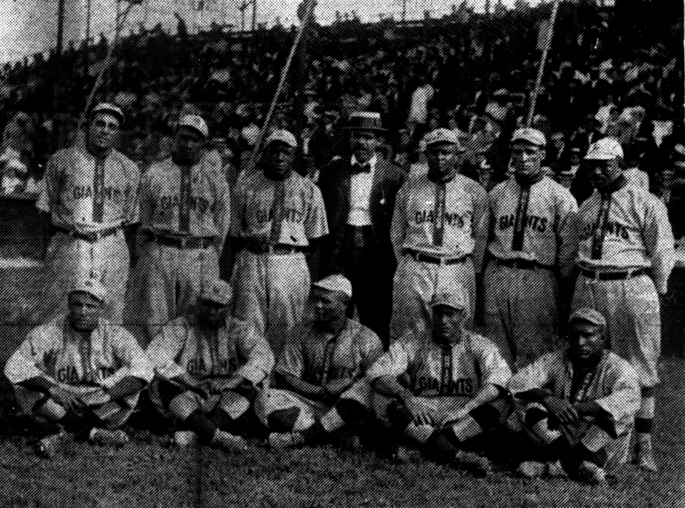

# Hudspeth Park, 1915

In 1915 Wilmar fielded two baseball teams. Steven Teske’s paragraph is the still. One team, white, played in the South East Arkansas League with Monticello, Dermott, and Warren. It won half of thirty-six games. At the same time a Black team from Wilmar was beating African American clubs from the surrounding towns, Monticello among them. Both used Hudspeth Park. They played on alternate days of the week.

William Shea and William F. Droessler told the white league’s story in the *Drew County Historical Journal* in 2001: “A Nice Little League of Our Own.” Teske cites them. This draft has Teske’s summary, not their box scores. The journal is in Monticello. A later pass should lift the standings, the managers if they are named, the days of the week if the paper printed them. What can be said now is that a mill town of about a thousand people — the 1910 census was 929; the 1920 would be 1,034 — had enough men, enough Saturday, and enough pride to support two nines and a park with a name.

This essay will not invent a ninth-inning. It will not assign batting averages. Shea has taught Civil War history at the University of Arkansas at Monticello since 1974; Heady lists him among the campus’s notable writers. Droessler is his co-author on the 1915 piece. Their title is already an argument: the league was little, and it was theirs. Teske’s contribution is the second team the title did not have to hold.

## Alternate days

Alternate days is the Jim Crow sentence that does not need an adjective. The grass was the same. The days were not. A documentary that filmed only the league would film half the town’s Saturday. A documentary that filmed only the Black club, without the league, would miss how official the split was. Teske’s “evidently both used Hudspeth Park” is a historian’s adverb: the sharing is attested, the lease paper may not be.

Hudspeth is a Drew County name. The 1907 *Advance* lists C. F. Hudspeth among lodge men. Whether the park is his gift, his field, or his vanity is a footnote for the journal and for a deed book this draft has not opened. The name means the park was someone’s, which is how parks start. PHOTO_NOTES wants a score book or a grandstand. This pack does not have either. The name is the object until a scanner appears.

1915 sits two years after the *Gate City* went down on the Saline near Warren — October 14, 1913, in Woodard. People who would sit at Hudspeth Park were alive when the boat sank. The park is not prehistoric. It is a mill-town amenity in the last good census decade, after Beauvoir’s buildings had already gone east and before Teske’s Klan sentence of 1923.

## A league of four towns

Monticello, Dermott, Warren, Wilmar. County seat, Delta-edge town, timber seat, mill stop. The South East Arkansas League is a map of the ridge and the river towns that thought they were in the same conversation. Warren is Bradley County. Dermott is Chicot County. Monticello is the square. Wilmar is the Gates interchange on the old Iron Mountain Warren branch. Thirty-six games, .500 ball: a season, not a picnic.

Teske does not say who finished first. He says Wilmar won half. Eighteen and eighteen, if the arithmetic is clean, which a later look at Shea and Droessler must confirm. This draft will not build a pennant from a fraction. Half of thirty-six is the card.

The Black club’s schedule, in Teske, is “surrounding communities such as Monticello.” No league name. That absence is the record’s politics, not necessarily the team’s. Black southern baseball in 1915 was already a serious economy of travel and pride. Wilmar winning is the fact Teske felt worth keeping. He does not give a win-loss total for the Black nine. Do not invent one to make the paragraph symmetrical. The symmetry the sources will bear is the park and the alternate days.

Dermott sits toward the Delta. Warren sits on the Saline’s mill shore. Monticello sits on the ridge. The white league already knew the county line was not the edge of Saturday. The Black club, traveling to Monticello and “surrounding communities,” knew the same geography without the comfort of a printed circuit. Both knowledges are 1915.

Shea’s other public work, in Heady, is Civil War history — Pea Ridge, Prairie Grove — taught at the campus that absorbed Beauvoir’s afterlife. A man who writes battles can also write a four-town league. The *Journal* page span Teske prints is 24–28, five pages. Five pages can hold standings. This draft will not guess which column they occupy. Cite the essay. Leave the innings in Monticello until someone copies them. The pack’s expansion list already names those box scores as later work. That line is the assignment, not a license to invent a 6–4 score because the sentence wants music.

## A town large enough for two nines

844 in 1900. 929 in 1910. 1,034 in 1920. Wilmar at the baseball year is a city climbing toward its census peak. Gates Lumber Company is still the industrial fact. The Wilmar and Saline Valley Railroad, chartered 1904, had by 1907 twenty-five miles of track, four locomotives, fifty-five log cars, two loaders. Logging equipment would go to Crossett in the late 1920s. In 1915 the whistle still meant a shift and a Saturday that could be spent at a park.

Beauvoir was already gone. The 1907 paper had already advertised Massey’s high school, two hundred students in round numbers, Mahling on music. Some of those students, by 1915, were old enough to sit in a grandstand if a grandstand existed. This draft does not have the grandstand. It has the park’s name and the two teams.

Heady’s county population in 1910 is 21,960, the table’s high. 1920 is 21,822. The county was as large as it would ever be in the printed decennials. A four-town league in that decade is not a curiosity. It is what a timber-and-cotton county did with summer.

## After the last inning

1915 is also, in Heady, a year the Klan resurged in Drew County, dwindling by 1928. Teske puts a Klan chapter in Wilmar in 1923. The park and the klavern are the same decade. A series that loves baseball without the adjacent sentence is doing a postcard. This essay will not develop the Klan — that is the next piece — but it will not pretend Hudspeth Park was an island.

Philip Slater’s lynching, in Heady, is 1921, “the most recent” in the county. Six years after the season Teske records. The park does not wash 1921. 1921 does not cancel the Black club’s wins. They are the same town, which is the only moral this piece is allowed.

If a scorebook survives, it should be filmed like a letter. If Shea and Droessler printed standings, those numbers should be added as numbers, not as color. If the *Advance* of 1915 wrote a game story, quote the game story. This draft has not seen those pages. Honesty is leaving the box empty.

No shop. No “America’s pastime” moral. Two teams, one park, alternate days. The town was large enough to need the sentence and small enough that everyone knew which day was whose.

<figure class="wilmar-figure">

<figcaption>Figure 1. 1915 sits on the last climb toward 1,034. Pack graphic AS-TL-01. No generated grandstand.</figcaption>
</figure>

<!-- photo_slot: P-06 Hudspeth Park or a 1915 score book — only if a real still appears. -->

<figure class="wilmar-figure wilmar-figure--period">

<figcaption>Figure 2. 1910 Leland Giants baseball team portrait, era of segregated town ball. Chicago Leland Giants, 1910 — not Hudspeth Park’s roster; an era plate for segregated town ball. Credit: Wikimedia Commons. License: Public domain.</figcaption>
</figure>

## Sources for this piece

Teske, “Wilmar (Drew County)” (two teams; South East Arkansas League with Monticello, Dermott, Warren; half of thirty-six games; Black club vs. surrounding towns including Monticello; Hudspeth Park on alternate days; “evidently”). Shea and Droessler, “A Nice Little League of Our Own: Baseball in 1915,” *Drew County Historical Journal* 16 (2001): 24–28, cited from Teske; box scores not consulted in this draft. Census of 1910 and 1920 as printed by Teske. Industrial & Souvenir Edition of the *Advance*, December 17, 1907 (C. F. Hudspeth among lodge men; mill-rail inventory). Heady, “Drew County,” for the 1915 Klan resurgence, the 1910 county peak, and Slater 1921 as adjacent weather. Woodard, “Saline River,” for the *Gate City* date as a nearby still.
