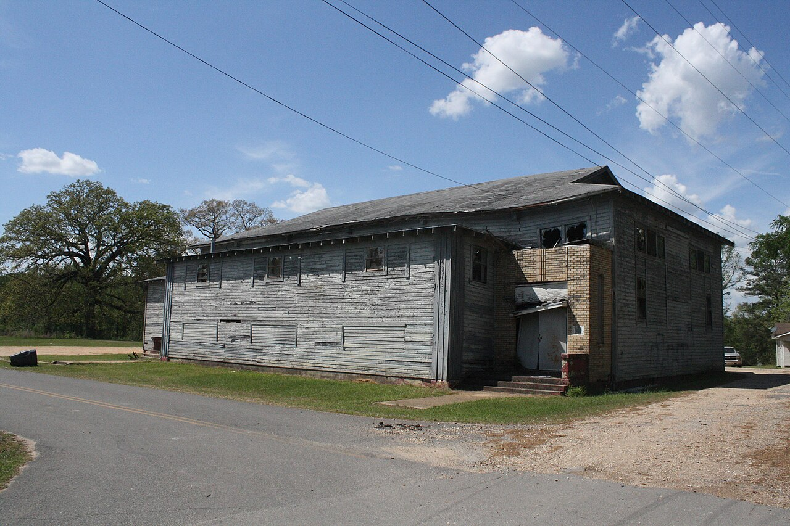

# A Chapter in 1923

Steven Teske’s Wilmar article, after the baseball paragraph, adds a sentence that a booster history would have cut. A chapter of the Ku Klux Klan was active in Wilmar in 1923. Mary Heady’s county article gives the longer weather: Klan violence in Reconstruction until about 1875; martial law in 1868–69; a resurgence in 1915 that dwindled by 1928. The national second Klan — the 1915 Stone Mountain revival, the 1920s membership boom — is the context. The local fact is a mill town chapter in the year the city’s population was still near its peak.

This essay will not invent a roster, a parade, a robe count, or a church that hosted. It will put the date next to the other 1920s dates: Gates lands to Crossett, 1924, in Heady; mill closure in Darling and Bragg’s note, 1924; equipment south, late 1920s, in Teske; census 1,034 in 1920 and 627 in 1930. The klavern and the cutover share a decade. That is not a causal proof. It is a juxtaposition a documentary is allowed.

If the camera stops here, it stops on a year and a noun. 1923. Chapter. Wilmar. The temptation is to furnish the noun with night. The sources on this desk do not furnish the night. The refusal is the work.

## The first Klan, so the second is not a surprise

Heady’s Reconstruction paragraph is the necessary preface. After the 1868 election, Clayton’s martial law, Mallory’s militia, a home-guard bargain, a commission that executed a Klansman for murdering a deputy and a Black man. The sentences, kept as sentences:

The Ku Klux Klan was active in Drew County during and after Reconstruction until around 1875. Following violence and intimidation of voters in the November 1868 election, Governor Powell Clayton declared martial law in fourteen counties, including Drew. The state militia in southeastern Arkansas was led by Colonel Samuel W. Mallory. Four prominent Drew County citizens met with Clayton in Little Rock and offered to form a bipartisan home guard to keep peace. Clayton agreed. Members of the militia and the home guard formed a military commission that tried, convicted, and executed one local Klansman for murdering a deputy sheriff and a Black man. Clayton revoked martial law in southeastern Arkansas in February 1869.

Drew County was not a bystander county. The first Klan here ended, in the official telling, around 1875. Fifty years later the costume came back, as it did in a thousand American counties, with a new list of enemies and the same appetite for night. Heady’s “resurgence… in 1915” is the same year Teske’s baseball paragraph occupies. The park and the second Klan share a printed year in two encyclopedia entries. Essay 19 said so and moved on. This essay stays with the later date Teske attached to the town.

DeBlack’s *With Fire and Sword* is on Heady’s shelf for 1861–1874. This draft has not lifted DeBlack’s chapters onto the desk. The martial-law paragraph above is Heady’s. A later pass that page-checks DeBlack should add DeBlack as a consulted book, not as atmosphere already used.

## 1923 next to 1921, 1924, 1928

Philip Slater’s lynching in 1921 is in Heady’s calendar: the most recent lynching to occur in the county, the official pretext an alleged assault on an unnamed white woman and her children. The Wilmar chapter is 1923 in Teske. The two facts are not, in these sources, tied by a case file. A responsible series keeps them in the same reel anyway.

1924, in Heady: Gates lands sold to Crossett Lumber Company. 1924, in Darling and Bragg as this pack cites them elsewhere: mill closure note. Late 1920s, in Teske: logging and railroad equipment transferred to Crossett after the Wilmar woods had significantly declined. 1928, in Heady: the county Klan resurgence had dwindled. 1928, in Teske: Arkansas-Louisiana Gas Company laid a pipeline meant to connect northern Louisiana with St. Louis. The decade is a stack of endings and one new pipe. The chapter is one card in the stack.

1,034 in 1920. 627 in 1930. Teske’s table does not have a 1923 estimate. The chapter exists in the last years of the larger number. A writer who wants the Klan to be only a symptom of the cutover will have to wait for a source that says so. This draft will not say so. A writer who wants the Klan to be unrelated to a mill town losing its mill will also have to wait. Juxtaposition is the allowed move.

Heady’s county table: 21,822 in 1920; 19,928 in 1930. The county subtracted too. Wilmar’s subtraction was steeper in percentage. The chapter is a town fact. The dwindling by 1928 is a county fact. Teske does not say when the Wilmar chapter closed. Do not close it by inference from Heady’s 1928.

## What we do not print

No costume close-up as entertainment. No “both sides” mill-worker psychology. No soft-link. No generated night ride. PHOTO_NOTES already forbids reenactment lynching imagery; the same rule covers a klavern invented for a thumbnail. If a newspaper in 1923 printed a membership boast or a denial, that page should be found and quoted. This draft has not found it. The encyclopedia’s sentence is the card.

The national second Klan sold itself as a fraternal order, a Protestant civic club, a night power. Those sentences are textbook. They are not a Wilmar roster. Teske did not print officers. Heady did not print a Wilmar meeting place. The 1907 *Advance* is too early to help and too booster to be trusted on this subject anyway.

The June Dinner continued. The Colored School ground continued. Black Wilmar, which would be the statistical majority by 2010 (364 of 511, in Teske), continued. A Klan chapter is an attempt to govern a town that was never only the chapter’s. The attempt is the history. Its failure to be the whole town is also the history.

1918, in Heady: Robert Hill of Drew County incorporated the Progressive Farmers and Household Union of America. 1919: a chapter of that union stood at the center of the Elaine Massacre in Phillips County. Those dates belong in the same decade as the 1915 resurgence and the 1923 chapter. They are not Wilmar minutes. They are the region’s paper. This pack will not steal Elaine. It will not pretend Drew’s union origin is a local pride badge. It will leave Hill’s name where Heady left it: a Drew County resident, a paper incorporation, a catastrophe elsewhere.

## 1860, so 1923 has a floor

Heady’s 1860 counts — 5,581 white, 3,497 held in bondage — are the labor system the first Klan tried to restore by other means. Anderson’s five named field hands are the Wilmar-scale version of that count. The second Klan did not need a plantation to want a hierarchy. It needed a county that had already practiced one. That is as much causation as this desk will write.

Martial law ended in February 1869. The first Klan, in Heady’s telling, lasted to about 1875. Forty years of ordinary white supremacy then passed without Teske needing a klavern sentence. 1915 brought the costume back. 1923 put it in the mill town by name. 1928, countywide, dwindled. The dates are ugly and useful. They are not a novel.

The still is Teske’s sentence after the baseball paragraph. Then Heady’s 1915–1928 clause. Then the census drop. Then stop. The town is more than the chapter. The chapter is not therefore a footnote.

<figure class="wilmar-figure">

<figcaption>Figure 1. 1923 on the same arc as 1,034 and 627. Schematic. Pack graphic AS-TL-01. No costume still.</figcaption>
</figure>

<figure class="wilmar-figure wilmar-figure--period">

<figcaption>Figure 2. WPA building in Wilmar, Arkansas, civic architecture after the mill. Credit: U.S. Government work / Wikimedia Commons. License: CC0 1.0.</figcaption>
</figure>

## Sources for this piece

Teske, “Wilmar (Drew County)” (Klan chapter active in Wilmar in 1923; 1920 and 1930 counts; late-1920s equipment south; 1928 pipeline as adjacent industrial date). Heady, “Drew County” (Klan to about 1875; Clayton martial law 1868–69; Mallory; home-guard bargain; commission execution; 1915 resurgence dwindling by 1928; Slater 1921; Gates lands to Crossett 1924; Robert Hill 1918; 1860 bondage counts; county census 1920/1930). Darling and Bragg, *AHQ* 67 (2008), as cited elsewhere in this pack for a 1924 mill-closure note. No 1923 local newspaper file was consulted in this draft.
