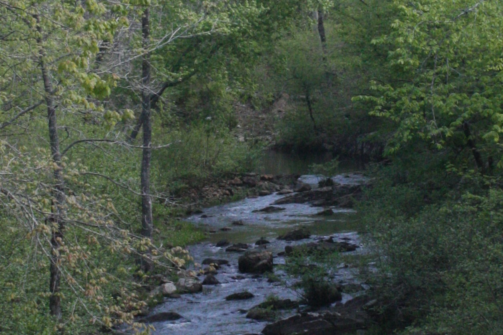

# Four Forks

Jann Woodard’s Encyclopedia of Arkansas article begins the Saline where a mountain stream is still allowed to be dramatic. The river rises north of Benton and is formed by four forks that converge near Riverside in Saline County. South Fork, thirty-eight miles, the only one not wholly born in that county. Middle Fork, thirty-seven miles, banks of wildflowers. Alum Fork, sixty-one miles, cliffs. North Fork, twenty-nine miles, the shortest. After the meeting, the river meanders through Saline, Grant, Dallas, Cleveland, Bradley, Drew, and Ashley counties and gives itself to the Ouachita near Felsenthal. Two hundred and four miles. A watershed of about 3,350 square miles. A gravel bottom. Pools and shoals. The last free-flowing river in the Ouachita basin.

Wilmar does not sit on the forks. It sits on the later river, the one that has already become a south Arkansas fact, the one that forms Drew County’s southwestern border and gives Warren a neighbor and Longview a name. This essay is the headwaters piece so the mill pieces cannot pretend the Saline is a local ditch.

If the camera had a still for the beginning of the water, it would be four names becoming one at Riverside, not a depot in Drew. The pack’s schematic map is not a survey. It is a reminder. USGS historical topos of Monticello, Warren, and Hermitage are the public-domain sheets a later editor should put under the schematic. IMAGE_SOURCES already says so.

## A river that changes its mind

Woodard’s opening claim is the one a documentary should keep: mountain stream at the origin, Delta-type bayou near the mouth at Felsenthal, where the stream converges with the Ouachita. The Saline is not one landscape. It is a career. Merry Saline, Saline Bayou, Marie Saline, Marais Saline, Marais de Saline — the aliases are French and English attempts to hold a salty marsh and a long water in one mouth. Essay 26 will stay with the christenings. This essay stays with the four lengths and the seven counties.

Communities along it, in Woodard’s list, include Haskell, Traskwood, Prattsville, Farindale, Staves, Rison, Warren, Longview. Wilmar is not in the list. Wilmar is inland, eight miles from Monticello, toward the river but not of the bank. Teske’s coordinates — 33°37’44″N, 91°55’53″W, elevation 154 feet — put the city on the ridge’s western lean, not on a landing. The town named a railroad for the valley anyway. Wilmar and Saline Valley Railroad, 1904, Gates, twenty-five miles of track by 1907. The valley was letterhead. The forks did not need the letterhead.

Patrick Dunnahoo’s *Of Clear, Cool Water and Gentle Hills: The Story of the Four Forks of Arkansas’ Saline River* (Benton, 1993) is the four-forks book. Woodard lists it first among additional information. This draft has Woodard, not Dunnahoo’s pages. The book is the next desk. INDEX.md already names it among expansions later. The encyclopedia is enough to stop a writer from treating “Saline River” as a mood. It is not enough to retire Dunnahoo. Cite him as the unconsulted lead. Do not borrow his title’s adjectives as if they were measurements.

Ron Moseley’s *Ghosts of the Saline River* (2015) is on the same shelf. The pack’s bibliography is blunt: use cautiously; mark folklore as folklore. This essay will not lift a ghost. The forks are geology and mileage.

## What the forks have to do with a mill town

Pine in the Saline bottoms, the 1907 *Advance* said, and hardwood, and stave timber. The paper’s booster arithmetic — Bartholomew bottoms of about 100,000 acres, Saline bottoms of about 8,000, uplands between — is a souvenir’s geography, not a surveyor’s. Use it for how the town wanted to be seen. The river’s lower course is a timber geography even without the *Advance*’s acre counts. The forks’ upper course is a recreation and salt-works geography. A mill town in Drew lived on the river’s lower opinion of itself: flood, silt, trees, a border with Bradley.

Gates Lumber Company cut the Wilmar woods without replenishing, Heady writes, and sold the lands to Crossett in 1924. The forks did not attend the sale. Alum Fork’s sixty-one miles of cliff did not get shorter when the W&SVR’s locomotives went south. That is the forks’ usefulness as an opening. They predate the mill and they outlast the mill, which is not a moral. It is mileage.

Woodard’s bottom is gravel, with an abundance of aquatic insects and other organisms, pools and fast-running shoals, many species of fish. Those are encyclopedia sentences, not a creel survey from this desk. A later pass that wants species names must go to a Game and Fish list or a scientific paper. This draft will not invent a bass.

## Older than the Quapaw story the tradition wants

When Native Americans gave up their land in an 1818 treaty, Woodard writes, they left reminders of a 300-year sojourn. Historical tradition associates the upper Saline with the Quapaw. Excavated relics, artifacts, and pottery are of Caddoan origin. The Hughes mound, near Benton, is one of the largest Indian mounds along the river. Heady, on the county, adds the Tunica as farmers in southeastern Arkansas before moving south, and the Quapaw as the people French missionaries met in the late seventeenth century. The 1824 treaty and the 1830s removal to Indian Territory are Heady’s Drew-scale dispossession dates. Woodard’s 1818 is the river-scale date she uses.

A Wilmar series that never goes north of Warren is a series that has not met the river it keeps writing down. Caddoan pottery and the Hughes mound are not a Drew County origin myth. They belong to the water. Anderson’s 1859 dollar is not the beginning of the ground.

Charles Green found an ancient dugout at Peeler Bend near Benton in August 1999. Archaeologists dated the twenty-four-foot canoe to the 1100s, tooled in the fashion of the Caddo. Historic Arkansas Museum held it until 2017, then loaned it to Benton. Essay 34 will stay with that boat. Here it only has to say the forks were a road before they were a postcard.

## Film the confluence, then the mill

The still, if a crew can get it, is the meeting at Riverside — four names becoming one. South Fork, thirty-eight. Middle Fork, thirty-seven. Alum Fork, sixty-one. North Fork, twenty-nine. Then a cut to a USGS sheet of the Drew-Bradley line. Then Teske’s town, 154 feet, 1.53 square miles, not on Woodard’s community list. The river does not exist to flatter Wilmar. Wilmar existed, for a while, to take trees out of the river’s country. The forks do not care. That is their usefulness as an opening.

A shop that took the river’s name in the twenty-first century took the whole career, whether it meant to or not: cliffs and wildflowers and a bayou mouth and a logging road that used the valley as letterhead. One sentence. No catalog. The preferred host for that sentence, the style guide says, is a river essay. This is one.

Dunnahoo remains on the desk that has not been opened. Until it is, Woodard’s four lengths and seven counties are the film. 204 miles. About 3,350 square miles of watershed. Last free-flowing in the Ouachita basin. Essay 27 will stay with that lastness as a political fact. This essay is only the four streams that made the one water.

<figure class="wilmar-figure">

<figcaption>Figure 1. Four forks to a mouth. Schematic, not a survey. Pack graphic AS-MAP-02.</figcaption>
</figure>

<figure class="wilmar-figure wilmar-figure--period">

<figcaption>Figure 2. Saline River flowing through Ouachita National Forest, Arkansas. Credit: U.S. Forest Service / Wikimedia Commons. License: CC0 1.0.</figcaption>
</figure>

## Sources for this piece

Woodard, “Saline River,” Encyclopedia of Arkansas (four forks and lengths; Riverside confluence; 204 miles; ~3,350 square miles; seven counties; community list; mountain-to-bayou career; aliases; gravel / pools / shoals; 1818 treaty; Caddoan material and Hughes mound; last free-flowing in the Ouachita basin; 1999 dugout as adjacent). Dunnahoo, *Of Clear, Cool Water and Gentle Hills* (1993), cited as the forks monograph, not page-checked in this draft. Teske, “Wilmar (Drew County),” for the town’s distance from the bank and the W&SVR name. Industrial & Souvenir Edition of the *Advance*, 1907, for Saline-bottom timber as booster geography. Heady, “Drew County,” for Quapaw/Tunica and the 1824/1830s removals as county-scale dispossession. Moseley (2015) noted as folklore, unused.
