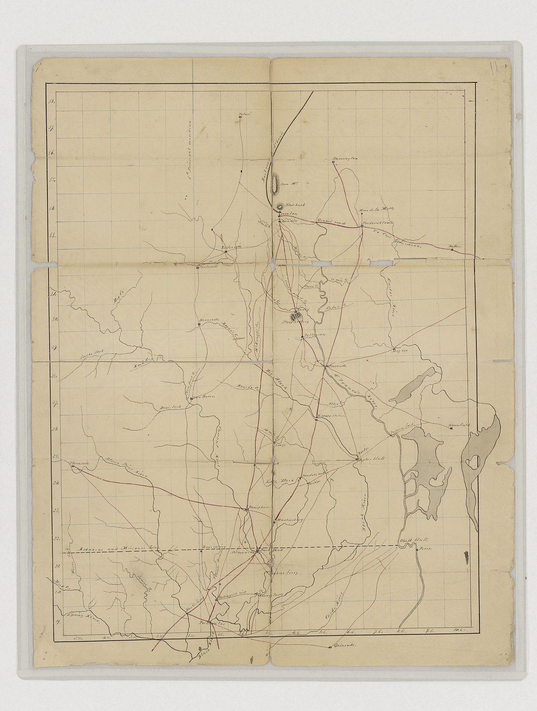

# A Dugout from the 1100s

August 1999. Charles Green, Peeler Bend near Benton. A twenty-four-foot dugout. Archaeologists dated it to the 1100s and to Caddoan tooling. The canoe lived at the Historic Arkansas Museum in Little Rock until 2017, then went on loan to the City of Benton. Jann Woodard’s paragraph is the whole catalog entry. This series needs it because the fifty-four steamboats are a late fleet. The first boat we can point to on this river is a tree.

The date of the find is a reminder that the river still gives things up. Low water, a bend, a man who looked. The century of the making is a reminder that “first” in a mill-town history is a local first. Anderson’s 1859 dollar is a beginning of Wilmar. It is not a beginning of the Saline. Green’s canoe is not a beginning either. It is the oldest hull Woodard’s article will stand behind. A later excavation may move the number. This draft will not invent an older one to look deep.

## Caddoan, which is not a Wilmar story except as a river story

Woodard has already said that excavated relics along the upper Saline are of Caddoan origin, though tradition associates the upper country with the Quapaw, and that Native people left after an 1818 treaty following a 300-year sojourn in the telling she uses. The Hughes mound near Benton is the large earthwork. The dugout is the watercraft. Together they make the Benton reach older than Drew County’s 1846, older than Anderson’s dollar, older than salt works of 1827.

Heady’s Drew County article is the southern neighbor of that sentence. Native people lived in southeastern Arkansas, including Drew, long before European exploration. By the late seventeenth century French missionaries and explorers encountered the Quapaw. There is evidence, she writes, that before the Quapaw settled, the Tunica lived there as farmers and then moved south. In an 1824 treaty the Quapaw agreed to sell their land and move toward northwestern Louisiana and southwestern Arkansas; flooding and hunger sent them back; pressure continued; they agreed in the 1830s to move to Indian Territory. Drew County’s white settlement story — Rough and Ready by 1837, Monticello’s acreage in 1849 — sits on that removal. The dugout is not a Drew County object. It is the river’s older human record, from the forks country Heady is not writing.

Woodard’s 1818 treaty and Heady’s 1824 treaty are not a contradiction this draft will iron flat. They are two dates in a removal sequence the encyclopedia house tells from two chairs: a river article looking north, a county article looking at the Quapaw’s later sales. The 300-year sojourn in Woodard’s clause is a rounded tradition. The excavated pottery, she says, is Caddoan. The tradition associates the upper country with the Quapaw. Put the disagreement on the page. Do not invent a migration map that makes the canoe a Quapaw canoe or a Tunica canoe because a sentence wanted a neater tribe. The archaeologists, as Woodard reports them, said Caddoan fashion. That is the attribution we have.

A mill town in Drew County does not get to claim the canoe. It gets to admit that the river it named a railroad for was a road when the trees were still a forest in a different sense. The Wilmar and Saline Valley Railroad, chartered in 1904, used *Saline Valley* as letterhead. The valley had already been a road for a canoe a tree long and nine centuries earlier. That is not a pretty irony. It is a sequence.

French families on the lower Saline in the late 1700s — Fogle, LaBeouff, DuBose, Charron, Pevetoe, Ramsauer, De Ambleton, Carcuff, Bullet — are another sequence, not this one. They belong to the Marais Saline essay. The dugout is Caddoan tooling on the upper river. Do not mash the French list and the 1100s hull into a single “early people” paragraph. The river is long enough to keep its centuries apart.

## Twenty-four feet

The number is the still. A canoe that long is a working boat, not a toy. Tooling “in the fashion of the Caddo Indians” is the archaeologists’ sentence as Woodard reports it. This draft will not improve their typology from a desk. It will keep the length and the century. No excavation report was read in the making of this piece. The dating is Woodard’s report of the archaeologists. If a later report moves the century or the attribution, the report should replace this paragraph.

1999 is within living memory of people who still cook in June in Wilmar. It is not antiquity as a mood. It is a Tuesday in August on which a man found a boat. The museum years — Historic Arkansas Museum, Little Rock, until 2017 — are a custody story. The 2017 loan to the City of Benton is a second custody story. Benton, where the forks are a local pride, took the boat home. That is as it should be. Wilmar does not get a loan of this object. Wilmar gets the sentence that its river is older than its post office.

Peeler Bend is a place name this pack will not decorate. It is near Benton, on the upper Saline, in the county that shares the river’s name. USGS sheets will show the bend to anyone who wants a still that is not a drawing of a canoe. A generated “ancient canoe on a misty river” is a lie and a theft. The object exists. Photograph the object, or photograph the bend, or print Woodard’s dates on a card.

Fifty-four steamboats, Woodard writes, have been documented on this river. The *Gate City* sank near Warren on October 14, 1913. Charles Green’s canoe is not a fifty-fifth. It is a different class of hull, a different century, a different way of being documented: not an enrollment, an excavation’s report as the encyclopedia summarizes it. The recreation century that took the channel after commerce diminished in the 1930s is the century that found the boat. Low water is a recreational fact and an archaeological one. The dam that died in 1975 is the reason the bend is still a bend and not a contour on a reservoir. Woodard’s free-flowing sentence and her dugout sentence are neighbors whether she meant them to be or not. A flooded Peeler Bend is a thought this essay does not need to finish. The canoe was found in a river that still ran.

## How not to use this

Do not put a Caddo canoe on a furniture hangtag. Do not write “ancient artisans” and then a table price. The dugout is a limit on the brand’s hunger for heritage. The shop may be named for the river. The river’s 1100s are not inventory.

The style guide’s soft-link rule allows a workshop sentence on essays about the river’s name, the dividing ridge, the years after the whistle. This is not those essays. This is a hull. The correct close is a refusal. Fifty-four steamboats, a wreck in 1913, stave crews from the Adriatic, a pearl fashion, a dam that died in 1975 — the river’s documented later life is busy enough without recruiting the 1100s into a catalog.

Woodard’s Native paragraph and her dugout paragraph are not a complete Indigenous history of the Saline. They are what one encyclopedia article will carry. Dunnahoo’s four-forks book and any excavation reports sit on the next desk. Heady’s Quapaw and Tunica sentences sit on the county desk. This series will not invent a village, a ceremony, or a last departure scene to fill the space between 1100 and 1818. Three hundred years, in Woodard’s “sojourn” clause, is already a rounded number. Rounded numbers are how tradition talks. Keep the tradition labeled. Keep the canoe measured: twenty-four feet, 1100s, Caddoan fashion, Peeler Bend, Green, 1999, Historic Arkansas Museum, Benton 2017.

Anderson cleared five acres in 1859 and planted corn that five enslaved people tended. That is the beginning of Wilmar as Teske “generally” tells it. The dugout is the beginning of this pack’s honesty about the water the town later borrowed for a name. Two beginnings. One river. The camera, if it had any decency, would hold the canoe longer than the receipt.

<figure class="wilmar-figure">

<figcaption>Figure 1. Peeler Bend belongs to the forks country, not to Wilmar. Schematic. Pack graphic AS-MAP-02. Do not caption a drawing as the 1999 canoe. The object’s photograph, when a museum allows it, is the still.</figcaption>
</figure>

<figure class="wilmar-figure wilmar-figure--period">

<figcaption>Figure 2. Regional map of Missouri and northeastern Arkansas. Credit: U.S. National Archives / Wikimedia Commons. License: Public domain.</figcaption>
</figure>

## Sources for this piece

Woodard, “Saline River.” Historic Arkansas Museum / City of Benton custody as reported there. Heady, “Drew County,” for Quapaw/Tunica and the 1824/1830s removals as the southern neighbor of Woodard’s 1818 sentence. Teske, “Wilmar (Drew County),” for the 1859 beginning this canoe older than. No excavation report was read in the making of this draft; the dating is Woodard’s report of the archaeologists.
