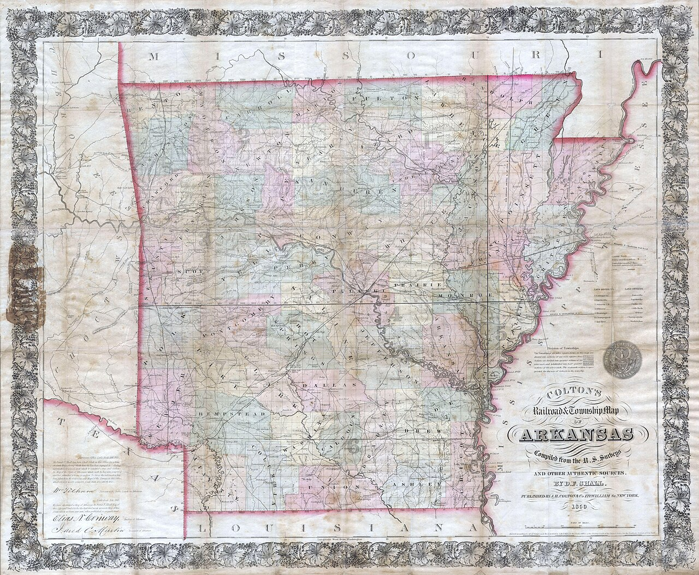

# The Town of Second Importance

“The town of second importance in Drew County is Wilmar.” The Monticello *Advance*, Industrial & Souvenir Edition, December 17, 1907. The sentence is a snub and a compliment in one. First is the county seat, compact brick, waterworks, a cotton mill, three thousand people. Second is the mill stop, eight miles west, a thousand or twelve hundred, Gates, Beauvoir just gone, a stave factory, a bank, a Farmer’s Union warehouse. The paper is writing from the square. It still needs Wilmar to look busy, because a county souvenir that only sells Monticello is a thinner souvenir.

This essay treats the 1907 inventory as a primary source and the 1907 adjectives as advertising.

## The inventory, which is the still

- Population: 1,000 or 1,200 (the paper will not choose; the 1910 census would say 929 — the booster was high).
- Gates Lumber Company: the “real history.”
- Beauvoir: abandoned that spring on Spence’s removal; high school under W. B. Massey; eleven grades; nine-month term; enrollment “in round numbers” 200; four literary teachers, one music, one expression; literary societies; boarding department.
- Stave factory: 10,000 per day.
- Bank: $25,000 capital.
- Five general merchandise stores; one exclusive dry goods; one drugstore; livery; blacksmith.
- Farmer’s Union Warehouse: only one in the county; 1,000 bales; established that year.

That is a town. It is also a list a chamber of commerce would write. Both.

Teske’s later table is the correction the souvenir cannot make. 1900: 844. 1910: 929. 1920: 1,034. The paper’s thousand-or-twelve-hundred sits between the first two census points and above both of them. Boosters round up. Census enumerators count. The 1920 peak would finally pass a thousand, then the 1930 count would fall to 627. Second importance, in 1907, was a claim made at the edge of the town’s largest decade. It was not a prophecy.

## What first importance looked like from the square

Monticello, the same edition says, sat northwest of the county’s center on the highest part of the dividing ridge. No vacant lot around the Public Square. Nothing but substantial brick. A cotton mill, a cottonseed oil mill, a cotton compress, ginneries, a steam laundry. One railroad, the Warren Branch, and the near-certainty of another, the Arkansas, Louisiana and Gulf, surveyed Pine Bluff to Monroe. A 750-foot well. City-owned waterworks and electric light, installed at about $25,000, $11,000 still owed, paid down at about $2,500 a year. An $18,000 jail appropriation from the last quorum court. Sewerage “now being agitated.” Residences that would “adorn a city of the size of Little Rock.”

That is the first town talking. Wilmar’s paragraph, a few columns later, has no brick-square sentence. It has a mill, a college just abandoned, a high school, a stave factory, a bank, stores, a warehouse. The comparison is the document. Second importance means: the payroll is real, the masonry is thinner, the paper still needs you.

Beauvoir is the wound the souvenir dresses in the same paragraph. “Up to the spring of the present year” Wilmar was the home of the college. Spence had established a high school “about ten years ago,” later Beauvoir, enrollment “between 400 and 500 students.” Abandoned on his removal to Monticello. Then the pivot: flourishing high school, Massey, eleven grades, 200 in round numbers. Teske’s later article puts the death in a harder order: smallpox in 1905, financial crisis in 1907, resources transferred toward the Fourth District State Agricultural School that the legislature would create in 1909. The souvenir does not mention the panic. December 17, 1907. The national money is already in the ditch. The paper says abandoned, then pivots to the high school. That pivot is the document.

## Public spirit, the unmeasurable

“Wilmar possesses one of the most public spirited citizenry to be found anywhere. They are brim full of local pride and loyalty.” This is the sentence a Ken Burns parody would score with a piccolo. We will leave it unsored. Public spirit, in 1907, meant subscriptions, a college half paid by the town, a well from Gates, a welcome to “any new citizen or any new enterprises.” It also meant, we know from other essays, a color line, a recent smallpox, a coming panic already underway. The paper does not mention the panic. It does not mention William and Henry Beavers, lynched in 1890 and 1892. It does not mention the Black households that would make the June Dinner a century-long fact. Public spirit, in a souvenir, is a white civic smile. The inventory is still useful. The smile is a period costume.

Otto Mahling, Berlin concertmaster, violin and cornet, is the souvenir’s proof that second importance could hire Europe. He is a later essay’s job. Here he only has to stand in the 1907 list as the music teacher the high school kept after the college left. Kidd Bros., “the largest mercantile concern in Wilmar, and in fact one of the largest in the county,” stockholders in Gates and in the Bank of Wilmar, is the commissary fact the last essay in this pack will unpack. Dr. S. Harris, “the only drug store in Wilmar,” is a name the transcription preserves with a damaged line. The souvenir wanted faces. This essay will keep the faces that have a function and refuse to invent the rest.

## Anderson, still alive

The founder is still a merchant, still honored, still the man whose liberal policy “probably” drew the mill. Capt. J. T. D. Anderson, first settler of the present town, owner of practically all the land on which the town had been built, storekeeper, postmaster, depot agent, the four jobs in the house that now served as a depot. The souvenir needs a living first settler. Heritage writing a century later needs to remember that 1907 could still interview him, or pretend to. We have the paper, not the interview notes.

Teske’s cooler beginning is 1859, seven hundred acres, a dollar an acre, five acres of corn, five enslaved people named. The souvenir’s beginning is the Warren Branch’s arrival and a man who opened a store. Both beginnings are true if you say what they are. The souvenir is a town-site story. Teske is a land-and-labor story. Second importance, in 1907, preferred the town-site story because the mill was the vanity and the mill needed a host.

## How to read a souvenir

Carolyn Haisty’s transcription, on ARGenWeb, is how this pack reached the text. The original cuts — courthouse tower, school buildings — are not in the transcription as images. A later editor should pull the microfilm. Until then, the words are the photographs. Second importance is the caption. The inventory is the picture. The census of 1910 is the correction.

The paper’s county population by decades — 3,276 in 1850; 9,087 in 1860; 9,960 in 1870; 12,231 in 1880; 17,352 in 1890; 19,451 in 1900 — is a booster’s drumroll toward the present. Heady’s table has 9,078 for 1860, a small seam, and then the later counts the souvenir could not know: 21,960 in 1910, the county peak; 17,350 in 2020. Wilmar’s own table, in Teske, peaks at 1,034 in 1920 and stands at 395 in 2020. Second importance did not last as a population fact. It lasted as a sentence someone once printed, which is a different kind of lasting.

Do not sell this inventory as a golden age for a chair. The town of second importance was a mill town with a closed college, a new warehouse, and a paper that needed it to look busy. That is already a lot. It is enough.

<figure class="wilmar-figure">

<figcaption>Figure 1. 1907 sits on the rising side of Teske’s table, after Beauvoir’s close and before the 1920 peak. Pack graphic AS-TL-01. The souvenir’s 1,000-or-1,200 is not a census.</figcaption>
</figure>

<figure class="wilmar-figure wilmar-figure--period">

<figcaption>Figure 2. 1859 Arkansas railroad pocket map, Drew County region. Credit: J. H. Colton & Co., 1859; Geographicus / Wikimedia Commons. License: Public domain.</figcaption>
</figure>

## Sources for this piece

Industrial & Souvenir Edition of the *Advance*, December 17, 1907, Haisty transcription: Wilmar section, Monticello section, and the county decade table. Teske, “Wilmar (Drew County),” 1910 census and the later table as a check on the booster’s thousand-or-twelve-hundred. Heady, “Drew County,” for the 1860 seam and the county’s later counts.
