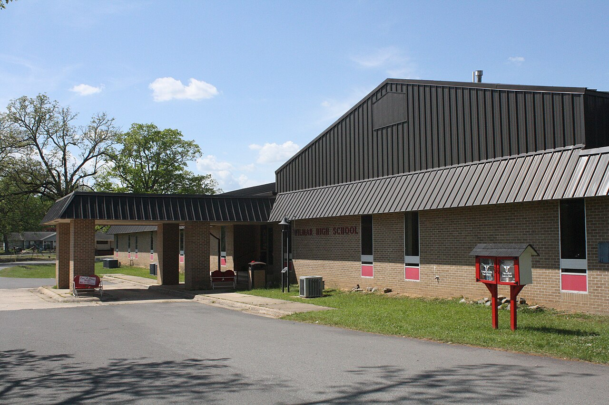

# After the Whistle

Balogh’s warning about cut-out towns is a death sentence written as a textbook. Relocation of production meant decline and possible death. Wilmar declined. It did not, in the census sense, die. 627 people in 1930 are not zero. 395 in 2020 are not zero. Rex Nelson, in 2026, used *dying* anyway, because columnists need a verb and because 395 against 1,034 feels like a verdict. This essay will use *subtracted*.

What was subtracted: a mill, a company railroad, a college already gone, a high school as a local daily fact, a Presbyterian congregation, several hundred people each decade after 1980. What stayed: a city charter, churches, a June table that can still draw thousands, a gas station of a different sort, a name on a map, a suburb relationship with Monticello, a majority-Black city in 2010, a mayor who could tell PBS a Galveston story.

Teske’s table is the long film. 1900: 844. 1910: 929. 1920: 1,034. 1930: 627. 1940: 695. 1950: 746. 1960: 718. 1970: 653. 1980: 747. 1990: 637. 2000: 571. 2010: 511. 2020: 395. If you read the numbers aloud you can hear the mill, the Depression, a mid-century plateau, a 1980 ghost of recovery, and then the stepping-down Nelson wanted a verb for. The 1920 peak is Gates’s last good decade, Beauvoir already gone thirteen years, the Wilmar and Saline Valley Railroad still theoretically useful, the Klan year still three years ahead. The 1930 drop of four hundred is the method photographed as Arabic numerals. Heady puts the land sale to Crossett Lumber Company in 1924 and the exhaustion of the clear-cut in the mid-1920s. Teske puts the equipment transfer in the late 1920s. Darling and Bragg, in a note this pack has used elsewhere, put the Wilmar mill’s closure in 1924. The seams are real. The direction is out.

## Staying as work

People who stay in a subtracted town do a kind of work that does not show up in board footage. They keep a church key. They cook in June. They ride a child to Drew Central. They commute to Monticello, to a plant, to a hospital, to a campus that used to be an agricultural school. Teske’s “mostly a suburb of Monticello” is a weekday truth. The weekend in June is a different jurisdiction.

Small-town America, as a heritage product, likes murals and “we’re still here.” The honest version is quieter. We’re still here, and here is smaller, and the table is larger than the census. Those three clauses can live together.

Teske’s 2013 church list is Baptist, Missionary Baptist, African Methodist Episcopal, United Methodist, Israel of God. The Presbyterian church that went up near Anderson’s land in 1861 disbanded in 1974 with eight active members. Children from Wilmar attend schools in Monticello, all of them in the Drew County Central district. The 2010 population, Teske writes, was 511, of whom 134 were white and 364 were African American. The 2020 table does not repeat the race line in the same cell. The 2010 line is enough to prevent a reader from imagining Wilmar as a white mill remnant. The June Dinner’s thousands and the 2010 majority are the same town. Drew County as a whole, in Heady’s 2020 characteristics, was 65.1 percent white and 27.9 percent Black. Wilmar is not the county. It is a particular city on the west side, with a particular history of Black institutions and a particular out-migration. The table does not explain who left. It only records that leaving won.

## What replaced a whistle, and what did not

Fortunes improved, Teske writes, with the development of the natural-gas industry. A pipeline installed by the Arkansas-Louisiana Gas Company in 1928 was intended to connect northern Louisiana supplies with St. Louis. The Wilmar Transmission Station has supplied that line since 1948 and includes the first turbine pump constructed on a natural-gas pipeline in the United States. The pumping and distribution system based in Wilmar belongs to CenterPoint Energy. Boyd and Hyatt’s 2010 *Drew County Historical Journal* essay is the energy desk this pack has not yet opened. The census lift — 695 in 1940, 746 in 1950 — sits on Teske’s gas sentence. Energy did not restore 1,034. It restored a few hundred and a reason not to vanish.

The 1980 uptick, 747, is the number a careless narrative skips. Something — a plant, a road, a return, a count that caught people the 1970 count missed — lifted the town above 1970’s 653. This draft will not invent the something. Honesty is leaving the 1980 bar on the graph.

Heady’s county paragraph has another after-the-cut story that Wilmar did not get to be the classroom for. In 1925 Leslie K. Pomeroy and Eugene P. Connor established Ozark Badger Lumber Company and pioneered sustained-yield forest management with selective cutting, a model for other firms in the 1930s. Cap Gates, from Crossett, telephoned Yale in 1926. The county that had been clear-cut learned, in the next operation and the next decade, to treat pine as a crop. The agricultural school Monticello won in 1909 became Arkansas A&M, then UAM, with the state’s only School of Forest Resources. Students now walk a curriculum Gates’s 1890 plant did not have. Wilmar’s contribution to that curriculum is negative space: a method that failed the town, a college that failed the panic, a ridge that still grows pine and oak.

Burlington’s later hold on the old Anderson Cotton Mill in Monticello lasted until 2001. SeaArk Marine is Heady’s modern industrial name. Those are county-seat and county facts. They are the weekday destinations inside Teske’s suburb sentence. They are not a restored whistle.

## What not to sell

Do not sell the subtraction as authenticity for a chair. Do not tell a buyer that a town’s loss is the wood’s gain. After the whistle, hardwood still grew, pine grew back as a crop, UAM taught forests, Pomeroy tried selective cutting in the same county. The work of wood continued. The mill’s particular whistle did not. A shop that works now works in that continuation. Soft-link: a household in this county still turns wood into objects people live with, and the public shop name already spoken takes the river that outlasted the mill. That is all. No “reviving Main Street” claim the shop cannot cash.

The style guide’s preferred hosts for that sentence are the river’s name, the years after the whistle, hardwood after pine, the dividing ridge, the workshop named for the river. This is the after-the-whistle essay. One sentence. Mid-body or late. No SKU. No close that turns a census into a brand.

## Nelson’s column, used as weather

Nelson’s 2026 piece is useful because it shows how the state press now sees Wilmar: dying, surprising college town, Teske quoted, Gates quoted. It is a eulogy with footnotes. This pack is a series, not a eulogy. The difference is that a series has to keep the June Dinner and the five names and the turbine in the same town as the 395. A eulogy can pick a mood. We will not pick his.

The city remains incorporated, the date still March 8, 1899. The elevation is still 154 feet. The area, in the 2020 census line Teske prints, is 1.53 square miles. Those are not romantic numbers. They are the skin of a place that subtracted and stayed. The Saline, a few miles of conversation to the southwest, is still the last free-flowing river in the Ouachita basin, still used mostly for fishing and recreation, still carrying the memory of fifty-four boats and a wreck in 1913 and a canoe from the 1100s. The river did not leave when the mill did. Neither, in the census sense, did the town.

A documentary that ends on an empty depot has chosen a still this series will not end on. The still is a table in June, a church list, a turbine on a line, a mayor on PBS, a count of 395, and a ridge that still grows wood. Subtracted is not vanished. The arithmetic is the town’s.

<figure class="wilmar-figure">

<figcaption>Figure 1. After the whistle is most of the line. Pack graphic AS-TL-01. 1,034 to 395 is a subtraction, not a funeral, unless a columnist needs a verb.</figcaption>
</figure>

<figure class="wilmar-figure wilmar-figure--period">

<figcaption>Figure 2. Wilmar High School after the mill whistle. Credit: U.S. Government work / Wikimedia Commons. License: CC0 1.0.</figcaption>
</figure>

## Sources for this piece

Teske, “Wilmar (Drew County),” historical population table, 2010 race line, gas-pipeline paragraph, 2013 church list, and the suburb sentence. Balogh, “Timber Industry.” Heady, “Drew County,” for the 1924 land sale, Pomeroy/Connor 1925, UAM, and 2020 county characteristics. Nelson, August 22, 2026, as contemporary commentary, not as a count. Woodard, “Saline River,” for the river that stayed. Boyd and Hyatt (2010) cited as the energy desk not opened here.
