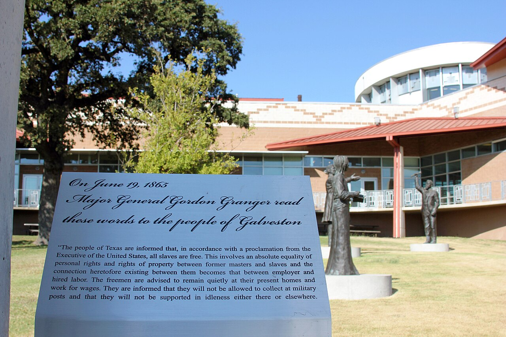

# The June Table

A 2006 visitor who cared about food more than sermons wrote down what the Wilmar June Dinner tasted like that year. Barbecue goat, pork, beef. Ribs. Turkey legs. Catfish. Chicken. Hot tamales. Pound cake. Fried green tomatoes. Funnel cake. Police sausages. Hot dogs. Chips. Baked beans. Pickles. Soda and water. Church fundraisers and family smokers on the same ground. Parade History published the list with photographs and an interview with Joyce Steen. The list is a document. It is not a menu a chamber of commerce invented later, and it is not a recipe book. It is what a person with a camera could buy, smell, or be handed on one June weekend in a city the 2010 census would put at 511.

Steven Teske, writing the town’s opening paragraph for the Encyclopedia of Arkansas, puts the dinner before the mill. One of the oldest Juneteenth celebrations in Arkansas. Begun in the nineteenth century. Thousands of attendees each year. Arkansas PBS, filming for *Celebrating Arkansas* from interviews made in 2023, called the same holiday kinship and oral history. Mayor Toni Perry said the dinner has always been held at the Wilmar Colored School, and that it cannot move. This essay will not restage that ground. Essay 16 is the origin. Essay 17 is the yard. This one is the plate.

A town of a few hundred that feeds thousands is a town whose cuisine is a civic plan. The plan is older than the 2006 still and older than the PBS short. The food changes. The obligation to feed does not.

## What the first table carried

PBS is plain about the earliest method. Locals brought any dish they could make and sat down together. They celebrated togetherness, the film says, and, more importantly, freedom at last. That is a potluck sentence, not a vendor sentence. It belongs to a nineteenth-century Black reunion on a schoolyard in a county that, in 1860, had counted 3,497 people in bondage. The first plates were whatever a household could spare after a year of other people’s fields, or its own. The 2006 list is what that obligation looked like after a century of smoke, sugar, and cash.

Beverly Railey, a Wilmar native speaking to PBS, drew the geography in six words: “Chicago, I’m a visitor. Wilmar, I’m home.” Return is a foodways fact. People who left for Chicago, Detroit, Washington — Terry Jones named those cities to Tiff Graham in 2006, talking about the parade — come back to eat what they cannot eat on a Tuesday in another state. Reunion food has to travel or it has to be cooked on arrival. Pound cake travels. Barbecue is cooked on arrival. Tamales can do either. The 2006 ground held both kinds of work.

The dinner commemorates June 19, 1865, in Galveston: General Order No. 3, news of freedom arriving late. Parade History’s brief history says so without dressing it up. Teske says the Wilmar table started in the nineteenth century. PBS says the history has been passed down mostly through oral accounts. A food essay that turns those sentences into a novelized kitchen in 1868 has left the sources. What can be said is smaller and better. The first cooks brought what they had. Later cooks brought smokers. By 2006 some people sold and everyone ate.

## The 2006 still

Tiff Graham’s Parade History piece is useful because it is greedy for names. Divalicious Fixings and More. Margo’s Catfish. The Catfish Hut — Finger Licking Good. A & W Concessions. A stand that the list simply calls Hot Tamales. Simply the Best B & B. AAU Boys Basketball fundraisers. Revival Center Church of God of Christ (the 2006 list’s spelling; the denomination’s usual English is Church of God in Christ), raising money for the youth department. Each sold some combination of the meats and sides already named. Families and social groups also came prepared: grills, smokers, coolers, tables, chairs, their own drinks. That split is the dinner’s economy. Some people sell. Everyone eats. The school ground holds both.

A later year will have a different list. This draft will not update 2006 into a directory. Vendors close. Churches change names. AAU teams age out. The still is the still. What it proves is that by the early twenty-first century the June table had room for a church youth department and a basketball fundraiser and a family that did not want to buy a sandwich from anyone. Cash and kinship on one acre. The booster paper of 1907, listing five general stores and a commissary, never printed this inventory. It was not looking.

Joyce Steen sat for Graham’s camera and talked about her life, her family, the community, food, and work. Graham, in a rare moment of the interviewer remaining on the page, admitted the worry: a festival, a busy person, a stranger with a lens, the fear of asking too much. Steen fed the visitor anyway. She had raised eight children. One daughter had become a dietician. The interview is unedited video on the Parade History site. This essay will not pretend to have a transcript of recipes. It will say that a woman who cooked and worked and raised eight people was willing, on a June day, to talk about food as if food were history, which it is.

Graham’s 2006 population figure was “500 plus.” Teske’s 2010 count is 511; 2020 is 395. The food list does not shrink with the census. Thousands come. The arithmetic is the point. A city that can hold thousands on one weekend is a city that exists in a larger geography of kin. The plate is how that geography becomes visible.

## Goat, smoke, and the weekday meat

Barbecue goat is the line in the 2006 list that will not let a reader pretend this is a generic Southern picnic. Goat is a holiday meat in more than one Black Southern and Caribbean kitchen. Pork and beef are the weekday vocabulary raised to a feast. Ribs and turkey legs are fairground grammar. Chicken is the bird a church can cook in quantity. Catfish is the river and the pond, sold from stands with names that already tell you the product. Police sausages and hot dogs are what you hand a child who will not wait for a rib. The list is not a tasting menu. It is a working classification: slow meat, fast meat, fish, bread, sugar, pickle, smoke.

Barbecue is the smell that marks a holiday from a Tuesday. Anyone who has walked toward a schoolyard in June in this country knows the argument the smoke makes before a sign does. The 2006 record does not give a sauce recipe or a wood species. It does not need to. The smokers are in the sentence about families who brought their own. The vendors sold sandwiches. Both methods count. A cuisine that only recognized restaurant barbecue would miss half the ground.

Fried green tomatoes are a summer crop that has not waited to ripen. They belong on a June table in a county the 1907 *Advance* still sold as cotton, corn, and peaches. Pickles are vinegar and time. Baked beans are the pot that sits next to the meat and does not ask for attention. Funnel cake is carnival sugar that arrived after the potluck years, a late guest the 2006 list does not apologize for. Chips and soda are the American default, and they are on the list because people bought them. A foodways essay that edits out the chips to make the table look older is lying.

## Tamales on the Delta’s edge

Hot tamales in Arkansas are not a surprise the encyclopedia forgot to mention. Amy Evans, writing the Tamales entry for the Encyclopedia of Arkansas, puts them on restaurant menus and roadside stands across the state and, with more care, in the Delta: meat and meal, a warm lunch that could go into a cotton field, cornmeal coarser than a Latin American masa, husk or parchment, beef or chicken or venison. How they arrived is a set of hypotheses, not a deed. Mexican War veterans. Native kitchens. Latino migrant labor in the 1920s and 1930s. Evans’s Arkansas date is earlier: Peter St. Columbia, a Sicilian who landed at New Orleans in 1892 and peddled dry goods upriver, learned a recipe from Hispanic field workers around Helena because Italian and Spanish could share a counter when English could not. Helena is Phillips County. Lake Village, later, is Chicot. Wilmar is Drew, on the Delta’s western edge, eight miles from a county seat that faces Bayou Bartholomew’s cotton country.

The 2006 Wilmar list includes tamales without a footnote. That is the fact this essay needs. It does not prove a St. Columbia cousin cooked in Wilmar. It does not prove a Mexican crew on the Warren Branch. It proves that by 2006 a Juneteenth table in this town treated tamales as ordinary festival food, next to goat and pound cake, sold from a stand the record names only as Hot Tamales. Wilmar’s dinner is not a museum of 1865 Texas. It is a living southern table that picked up what the region cooks. The seam between Evans’s Delta trail and Graham’s schoolyard list is the honest one. Do not nail them together with a story neither source tells.

Portable heat is the shared logic. A tamale holds. A rib holds if you wrap it. A pound cake holds until Sunday night. Juneteenth food, in this county, has always had to survive a crowd and a trip.

## Pound cake, sugar, and time

Parade History put pound cake in the headline with barbecue and tamales. Cake is a reunion food because it travels and because it says someone had sugar and time. A pound of butter, a pound of sugar, a pound of flour, a pound of eggs — the old ratio is a memory, not a 2006 laboratory note. This draft does not have Steen’s recipe and will not invent one for a search engine. What it has is the headline’s judgment: in Wilmar, in 2006, pound cake was important enough to stand with the smoke and the shuck.

Church desserts and family desserts are not the same labor. A youth department selling plates is raising money and feeding people at once. A family setting out its own cake is refusing, for an afternoon, to be a customer. Both belong on the ground Mayor Perry will not move. PBS’s modern sentence — the town comes together not as individuals living in the same place but as an entire family — is theology if you want it to be. It is also a catering problem. Thousands of attendees, Teske says. You do not feed that many on memory. You feed them on goat, catfish, tamales, and cake, paid or brought.

## Fundraisers are a cuisine

Revival Center Church of God of Christ, youth department. AAU boys’ basketball. Those two lines in the 2006 vendor list are as important as Simply the Best B & B. A June table that is only nostalgia has no use for a basketball fundraiser. A June table that is a living institution does. Black churches in this county have been feeding people longer than Gates Lumber Company stood. The 1907 paper named Otto Mahling and Kidd Bros. and did not name this kitchen. The 2006 list names the kitchen without needing the paper.

Graham worried about interrupting people who were making money and connecting and cooking. That worry is evidence. The dinner is work. Joyce Steen’s interview is titled around food and work for a reason. Teske’s thousands do not arrive already fed. Someone lifted a cooker. Someone wrapped a tamale. Someone sliced a cake on a folding table. The civic plan is labor.

## 2006 is a still; 2023 is a film

Seventeen years separate Graham’s food record from PBS’s interviews. The film is about kinship, a Galveston story, a school ground, Beverly Railey’s two cities. It is not a new menu. That is correct. Foodways writing that chases every year’s special has become a blog. Foodways writing that freezes 2006 as the eternal plate has become a museum label. This essay will do neither. 2006 is the year we have a named inventory. 2023 is the year we have a filmed account of why people return. The dinner is older than both.

Teske’s census after 2010 is a smaller town. The table did not ask the census for permission. People who live in Monticello now, or in Chicago, still owe June a dish or a dollar. The suburb Teske names in another sentence is a weekday truth. The plate is a weekend jurisdiction.

## What this essay will not do

It will not put pound cake on a furniture page as local flavor. It will not score a recipe as heritage branding. It will not sell a board as a June relic. The style guide forbids the close. The community owns the table. Essay 16 may point here. This essay does not point at a shop.

If a photographer is invited, photograph hands and smoke, with permission. Do not photograph children as emblems. Do not invent a secret recipe. Do not caption a generated feast as 2006. Graham’s pictures and PBS’s stills exist; ask the people who hold them. The Colored School grounds are the set. The work is the cooking. The theology, if any, is the date: news of freedom, late, then annually on time, with goat and tamales and a cake that made the headline.

<figure class="wilmar-figure">

<figcaption>Figure 1. The dinner outlasts the mill on the pack’s own timeline. Schematic, not a menu. Pack graphic AS-TL-01.</figcaption>
</figure>

<!-- photo_slot: P-05 June Dinner food and grounds, PBS or family, with consent. Not a generated feast. Not children as emblems. -->

<figure class="wilmar-figure wilmar-figure--period">

<figcaption>Figure 2. General Order No. 3 Juneteenth monument text. Credit: Larry D. Moore / Wikimedia Commons. License: CC BY-SA 4.0.</figcaption>
</figure>

## Sources for this piece

Parade History, “Juneteenth Celebration In Wilmar Arkansas: BBQ, Hot Tamales, And Pound Cake,” 2006 food record, vendor list, and Joyce Steen interview (Tiff Graham). Parade History, “Juneteenth and June Dinner Parades,” for Terry Jones (2006) on people coming home from Chicago, Detroit, and Washington. Arkansas PBS, “Wilmar June Dinner: A Juneteenth Celebration,” *Celebrating Arkansas*, including Mayor Toni Perry, Beverly Railey, and the potluck origin as reported from 2023 interviews. Teske, “Wilmar (Drew County),” for the nineteenth-century start, the thousands, and the census. Evans, “Tamales,” Encyclopedia of Arkansas, for the Delta tamale foodway as regional context, not as a Wilmar origin story.
