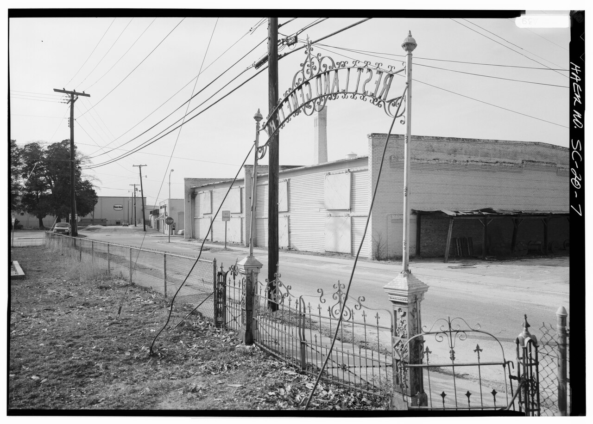

# A Thousand Bales

The Monticello *Advance*, listing Wilmar’s enterprises in December 1907, saves a particular pride for a new building. A Farmer’s Union Warehouse — “the only one in the county” — capacity 1,000 bales, established during the present year. In a town whose “real history” the same paper dated from Gates, the farmers filed a warehouse. That filing is the still.

The Farmers Educational Cooperative Union of America — Farmers Union in the shorter later name — was, in the southern early twentieth century, a cooperative politics: marketing, warehouses, a hope of not selling cotton at the merchant’s price. Charley Sandage’s Encyclopedia of Arkansas article puts the national founding at Point, Texas, in 1902, and the Arkansas root at Spring Hill, Hempstead County, in 1903. Bankers, lawyers, merchants, and speculators were denied membership. Teachers could join. The union was often at odds with banks, exchanges, processors, and shippers. This draft will not reconstruct a Wilmar charter from that national history. It will take the *Advance* at its inventory word. Wilmar had the county’s only such warehouse in 1907. Monticello had the compress and 12,264 bales of receipts. The seat still won the volume. The second town won the union building.

## What the souvenir thought a bale was worth

Drew County, the *Advance* said, yielded 15,000 to 20,000 bales in a normal year. The previous year: 20,040. From 12,000 to 14,000 marketed in Monticello. Compress receipts for the last season: 12,264 at the seat. The remainder moved through Wilmar, Collins, Tillar, and probably some at Dermott, just across the line in Chicot County. Cotton was “the great staple.” Agriculture was “the most important and stable of all industries,” even in a souvenir that needed Gates to look like destiny. Bayou Bartholomew bottoms — about 100,000 acres in the paper’s figure — were the rich country, a bale and forty to fifty bushels of corn, rent at five dollars. Saline bottoms — about 8,000 acres — were “not so good from an agricultural standpoint, but are heavily timbered.” Wilmar sat in the conversation between those sentences. A mill town with a thousand-bale warehouse was announcing that the ridge had not given all the staple to the east.

A thousand bales is a booster’s round number. It is also a capacity, not a receipt. The paper does not say how many bales the new building held in December. It says what the building could hold. Treat the adjective *only* as the paper’s pride and as a claim a later county historian might check. Treat 1,000 as inventory, not as a harvest. The mnemonic “one bale per person,” for a town the souvenir put at 1,000 or 1,200, is a joke a writer can make and then retire. The 1910 census would say 929. The warehouse was not a census.

Southern Compress in Monticello, the same souvenir said, handled cotton from a wide radius; Warren’s market sent bales here to be pressed; factors bought thousands. Wilmar’s union shed could not beat that machine. It could keep a fraction of the remainder from having to ride eight miles east before it had a roof. That is a farm fact inside a mill inventory. The saw did not abolish the gin. The gin did not abolish the saw.

## 1907, which is a union year as well as a panic year

Sandage’s membership figures are the other still from that year. The Arkansas state convention reported 718 locals and 78,085 members. Secretary-Treasurer Ben Griffin, more carefully, reported no more than 42,039 dues-paying members in any quarter of 1906. Still, Sandage writes, the union was among the state’s largest organized interest groups. In September 1907 the national union met in Little Rock. The *Arkansas Gazette*, Sandage writes, put the meeting on the front page under large headlines. This pack does not have the Little Rock minutes on the desk. It has Sandage, the *Advance*’s December building, and a calendar. The county’s only union warehouse opened in the same year the national union came to Arkansas. A writer who nails those two facts into a single cause has gone past the sources. A writer who leaves them in the same year has not.

Some Arkansas organizers had recognized members of a separate Colored Farmers Progressive and Educational Union. The practice was halted in 1906. Union gins and warehouses, Sandage adds, continued to market cotton from Black farmers. That sentence matters in a county that was 3,497 enslaved people in 1860 and, in Wilmar by 2010, majority African American. The 1907 paper does not say whose cotton went into the new shed. The state article says the type of building was not, in principle, closed to Black bales. Do not invent a Wilmar ledger that proves either welcome or refusal. Put the seam on the page.

The union’s later Arkansas work included a campaign that led, in 1909, to legislation establishing four district agricultural schools. One of them went to Monticello and became, by stages, UAM. Sandage and Heady agree on the destination. Essay 15 has already said what that destination cost Wilmar. The warehouse of 1907 and the campus of 1909 are both Farmers Union sentences. They are not the same building.

## Why a mill town wanted a warehouse

Because the county still made 15,000 to 20,000 bales, and some of them moved through Wilmar. Because a commissary — Kidd Bros., the same paper’s giant, acting for Gates — is not a cooperative. Because public spirit, in the souvenir’s dialect, included “any new enterprises.” Because bankers and merchants were the people the union’s national rules kept out, and a mill town’s middle was exactly those people. The contradiction is the essay. Wilmar’s leading storekeepers held stock in the mill and the Bank of Wilmar. The farmers filed a warehouse anyway, or the paper wanted readers to believe they had. A booster can invent pride. It is harder to invent a building and a bale count in a list that also has to survive local memory.

The Farmer’s Union warehouse is the named alternative for cotton. The commissary is the named counter for groceries and dry goods. Between them sits the town’s political economy in 1907: company provisioning and cooperative marketing, under the same water tower, in a city the paper would not choose between 1,000 and 1,200. Essay 46 will stay with Kidd. This one stays with the shed.

## Robert Hill, a different union, eleven years later

Heady records that Drew County resident Robert Hill incorporated the Progressive Farmers and Household Union of America in 1918, and that a chapter of that group stood at the center of the Elaine Massacre in Phillips County the next year. Jason McCollom’s encyclopedia article on the PFHUA thickens the sentence without collapsing it into 1907. Robert L. Hill of Drew County, with physician V. E. Powell, incorporated the organization in Winchester, in the northeastern part of the same county. Hill was African American. He called himself a U.S. Detective after a St. Louis correspondence course; others called him a farmer or farm hand. The constitution’s objective was “to advance the interests of the Negro, morally and intellectually, and to make him a better citizen and a better farmer.” Members bought shares at a dollar. Capital stock: $1,000. Passwords, handshakes, signs. Winchester’s own encyclopedia note adds that the Monticello firm of Williamson and Williamson drew up the articles.

That is not the 1907 warehouse. It is not the Farmers Educational Cooperative Union of America. It is a Black fraternal-and-labor order founded in Drew County eleven years later, grown among sharecroppers around Elaine, Ratio, Hoop Spur, Modoc, Old Town, Mellwood, Ferguson. They hired Ulysses S. Bratton to sue landlords for the 1919 cotton crop. On the night of September 30, 1919, at a church in Hoop Spur, union guards and armed whites exchanged fire. W. A. Adkins died. Charles Pratt, a deputy, was wounded. White posses and then federal troops from Camp Pike killed an unknown number of African Americans — estimates have run into the hundreds. Five white people died. Robert Lee Hill was hidden and escaped to Kansas. The Elaine Twelve were sentenced to die and, after years of lawyering by Scipio Jones and others, and after *Moore v. Dempsey*, were eventually freed. The PFHUA, McCollom writes, dissolved quickly in eastern Arkansas under intimidation and violence.

A series that mentions a Farmer’s Union building without the 1918 name is incomplete. A series that collapses the two unions is sloppy. Different organizations, different years, different membership rules, different outcomes. The 1907 warehouse is a marketing shed the county paper was proud to print. Elaine is a massacre. Keep them in the same county and in different sentences. Winchester is Drew. Hoop Spur is Phillips. Wilmar’s shed is not a rehearsal for Hoop Spur. The temptation to write a single “farmers’ union” story for southeast Arkansas is the temptation this essay exists to refuse.

Hill’s $1,000 capital stock and the warehouse’s 1,000-bale capacity are the same numeral and not the same fact. Leave the rhyme alone. It is too neat to lean on.

## After 1907, which this folder does not have

The building’s later life is not in this pack. A later pass should ask whether the warehouse outlasted Gates, whether it burned, whether it became a rumored rectangle like Beauvoir’s foundation lines. Until then, 1907 is the year. Teske’s industrial second act is gas, not cotton. The June table is another kind of surplus. The warehouse is a December still: the only one in the county, a thousand bales, a mill town filing a farm claim.

Do not treat the *Advance* as a census. Do not treat Sandage’s statewide membership as a Wilmar roll. Do not treat Heady’s Hill sentence as a caption for the 1907 shed. Three documents, three scales. The plate that would make a Ken Burns hour is the souvenir’s inventory line, then the Little Rock front page of September, then a blank for the building’s death date. Music would be wrong. Cotton is weight. Weight is enough.

<figure class="wilmar-figure">

<figcaption>Figure 1. Remainder cotton, the 1907 paper said, moved through Wilmar, Collins, and Tillar. The union shed stood in the second town. Schematic. Pack graphic AS-MAP-01.</figcaption>
</figure>

<!-- photo_slot: P-09 Farmer’s Union warehouse, if a later photograph or a foundation line is offered. Not a generated shed. -->

<figure class="wilmar-figure wilmar-figure--period">

<figcaption>Figure 2. Cotton bale warehouse, Farmers Union storage analog. Credit: Historic American Engineering Record / Library of Congress / Wikimedia Commons. License: Public domain.</figcaption>
</figure>

## Sources for this piece

Industrial & Souvenir Edition of the *Advance*, December 17, 1907, Haisty transcription (Wilmar warehouse line; county bale figures and Monticello compress receipts). Sandage, “Arkansas Farmers Union,” Encyclopedia of Arkansas (founding; 1906–1907 membership; Little Rock national meeting, September 1907; membership rules; Black farmers’ cotton; 1909 agricultural schools). Heady, “Drew County,” for Robert Hill and Elaine as a separate union story. McCollom, “Progressive Farmers and Household Union of America,” and “Winchester (Drew County),” Encyclopedia of Arkansas, for the 1918 incorporation at Winchester and the 1919 massacre. Teske, “Wilmar (Drew County),” for the town’s later industrial sentence, used only as context. No local warehouse charter was located for this draft.
