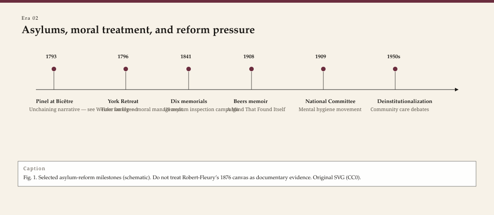

<!-- graphics-pass: 2 | source: articles/02-asylum-and-moral-treatment.md | do not publish without editor merge -->
---
title: "Asylums, moral treatment, and a famous untruth"
slug: asylums-moral-treatment
meta_description: "Pinel, Pussin, Tuke, and Dix: how asylums and 'moral treatment' remade care of the mad — and why the painting of Pinel striking chains is a legend."
tags:
  - therapy history
  - asylums
  - moral treatment
  - Pinel
  - Dorothea Dix
type: era
order: 2
portrait: none
citations:
  - "Weiner, Dora B. The Apprenticeship of Philippe Pinel. Am J Psychiatry 136(9), 1979."
  - "Weiner, Dora B. 'Le geste de Pinel.' In Discovering the History of Psychiatry, 1994."
  - "Scull, Andrew. Madness in Civilization. 2015."
  - "Gollaher, David. Voice for the Mad. 1995."
status: publishable
voice_check: human
last_verified: 2026-09-14
---

**Educational note.** This is history for a general reader. It is not a diagnosis, not a treatment plan, and not a substitute for care with a licensed clinician.

Tony Robert-Fleury painted it for a later century that wanted a hero: Philippe Pinel in a pale coat, a woman being freed, chains on the stone. The canvas hangs in the story even when the canvas itself is in storage. French psychiatrists of the nineteenth century needed a founding gesture. They chose a man and a myth.

<!-- figure-id: asylums-moral-treatment.asylum_reform_timeline -->

*Figure 1. Pass-2 infographic for era essay « asylums-moral-treatment » (see GRAPHICS_INDEX.md).*

*Rights: original editorial SVG (CC0). No AI-generated faces or likenesses.*

Dora B. Weiner spent years in the Archives nationales undoing that gesture. In 1979 she published a document in the *American Journal of Psychiatry*: "Observations of Citizen Pussin on the insane." Jean-Baptiste Pussin, the governor of the mental wards at Bicêtre — a former patient himself, a man who had learned the place from the inside — had already been running a psychological discipline Pinel would later call *traitement moral*. In 1797, Weiner showed, it was Pussin who replaced chains with straitjackets at Bicêtre. Pinel later brought Pussin and Marguerite Pussin to the Salpêtrière to help him rebuild that hospital. The physician wrote the treatise. The couple knew the keys.

If you remember one correction from this whole series, remember that one. Reform is usually a staff story before it is a statue.

## What "moral treatment" meant

*Moral* here does not mean sermonizing, though sermons happened. In late-eighteenth-century French and English it meant the passions, habits, and social order — *le moral* as opposed to *le physique*. A superintendent who believed in moral treatment thought the mad could be reached by routine, kind firmness, work, and a setting that did not look like a dungeon.

William Tuke, a Quaker tea merchant, opened the York Retreat in 1796 after a death in the local asylum shamed the Society of Friends. The Retreat used surveillance and expectation more than irons. Visitors wrote it up as a garden with rules. Andrew Scull and others have since described the steel inside the kindness: time-tables, withheld privileges, the gaze of staff who recorded every deviation. Moral treatment was still a power relation. It was a different power relation from a chain in a stone ring.

Vincenzo Chiarugi in Florence published *Della pazzia* in 1793–94 and tried, in the Bonifacio hospital, a medical order that did not begin with irons. Samuel Tuke, William's grandson, wrote *Description of the Retreat* (1813) and exported the York story to readers who would never see Yorkshire. Benjamin Rush in Philadelphia mixed bleeding and a "tranquilizer" chair with republican rhetoric. There was no single enlightened dawn. There were institutions arguing with one another about what a building could do to a mind.

The American "Kirkbride plan" later in the nineteenth century — Thomas Story Kirkbride's long, staggered wards, light, and air — is architecture as moral treatment. It is also architecture as a census machine. The buildings outlived the staffing ratios they required. A contemporary reader who sees a ruined state hospital on a hill is looking at that outliving, not at a proof that kindness was a lie. Kindness was a ratio. The ratio was not funded.

## The asylum as a machine that filled

The nineteenth century built asylums the way it built railways: on a theory of capacity, then past the theory. County asylums in Britain, state hospitals in the United States, *asiles* in France — the census climbed. Superintendents published annual reports with recovery percentages that later historians read as accounting, not miracles.

Moral treatment needed small numbers and staff who stayed. Warehousing needed neither. By the 1850s and 1860s many "reformed" hospitals were crowded, underfed, and proud of their architecture. The same generation that printed Pinel's legend also printed photographs of wards that look, to a modern eye, like warehouses with beds.

Dorothea Dix walked those American wards. A former teacher, she began in 1841 after a Sunday-school visit to a Cambridge jail and spent the next decades presenting memorials to legislatures — Massachusetts in 1843 is the famous one — counting the people she found in cages, cellars, and almshouses. She helped force the building of hospitals, including what became St. Elizabeths in Washington. She was autocratic. She was often right about the filth. She also believed in the hospital as the answer. A later generation would have to unlearn that part.

The figure essay on Dix in this series stays with her campaigns and her Civil War nursing command. The figure essay on Pinel stays with the *Traité* of 1801 and the Pussins. This era piece is about the building type they left behind.

## Patients who wrote back

Clifford Beers published *A Mind That Found Itself* in 1908. He had been a Yale man and a clerk and then a patient in Connecticut institutions. He described beatings, the "violent ward," and the way a sane interval could be punished as insubordination. The book is rhetorical — Beers was building a movement — and it is also one of the first American bestsellers in which the patient seizes the narrator's chair.

The National Committee for Mental Hygiene (1909) grew out of that book and out of the physicians Beers recruited, including Adolf Meyer. "Mental hygiene" would later sound like mouthwash. In 1909 it meant: the hospital is not the whole story; the public is implicated; aftercare and prevention belong on the docket. How much prevention the committee actually delivered is a research question. That a former patient set the agenda is not.

## What this has to do with a talking hour

Psychotherapy did not replace the asylum. For a long time it lived beside it, or upstairs from it, or in a private office that admitted only the people who would never see a state ward. Freud's first circle treated paying neurotics. The chronic patients of the Salpêtrière and of American back wards were someone else's census.

The inheritance for a contemporary counselor is double. First: the profession's ancestor institutions were carceral. Anyone who talks lightly about "the old days when we just cared for people" has not read a superintendent's report. Second: the people who changed those institutions were often not the famous physicians. They were governors, Quaker merchants, a Massachusetts teacher, a Connecticut clerk who survived his own chart.

When a clinic now writes a safety policy, fights an insurance denial, or decides whether a person can be seen outpatient, it is still in a conversation that the asylum started. The furniture is nicer. The question — who is free to leave — has not gone away.

Deinstitutionalization in the United States — the Community Mental Health Act of 1963, then the emptying that followed without equivalent street care — is an argument *with* Dix and Kirkbride, not a sequel that makes them unnecessary. Jails filled again. Emergency rooms became wards. A counselor who has never walked a state-hospital campus still works in the shadow of that emptying. The 1908 Beers book and the 1963 statute are two attempts to move the story off the hill. Neither finished the move.

## Sources

Weiner 1979 (PMID 382874) and Weiner 1994 on the Pinel myth and Pussin. Pinel, *Traité médico-philosophique* (1801). Scull 2015. Gollaher 1995 on Dix. Beers 1908; Dain 1980.

*WOW Therapies educational series. Complementary to the SLPWOW speech-pathology history pack; this lane is counseling and clinical heritage only.*
