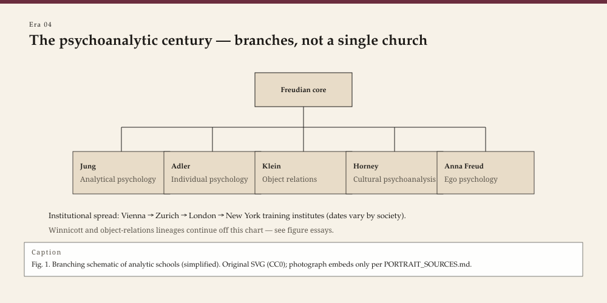

<!-- graphics-pass: 2 | source: articles/04-psychoanalytic-century.md | do not publish without editor merge -->
---
title: "The psychoanalytic century"
slug: psychoanalytic-century
meta_description: "From a Vienna circle to institutes on four continents: how psychoanalysis became a movement, a quarrel, and a language — and what it did not become."
tags:
  - therapy history
  - psychoanalysis
  - Freud
  - Jung
  - Klein
type: era
order: 4
portrait: none
citations:
  - "Makari, George. Revolution in Mind. 2008."
  - "Hale, Nathan G., Jr. The Rise and Crisis of Psychoanalysis in the United States. 1995."
  - "King, Pearl, and Riccardo Steiner, eds. The Freud–Klein Controversies 1941–45. 1991."
  - "Hartnack, Christiane. Psychoanalysis in Colonial India. 2001."
status: publishable
voice_check: human
last_verified: 2026-09-14
---

**Educational note.** This is history for a general reader. It is not a diagnosis, not a treatment plan, and not a substitute for care with a licensed clinician.

In 1902 a few Viennese physicians began meeting on Wednesday nights in Sigmund Freud's apartment. They took minutes. They expelled people. They wrote to colleagues in Zürich and Budapest and, later, to a psychiatrist in Calcutta who had already written a dissertation without asking their permission. By 1939 the Wednesday circle was a set of institutes, a publishing house, a training analysis that could last years, and a refugee traffic as Central Europe became unsurvivable for Jews.

<!-- figure-id: psychoanalytic-century.psychoanalytic_branches -->

*Figure 1. Pass-2 infographic for era essay « psychoanalytic-century » (see GRAPHICS_INDEX.md).*

*Rights: original editorial SVG (CC0). No AI-generated faces or likenesses.*

Call that a century even if the dates are messy. Psychoanalysis was the first psychotherapy that behaved like a church, a science, and a migration at once.

## A method that wanted to be a science

Freud's early claims were medical: dreams had rules (*Die Traumdeutung*, dated 1900, in the shops in November 1899), slips had sense, symptoms were compromises. He analogized to physics and archaeology. He also ran a movement. The International Psychoanalytical Association (1910), the secret "committee" of seven rings, the quarrels with Alfred Adler (1911) and Carl Jung (1913) — these are not sidebars. They are how a clinic became an institution that could survive its founder.

George Makari's *Revolution in Mind* is the book to read if you want the science-politics without the marble bust. Freud's circle included experimentalists and metaphysicians. They did not agree on the libido, on religion, or on whether a layperson could analyze. What they agreed on, for a while, was that the unconscious was lawful and that a training analysis was the instrument.

## Splits that were about more than personality

Adler left with "individual psychology": inferiority, compensation, social interest. Jung left with a libido that was not only sexual and with a psychology of types and images that would later feed both serious scholarship and a gift-shop unconscious. Sándor Ferenczi, who stayed longer, pushed trauma, mutuality, and the idea that the analyst's hypocrisy could injure a patient — and was punished for it in the family's memory until later readers opened the *Clinical Diary*.

After Freud died in London in 1939, the British Society spent the war years in the "Controversial Discussions" (1941–45). Melanie Klein's infant, full of envy and phantasy from the start, faced Anna Freud's child, who needed ego support and a developmental timetable. Pearl King and Riccardo Steiner edited the minutes. They read like a university department and a custody fight. Out of the wreck came three training streams in London: Kleinian, Anna Freudian, and "Middle Group" (later Independent), where Donald Winnicott did his most lasting work.

In the United States, psychoanalysis entered medicine more tightly. The American Psychoanalytic Association restricted training, for decades, to physicians — a lockout of psychologists and social workers that later lawsuits and a changing market had to pry open. Nathan Hale has told that story as a rise and a crisis: mid-century cultural power, then the collision with psychopharmacology, behavior therapy, and a public that would not lie down four times a week. Ego psychology (Heinz Hartmann, Ernst Kris, Rudolph Loewenstein) made analysis sound compatible with adaptation and with American optimism. The 1960s and 1970s made that compatibility look like a problem.

Karen Horney, Clara Thompson, and the "cultural school" had already left or been pushed from the New York institute. Their English-language books reached social workers and a reading public that the medical institutes did not consider their students. Counseling, as a later licensed job, inherited those readers more than it inherited the APsaA couch.

## Calcutta, Tokyo, Buenos Aires, and the idea of a "center"

Girindrasekhar Bose founded the Indian Psychoanalytical Society on 26 January 1922. He had already sent Freud *The Concept of Repression* (1921). Their letters run to 1937. Bose argued, among other things, that opposite wishes — not only repression of a single forbidden wish — structured mental life, and that the Oedipus story did not travel unchanged. The IPS became a component society of the IPA. Psychoanalysis was not "brought to India" like a piano. It was rewritten there.

Japan's encounter ran through translators, through Morita's separate clinical invention (1919), and later through a distinctive psychoanalytic culture (Takeo Doi's *amae* is a 1971 argument with, and inside, that culture). Argentina built one of the densest analytic worlds outside Europe. French psychoanalysis after 1945 became, in Jacques Lacan's seminar, a linguistic and institutional drama that this series will not pretend to summarize in a paragraph.

The honest global sentence is not "Freud went everywhere." It is: local elites and dissidents used a Viennese vocabulary to fight local fights — caste, colonial medicine, the family, the university — and sometimes threw the vocabulary away.

## What psychoanalysis gave the rest of the field (and what it did not)

Gifts, even if you never lie on a couch:

- The idea that a symptom can *mean*, not only misfire.
- Transference: the present relationship is haunted by older ones, including the one in the room.
- A reason to listen longer than a symptom checklist.
- A literature of infant observation, child analysis, and, later, attachment research that argued with analysis from the inside (Bowlby) and the outside.

What it did not give:

- A single outcome literature that satisfied the people who built CBT trials.
- Immunity to authoritarianism in institutes.
- A clean record on homosexuality, on women as theorists, or on the colonial patients who appear in old papers as "the native."
- A method you can learn from a magazine essay.

WOW Therapies will not offer analysis by correspondence. The reason to publish this history is narrower. Half the words a client already uses — denial, projection, unconscious, ego — leaked from this century into ordinary American speech. A clinician who does not know the leak will treat slang as science, or science as slang.

## After the century

Relational and intersubjective analysts in the United States (Stephen Mitchell and others) rebuilt the two-person frame. Neuropsychoanalysis tried to rent space in the medical school. Meanwhile most American outpatient care became short, billed, and cognitive-behavioral in language even when the clinician's heart was still Freudian.

The psychoanalytic century did not end because it was "disproven" in a single paper. It ended as a monopoly. The rest of this series is what grew in the space that monopoly left — and what had been growing all along in rooms that never subscribed to *Imago*.

The 1926 pamphlet did not settle American medicine. It named the fight.

Lay analysis was a fight inside the family. Freud's *The Question of Lay Analysis* (1926) defended Theodor Reik and a non-physician practice. American institutes, for decades, said no. Psychologists and social workers built other rooms — counseling rooms among them — while waiting. The later opening of institute doors did not return those decades. A profession that now shares "psychodynamic" language across licenses is living in the settlement, not in Freud's 1926 pamphlet.

## Sources

Makari 2008; Hale 1995; King and Steiner 1991; Hartnack 2001; IPS *Bose–Freud Correspondence* (1964/1999). Freud 1900 and 1914. For Ferenczi's 1932 lecture, the 1949 English of "Confusion of Tongues."

*WOW Therapies educational series. Complementary to the SLPWOW speech-pathology history pack; this lane is counseling and clinical heritage only.*
