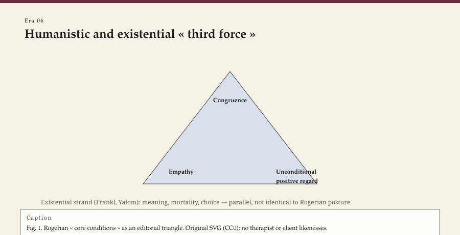

<!-- graphics-pass: 2 | source: articles/06-humanistic-existential.md | do not publish without editor merge -->
---
title: "The third force: humanistic and existential therapies"
slug: humanistic-existential-therapies
meta_description: "Rogers, Maslow, May, Frankl, and Yalom: how a mid-century revolt against drive theory and rat psychology built a clinic around presence, meaning, and the given of death."
tags:
  - therapy history
  - humanistic psychology
  - existential therapy
  - Rogers
  - Frankl
  - Yalom
type: era
order: 6
portrait: none
citations:
  - "Rogers, Carl R. The Necessary and Sufficient Conditions of Therapeutic Personality Change. 1957."
  - "Rogers, Carl R. On Becoming a Person. 1961."
  - "Frankl, Viktor E. Man's Search for Meaning. (…trotzdem Ja zum Leben sagen, 1946)."
  - "Yalom, Irvin D. Existential Psychotherapy. 1980."
  - "May, Rollo, Ernest Angel, and Henri F. Ellenberger, eds. Existence. 1958."
status: publishable
voice_check: human
last_verified: 2026-09-14
---

**Educational note.** This is history for a general reader. It is not a diagnosis, not a treatment plan, and not a substitute for care with a licensed clinician.

In 1957 Carl Rogers published, in the *Journal of Consulting Psychology*, a paper whose title still startles if you read it slowly: "The Necessary and Sufficient Conditions of Therapeutic Personality Change." Six conditions. Among them: two people in contact; the client in a state of incongruence; the therapist congruent, warmly regarding the client without conditions, and catching the client's inner world as if from inside — and the client, at least a little, perceiving that regard and that catching.

<!-- figure-id: humanistic-existential-therapies.humanistic_core_triangle -->

*Figure 1. Pass-2 infographic for era essay « humanistic-existential-therapies » (see GRAPHICS_INDEX.md).*

*Rights: original editorial SVG (CC0). No AI-generated faces or likenesses.*

*Sufficient* was the fight word. Analysts had spent decades on training analyses and on the right interpretation at the right depth. Rogers said, with Midwestern empiricism and a pile of recorded sessions from Chicago and later Wisconsin: the relationship, under these conditions, is the treatment. He taped the hours. He let researchers count pronouns. He made warmth into something you could miss on a transcript.

## Why "third force"

Abraham Maslow and the people who gathered around the Association for Humanistic Psychology in the early 1960s were tired of two reductions. Psychoanalysis, they said, had made the person a battlefield of drives. Behaviorism had made the person a schedule. Humanistic psychology wanted growth, peak experience, and a self that was not only a symptom.

Some of that language aged into poster copy. Maslow's hierarchy, taught in every undergraduate slide deck, is more famous than his later, stranger writing. The clinic kept the part that was a revolt: you may address a person as if they were capable of choice, even when they arrive unable to choose.

## Existence, imported and homemade

Rollo May had been a patient of Adler's circle and a reader of Kierkegaard. In 1958 he, Ernest Angel, and Henri Ellenberger edited *Existence*, the book that told American clinicians that Ludwig Binswanger and Medard Boss had already been doing something called *Daseinsanalysis*. Anxiety, May argued in *The Meaning of Anxiety* (1950), was not only a noise in the nervous system. It was the price of being a self who must decide.

Viktor Frankl's logotherapy is often flattened into a Holocaust parable. The flattening is disrespectful to the chronology. Frankl was developing a therapy of meaning in 1930s Vienna; the camps did not invent the theory, though *…trotzdem Ja zum Leben sagen* (1946) — later *Man's Search for Meaning* — is the book Americans bought. He argued that a will to meaning could sicken when it was frustrated, and that a therapist might help a person hear a task that was still theirs. He also argued with Freud and Adler as a Viennese among Viennese, not as a saint.

Irvin Yalom, decades later, wrote the textbook that made existential therapy teachable in American residencies: *Existential Psychotherapy* (1980), after *The Theory and Practice of Group Psychotherapy* (1970) had already made him the group therapist's novelist-professor. Death, freedom, isolation, meaninglessness — he called them ultimate concerns. He wrote case stories that are literature. He did not write a protocol this essay will excerpt.

Maslow's later writing on eupsychian management and on "self-actualizing" people is weaker than the revolt that made him useful. The hierarchy poster is a classroom object. The clinic kept a smaller claim: address a person as if choice were possible, even when it is currently not. That claim has to live next to assessment. A psychotic emergency is not a growth opportunity. Rogers and May both knew hospitals. Their worst students forgot.

## Encounter, and the hangover

The same years produced encounter groups, Esalen, and a faith that a weekend of honesty could do what a year of analysis had not. Some people were helped. Some were stripped of defenses in a room that did not have to see them on Monday. The humanistic movement's shadow is not "feelings." It is the unregulated workshop as a substitute for a profession.

Rogers himself moved toward large-group work and toward political encounters (including filmed work in Northern Ireland and South Africa). The recordings remain as documents of hope and of the limits of hope. They are not a script for a community meeting in Arkansas.

Fritz Perls and gestalt therapy — the empty chair that every introductory course now mimes — sat in the same mid-century weather and then at Esalen. This pack will not teach the chair. It will say: experiential humanism had more than one address, and some of those addresses charged a weekend rate that a county clinic never could. The hangover is the same hangover: a method that needs a stable relationship was sold as an event.

## What remained in ordinary counseling

Charlotte Bühler, Clark Moustakas, and the early Association for Humanistic Psychology meetings (the 1960s, with Maslow and others) are the organizational half of "third force." A movement that wanted to be more than two reductions also wanted journals, conferences, and a name on a masthead. Some of that institutional work was serious. Some of it was a new church. Rogers kept one foot in the research habit even when the other foot walked toward Esalen. The split is why a later counselor can use the 1957 conditions without owing the weekend.

Licensure exams still list "person-centered" as if it were a brand of furniture. The living inheritance is more specific:

- Reflective listening that is not a party trick.
- Unconditional positive regard as an *aim*, not a mood you fake.
- Congruence: the clinician is not a blank screen and not a peer at a party.
- A suspicion of the clever interpretation that serves the therapist's theory more than the hour.

Existential inheritance, quieter:

- You may speak of death without waiting for a special certification in "grief."
- Meaning is a clinical topic, not a luxury.
- Isolation in a full family is still isolation.

None of this is a reason to skip assessment, or to treat psychosis as a growth opportunity, or to refuse a hospital when a hospital is the safer room. Humanistic therapy's worst students used "authenticity" as an alibi. The better ones used it as a standard that made them sweat.

Bugental's later teaching kept "presence" as a demand you could fail in a single minute of unused cleverness.

James Bugental's *The Search for Authenticity* (1965) is another American door into the same revolt: presence as a technical demand, not a mood. It aged less publicly than Rogers and May. It still belongs on the shelf that refused two reductions.

The *Journal of Humanistic Psychology* (from 1961) and the later person-centered networks in Europe (Britain and the Netherlands especially) kept a literature when American graduate programs drifted toward manuals. That literature can sound earnest. It also kept the 1957 conditions from becoming only an exam item. A counselor who still tapes an hour and asks whether the client *felt* understood is doing the research Rogers wanted, even when the citation on the syllabus is CBT.

## Sources

Rogers 1957, 1951, 1961; Kirschenbaum 2007. May 1950; May, Angel, and Ellenberger 1958. Frankl 1946 and the 1930s logotherapy papers. Yalom 1970, 1980.

*WOW Therapies educational series. Complementary to the SLPWOW speech-pathology history pack; this lane is counseling and clinical heritage only.*
