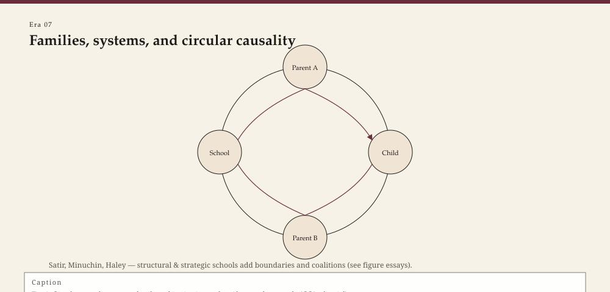

<!-- graphics-pass: 2 | source: articles/07-systems-and-families.md | do not publish without editor merge -->
---
title: "Families, systems, and the two-way street"
slug: families-systems-therapy
meta_description: "Bateson, Satir, Minuchin, Bowen, and the Milwaukee brief therapists: how the unit of treatment became more than one person — and how a theory of families can injure as well as help."
tags:
  - therapy history
  - family therapy
  - systems
  - Satir
  - Minuchin
  - Berg
type: era
order: 7
portrait: none
citations:
  - "Satir, Virginia. Conjoint Family Therapy. 1964."
  - "Minuchin, Salvador. Families and Family Therapy. 1974."
  - "Bateson, Gregory, et al. Toward a Theory of Schizophrenia. 1956."
  - "de Shazer, Steve. Keys to Solution in Brief Therapy. 1985."
status: publishable
voice_check: human
last_verified: 2026-09-14
---

**Educational note.** This is history for a general reader. It is not a diagnosis, not a treatment plan, and not a substitute for care with a licensed clinician.

A child who will not speak at dinner is not only a child. That sentence can be a liberation. It can also be a prosecution of the mother. Family therapy was invented in the space between those two uses, and it has never quite left it.

<!-- figure-id: families-systems-therapy.family_systems_cycle -->

*Figure 1. Pass-2 infographic for era essay « families-systems-therapy » (see GRAPHICS_INDEX.md).*

*Rights: original editorial SVG (CC0). No AI-generated faces or likenesses.*

## Palo Alto, a hotel, and a theory that blamed the household

In the 1950s Gregory Bateson, Don Jackson, Jay Haley, and John Weakland — working in Palo Alto with funds that included Rockefeller and later NIMH — published "Toward a Theory of Schizophrenia" (1956). They described a "double bind": a person, often a child, caught in contradictory injunctions that could not be escaped or named. The paper is a landmark in communication theory. It is also a document that later readers, and some of the authors, had to walk back from when it hardened into "the family causes schizophrenia."

Mothers had already been blamed by a generation of "schizophrenogenic" theories. A systems paper that does not name a villain can still deliver one. Contemporary family therapists who still read Bateson read him for the idea of *context*, not for an etiology of psychosis. This essay will not revive the etiology.

## Satir's growth and Minuchin's structure

Virginia Satir came out of social work and the Chicago tradition, then California. *Conjoint Family Therapy* (1964) and *Peoplemaking* (1972) taught a generation to look at stances — blaming, placating, computing, distracting — and at the way a family breathes when someone tells the truth. She was experiential, sometimes theatrical, and allergic to the idea that a child should be "the problem" on the intake form.

Salvador Minuchin, an Argentine-born psychiatrist, learned a different lesson at the Wiltwyck School for Boys and then at the Philadelphia Child Guidance Clinic. *Families of the Slums* (1967) and *Families and Family Therapy* (1974) made "structure" a clinical word: boundaries, coalitions, a parentified child, an enmeshed pair. He moved chairs. He asked a father to speak to a son while the room watched. He worked, often, with poor families that the analytic institutes of the same cities did not see.

Murray Bowen, at Georgetown, drew diagrams of triangles and differentiation that still cover whiteboards in counseling programs. His theory can sound like weather: anxiety moves through a system. It can also sound like fate. Good teachers use the diagrams as hypotheses. Bad ones use them as a family curse.

Nathan Ackerman in New York had already been seeing families as a unit in the 1950s, and the Ackerman Institute later became one of the East Coast addresses for the same argument. Milan, in the 1970s, produced a different dialect: Selvini Palazzoli, Boscolo, Cecchin, and Prata wrote about paradox, circular questions, and a team behind the mirror. American trainees imported the mirror and sometimes left the politics. The one-way glass is a historical object. It trained a generation. It also turned a household into a specimen. Consent forms got longer for a reason.

## Brief, solution, narrative

The Mental Research Institute in Palo Alto — Don Jackson opened it in 1958 or 1959, depending on which institutional sentence you trust — gathered Jackson, Weakland, Paul Watzlawick, and Richard Fisch. They shortened the ambition: interrupt the attempted solution that has become the problem. In Milwaukee, Steve de Shazer and Insoo Kim Berg founded the Brief Family Therapy Center in 1978 and spent the 1980s asking what was already working. Solution-focused brief therapy is easy to parody ("miracle question") and harder to do without becoming a cheerleader. Berg's own path — pharmacy training in Seoul, then American social work, then MRI, then BFTC — is the figure essay in this pack.

Michael White in Adelaide and David Epston in Auckland wrote *Narrative Means to Therapeutic Ends* (1990). They treated problems as stories that had recruited a person, and they looked for the moments the story did not win. Narrative therapy's politics (against the expert who owns the meaning) belong with the liberation essay later in this series. Its technique belongs here: the unit of treatment can be a story the family has agreed to tell.

## The two-way street

Individual therapy can pretend the rest of the house is scenery. Family therapy cannot. That is its honesty. It is also why a family hour can become a trial.

A contemporary clinician who invites a partner, a parent, or a translator into the room inherits this whole argument. Who is the client? Who signs the consent? What is said to the school? What if the safest person in the system is the adolescent who wants out?

Those are not questions a history essay answers. They are questions this history *invented* as professional questions rather than as gossip over a fence.

Recording a family, once a research glamour, is now an ethics exam. Who owns the tape? Who is in the frame when a child recants? Palo Alto and Philadelphia both filmed. The films trained. They also outlived the consent that made them. A contemporary clinician who wants a consultant behind a mirror inherits that file, not only the clever question.

## What not to do with this lineage

Do not use systems language to tell a woman she caused her child's psychosis. Do not use "enmeshment" as a polite word for cultural closeness you have not earned the right to judge. Do not treat a fifty-minute newscast of family week as a structural intervention.

Satir liked to say that the problem was not the problem; coping was. Like most aphorisms, it is true until it is not. A violent home is the problem. A hungry home is the problem. Theory is for the hour after those facts are named.

Whitaker could empty a chair or fill it. The hour either woke or wandered.

Carl Whitaker's experiential family work — unpredictable, sometimes theatrical — sat near Satir and far from MRI's cooler paradox. Trainees either found a living hour or found a license to be chaotic. History's job is to keep those outcomes from being confused.

Murray Bowen's Georgetown decades produced the diagrams that still cover whiteboards: triangles, cutoff, differentiation of self. The 1978 *Family Therapy in Clinical Practice* collected papers that had already been circulating among trainees. Bowen's own family-of-origin research included a famous, uneasy return to his family of origin — a move later teachers either mythologized or warned against. This pack will not assign that move. It will say: a theory of anxiety moving through generations can help a clinician see a room. It can also become a family curse drawn in marker. Use the diagram as a hypothesis. Date it. Be willing to erase it.

## Sources

Satir 1964, 1972; Minuchin 1967, 1974; Bateson et al. 1956; de Shazer 1985; White and Epston 1990. On MRI's opening years, Jackson's 1958–59 institutional papers and later MRI histories. On the afterlife of the double bind, see later statements by the Palo Alto group and the critiques in the schizophrenia family-research literature. For Milan, Selvini Palazzoli and colleagues' 1970s papers as history, not as a script.

*WOW Therapies educational series. Complementary to the SLPWOW speech-pathology history pack; this lane is counseling and clinical heritage only.*
