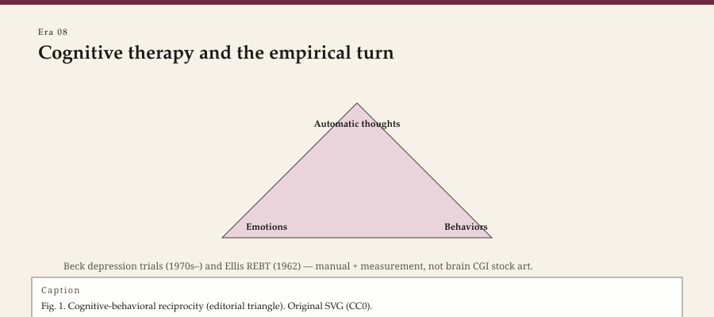

<!-- graphics-pass: 2 | source: articles/08-cognitive-empirical-turn.md | do not publish without editor merge -->
---
title: "Cognitive therapy and the empirical turn"
slug: cognitive-therapy-empirical-turn
meta_description: "Beck, Ellis, DSM-III, and the randomized trial: how psychotherapy learned to count thoughts — and what the counting left out."
tags:
  - therapy history
  - cognitive therapy
  - Beck
  - Ellis
  - DSM-III
type: era
order: 8
portrait: none
citations:
  - "Beck, Aaron T. Cognitive Therapy and the Emotional Disorders. 1976."
  - "Beck, Aaron T., et al. Cognitive Therapy of Depression. 1979."
  - "Ellis, Albert. Reason and Emotion in Psychotherapy. 1962."
  - "Decker, Hannah S. The Making of DSM-III. 2013."
  - "Eysenck, H. J. Journal of Consulting Psychology, 1952 (historical gauntlet)."
  - "Cahalan, Susannah. The Great Pretender. 2019."
status: publishable
voice_check: human
last_verified: 2026-09-14
---

**Educational note.** This is history for a general reader. It is not a diagnosis, not a treatment plan, and not a substitute for care with a licensed clinician.

Aaron T. Beck was an analyst who grew tired of waiting for insight to lift a depression. In the 1960s, at the University of Pennsylvania, he began writing down what his patients said they *thought* — not as associations on the way to a childhood scene, as claims about the present. A man who believed he was a burden found evidence for the belief and discarded the rest. Beck called the pattern a cognitive triad: a bleak view of self, world, and future. *Depression* (1967) and *Cognitive Therapy and the Emotional Disorders* (1976) made the pattern a school.

<!-- figure-id: cognitive-therapy-empirical-turn.cbt_thought_emotion_behavior -->

*Figure 1. Pass-2 infographic for era essay « cognitive-therapy-empirical-turn » (see GRAPHICS_INDEX.md).*

*Rights: original editorial SVG (CC0). No AI-generated faces or likenesses.*

Albert Ellis had already, from 1955 in New York, been interrupting "musts" and "shoulds" in a therapy he named Rational Emotive (later REBT). *Reason and Emotion in Psychotherapy* (1962) is loud on the page because Ellis was loud in the room. He owed more to Adler and to Stoic copybooks than to Freud, and he said so.

The two men were not twins. Ellis attacked the sentence. Beck tested the sentence. American hospitals, for reasons that were only partly scientific, preferred the tester.

## Why the trial arrived when it did

Randomized studies of psychotherapy existed before Beck. They did not run the culture. Several things changed together:

- **Psychopharmacology** after chlorpromazine (1950s) and the antidepressants taught medicine to expect a graph.
- **DSM-III** (1980), under Robert Spitzer, replaced narrative, theory-soaked diagnoses with symptom checklists. Hannah Decker's history of that manual is the book to read. The checklist made "depression" a countable object for a study arm.
- **Federal and insurer money** began to ask what, exactly, they were buying.

Cognitive therapy of depression (Beck, Rush, Shaw, and Emery, 1979) was built to be taught, supervised, and compared. That is a political fact as well as a clinical one. A therapy that can be written as a manual can be granted. A therapy that cannot is, in a managed system, a hobby.

A. John Rush's name on the 1979 manual matters. Pharmacologists and cognitive therapists were already sharing depressed inpatients and arguing about what a "response" looked like. The later STAR*D trial (2000s) is a descendant of that shared graph, not of a conversion story in which pills defeated talk or talk defeated pills. History's useful sentence is smaller: the object of treatment became something you could score on a Tuesday.

In the 1990s the Society of Clinical Psychology (APA Division 12) published lists of "empirically supported treatments." Dianne Chambless and colleagues wrote the rules. The lists were a reform against unfalsifiable guild talk. They were also a new guild. A therapy that had not yet run the right trial in the right journal looked, on a slide, like a superstition. Rural, bilingual, and community work arrived late to those slides or not at all.

## What the turn clarified

Thoughts are not only foam on a drive. They can be sampled. They can be wrong in patterned ways. A person can be invited, without a lecture on the unconscious, to treat a belief as a hypothesis. For a great many people with unipolar depression and with panic, that invitation was a better hour than an ambiguous silence.

The turn also clarified training. You can watch a tape and say: there, you missed the hot thought. Supervision became more like coaching and less like priesthood. Some of the warmth Rogers wanted survived in good CBT. Some of it died in worksheets that never looked up.

## What the turn postponed

Meaning. Culture. A childhood that is not a "core belief" worksheet. Psychosis as more than a thought to be challenged. The body. The political situation that makes a "negative thought" into a description.

Feminist and multicultural therapists said this at the time. So did analysts, sometimes usefully, sometimes as guild defense. Third-wave therapies (the later essay) would put acceptance and mindfulness back into the behavioral house without returning the keys to 1910 Vienna.

There is also the marketing hangover. "Evidence-based" became a brand. A trial in a university clinic with English-speaking undergraduates is not a trial in a rural county with comorbidity and a two-hour drive. Beck, to his credit, kept publishing limits. The slide decks did not.

## DSM as a neighbor, not a god

This series is not a history of diagnosis. But the empirical turn in therapy is unintelligible without DSM-III and its children. A counselor who writes "major depressive disorder" on a form is speaking 1980. A counselor who thinks the form *is* the person has mistaken a billing language for a soul.

ICD-11 now sits beside DSM-5-TR as another official dialect. The point for a history reader is not which code is truer. It is that psychotherapy agreed, in a specific decade, to be judged by the same kind of object a pill is judged by. That agreement won money and lost mystery. Both results are real.

Rosenhan's 1973 *Science* paper — pseudopatients, the words "on being sane in insane places" — was used for a generation as proof that diagnosis was a costume. Susannah Cahalan's later archival work (*The Great Pretender*, 2019) made the study a less stable parable. This pack will not use Rosenhan as a clean stick with which to beat DSM-III. It will say: the 1970s wanted a scandal about labels, and the 1980s answered with more labels, written as lists.

## How to read this on a practice site

WOW Therapies does not, in these pages, sell a protocol. If a later service page names CBT, that page needs its own review. This page names a turn in the profession: from interpretation as the highest craft to a craft that can be filmed, counted, and, at its worst, automated.

The figure essays on Beck and Ellis stay with the men. Linehan's essay shows what happened when a behaviorist who had been a suicidal patient wrote a manual the trial could see. The story is not "science arrived." The story is: a certain kind of science arrived, and the rest of the field had to answer it.

The National Institute of Mental Health's depression trials of the 1980s, including the Treatment of Depression Collaborative Research Program, put interpersonal therapy (Klerman and Weissman) on the same graph as CBT and medication. A third school on a federal graph is a political fact. It is also a reminder that "the empirical turn" was never only Beck's.

Managed care in the 1990s did not invent the thought record. It recognized a cousin it could authorize in six sessions. University clinics that had spent the 1970s arguing about manuals spent the 1990s arguing about how many sessions a depression trial needed. Rural counties arrived to that argument late, with comorbidity and a two-hour drive. A history that treats the Penn manuals as the whole country has repeated the slide deck's error.

## Sources

Beck 1967, 1976, 1979; Ellis 1957, 1962; Decker 2013; APA DSM-III (1980). For the wider "empirically supported treatments" lists of the 1990s, see the Society of Clinical Psychology (APA Division 12) documents of that decade — as history, not as a shopping list.

*WOW Therapies educational series. Complementary to the SLPWOW speech-pathology history pack; this lane is counseling and clinical heritage only.*
